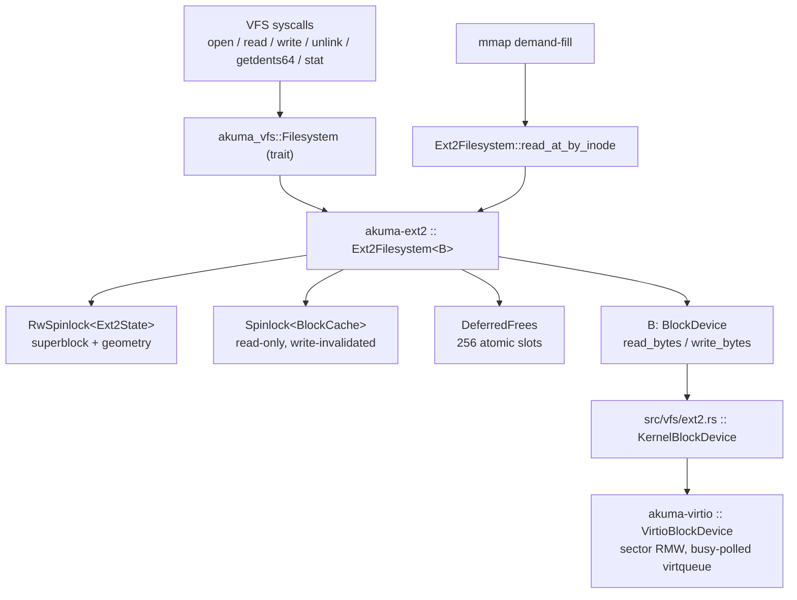

# akuma-ext2

A read/write **ext2** filesystem driver for `no_std` kernels. The caller supplies
a `BlockDevice` (raw byte-addressed I/O) and a timestamp callback; the crate
implements the kernel's `akuma_vfs::Filesystem` trait on top.

`no_std` + `alloc`. Host-testable: `#![cfg_attr(not(test), no_std)]` lets the same
code link against `std` for `cargo test`, backed by an in-RAM `Vec<u8>` device
and real `mke2fs` fixture images (`tests/fixtures/`).

- **In the kernel:** mounted as the root filesystem from `vda`
  (`src/vfs/ext2.rs` → `KernelBlockDevice` → `crates/akuma-virtio/src/block.rs`).
- **Consumers:** every VFS syscall (`open`, `read`, `write`, `unlink`, `getdents64`,
  `stat`, `rename`, …), plus `mmap` demand-fill via `read_at_by_inode`.

> **If you came here because "fs performance looks like shit":** jump to
> [Performance characteristics](#performance-characteristics). Short version — a
> single-block file `create` costs **~11 synchronous device writes** and a 2 MB
> sequential write has **5.7× write amplification**, because there is no
> write-back cache and the superblock + block-group descriptor are rewritten on
> every block/inode allocate and free. This is unconditional; it is not caused by
> fragmentation or by bulk deletes (see
> [`docs/archive/EXT2_PERFORMANCE_AUDIT.md`](../../docs/archive/EXT2_PERFORMANCE_AUDIT.md)).

---

## Contents

- [Where it sits](#where-it-sits)
- [On-disk layout the driver assumes](#on-disk-layout-the-driver-assumes)
- [Core types](#core-types)
- [Locking, and the IRQ-masked hold](#locking-and-the-irq-masked-hold)
- [The block cache](#the-block-cache)
- [Operation walkthroughs](#operation-walkthroughs)
- [Deferred inode frees](#deferred-inode-frees)
- [Performance characteristics](#performance-characteristics)
- [Allocation audit](#allocation-audit)
- [Feature flags](#feature-flags)
- [Testing](#testing)
- [Known limitations](#known-limitations)
- [Further reading](#further-reading)

---

## Where it sits



The crate is deliberately thin: no directory-entry cache, no inode cache beyond
what the block cache incidentally holds, no write-back buffer, no journal. Every
mutation is written through to the device before the call returns.

---

## On-disk layout the driver assumes

Standard ext2, revision ≥ 1, no `incompat` features negotiated (the driver does
not check `feature_incompat`, so a disk with `filetype` absent or `sparse_super`
tricks will misbehave — the kernel's own images are made with a fixed `mke2fs`
recipe, `scripts/create_disk.sh`).

```
byte 0      1024        block 1        per block group ...
+-----------+-----------+--------------+--------------------------------------------+
| boot area | superblock| group-desc   |  [ block bitmap | inode bitmap |          |
| (1024 B)  | (1024 B)  | table (GDT)  |    1 block      |   1 block    |          |
|           |           |              |    inode table (inodes_per_group entries) |
|           |           |              |    data blocks ...                        |
+-----------+-----------+--------------+--------------------------------------------+
                        \___________________ repeated for every block group ______/

block size   : 1024 << superblock.block_size_log     (kernel images: 4096)
inode size   : superblock.inode_size (rev >= 1) else 128
group count  : ceil((total_blocks - first_data_block) / blocks_per_group)
```

`Ext2State` caches the parsed superblock and the six geometry numbers derived
from it (`block_size`, `inodes_per_group`, `inode_size`, `block_group_count`,
`blocks_per_group`, `first_data_block`). The GDT, bitmaps and inode tables are
**not** cached in `Ext2State` — they are re-read from the device (through the
block cache) on every allocation.

**Block/inode addressing.** `read_inode(n)`: group = `(n-1) / inodes_per_group`,
index = `(n-1) % inodes_per_group`, byte offset =
`bgd.inode_table * block_size + index * inode_size`. `free_block(b)` adjusts by
`first_data_block` first. Inode `2` is the root directory. Inode `0` is "none".

**Block map.** 12 direct + single-indirect + double-indirect. Triple-indirect is
`FsError::NotSupported`. `read_inode_data` refuses files larger than 16 MB — large
files must go through `read_at` / `read_at_by_inode`, which stream.

**Fast symlinks.** Targets ≤ 60 bytes are stored inline in the
`direct_blocks`/indirect pointer area with `sectors_used == 0`; longer targets
allocate data blocks.

---

## Core types

| Type | What it is |
|---|---|
| `Ext2Filesystem<B: BlockDevice>` | the public handle; owns `dev`, `state`, `block_cache`, `deferred`, `write_lock_owner`, `time_fn` |
| `Ext2State` | parsed superblock + geometry, behind `RwSpinlock`; also the in-memory `bgd_cache` / `bgd_dirty` / `sb_dirty` for deferred metadata writeback (see below) |
| `Ext2ReadGuard` / `Ext2WriteGuard` | RAII lock guards that also carry the `StateHoldGuard` (see below); `Ext2WriteGuard::drop` clears `write_lock_owner` |
| `BlockCache` | `ClockBlockCache` with the `fs-cache` feature, else the 64-slot `BlockRingCache`; absent entirely on `extreme` |
| `DeferredFrees` | 256 `AtomicU32` slots for inodes unlinked while still mmap-pinned |

### Deferred metadata writeback

The superblock free counts and every block-group descriptor's free counts change
on *every* block/inode allocate and free. Writing them through per operation was
~1000 device writes for a 2 MB file (see [Performance](#performance-characteristics)).
Instead, the four allocator functions (`allocate_block`, `free_block`,
`allocate_inode`, `free_inode`) keep the authoritative copy in
`Ext2State::{superblock, bgd_cache}` and only set a dirty flag; `flush_meta`
writes the dirty ones at the end of every mutating `Filesystem` method and on
`sync()`. On-disk metadata is therefore consistent at every syscall boundary —
the same guarantee the per-block writes gave, since a crash *mid*-syscall was
already inconsistent. Only the write-locked allocator paths touch these fields
(read-only callers of `read_bgd` read `bgd.inode_table`, which no allocation
changes), so a plain `Vec` with no interior mutability is sound.

Raw on-disk structs (`Superblock`, `BlockGroupDescriptor`, `Inode`,
`DirEntryRaw`) are `#[repr(C, packed)]` and read with `read_unaligned`.

### Constructors

```rust
// Root filesystem — block cache sized from the crate-global cap.
Ext2Filesystem::new(dev, || utc_micros())?;

// Second and later mounts — explicit smaller cap so a data disk does not
// re-commit the whole global cache budget (the cache never shrinks).
Ext2Filesystem::new_with_cache_cap(dev, || utc_micros(), Some(16 << 20))?;
```

`set_cache_cap_bytes(bytes)` is called once by `src/fs.rs` before mount; the
kernel derives it as `min(RAM/8, 128 MB)`.

---

## Locking, and the IRQ-masked hold

`Ext2State` is an `RwSpinlock`. Reads run concurrently; writes are exclusive.
Both `read_state()` and `write_state()` are **unbounded** `try_*` + backoff
loops with a periodic orphaned-lock check: every 10 000 attempts they look at
`write_lock_owner`, and if that thread is dead (`ThreadHooks::is_thread_dead`)
they `force_unlock_write()`. This exists because an fs syscall can be killed
mid-hold.

### `StateHoldGuard`

Every lock guard carries a `StateHoldGuard`, taken *per `try_*` attempt* and
either kept (on success, covering the whole hold) or dropped before the backoff
spin:

| build | `StateHoldGuard` | effect while a state guard is held |
|---|---|---|
| default (`cargo build --release` → `smp-shared` → `no-bkl-vfs`) | `akuma_primitives::PreemptGuard` | **preemption disabled + local IRQs masked** |
| without `no-bkl-vfs` | `NoStateHold` (ZST) | nothing (the Big Kernel Lock covers it) |

Under `no-bkl-vfs` a core can be inside an ext2 critical section *without*
holding the BKL. The IRQ mask is what stops a nested IRQ on that core from
running `enter_kernel()` and hard-spinning for the BKL while this core holds the
inner lock — the AB-BA wedge that `no-bkl-network` closed the same way
(`crates/akuma-virtio/src/block.rs` has the full note). The device lock in
`akuma-virtio` is covered *transitively*: it is only ever reached from inside a
`read_block`/`write_block`/`write_superblock` call, which always runs with a
state guard held.

```
write_at("/x", off, data)              ┌─ PreemptGuard::new()  (preempt off, IRQs MASKED)
  let mut state = self.write_state();  ─┤
  ... resolve, allocate, per-block loop │   << every heap allocation in here
  ... write_inode                       │      runs with IRQs masked >>
  return written                       ─┘─ guard drops: irq_restore(), then preempt on
```

The design intent is *"IRQs masked only for the short hold"*. The crate does not
currently honour that — see the [allocation audit](#allocation-audit).

---

## The block cache

A single `Spinlock<BlockCache>`, separate from the state lock. **Read-only and
write-invalidated**: `write_block` calls `cache.remove(block_num)` *before*
writing the device, so a subsequent read re-fetches from disk. There is no dirty
list and no write-back.

```
read_block(b):
   cache.lock().get(b)  ──hit──▶  to_vec()  ─▶  return  (no device I/O)
        │miss
        ▼
   dev.read_bytes(b*bs, buf)  ─▶  cache.lock().insert(b, buf)  ─▶  return

write_block(b, data):
   cache.lock().remove(b)  ─▶  dev.write_bytes(b*bs, data)      (always device I/O)
```

### `BlockRingCache` (default without `fs-cache`)

64 slots, one contiguous `Vec<u8>` backing + a `[u32; 64]` tag array. Linear-scan
lookup, pure ring eviction. ~256 KB at 4 KB blocks. Too small to give any reuse
against a self-host build's working set (measured warm/cold ratio 1.00×) — hence:

### `ClockBlockCache` (feature `fs-cache`, in the kernel `default` set)

Sized from detected RAM. Backing grows one `CACHE_CHUNK_BYTES` (1 MB) chunk at a
time up to `capacity_blocks`; slots never move once allocated. `block_num → slot`
`BTreeMap` for O(log n) lookup. CLOCK (second-chance) eviction so a hot working
set survives cold blocks streaming past. Instrumented: `cache_stats()` →
`(hits, misses)`, `cache_occupancy()` → `(slots_used, slots_cap)`.

Under `fs-cache`, inode-table and GDT reads are also routed through the block
cache (`read_range_cached` / `write_range_cached` — single-block RMW), so a hot
`Inode` read is a memcpy.

### Coherence instrumentation (default off)

`E2_VERIFY_HITS` gates `verify_cached_block`, which re-reads every cache hit
straight from the device and compares (`[E2C-BAD]` on mismatch). Doubles read
I/O — only for chasing the self-host zero-page class
(`docs/archive/SELFHOST_ZERO_PAGE_HUNT.md`). `E2_READ_AT_EOF` counts
`read_at_by_inode` calls whose offset is past `i_size` (`[E2-EOF]`) — an i_size
incoherence signal, not a normal EOF.

---

## Operation walkthroughs

### Read (`read_at` / `read_at_by_inode`)

1. `read_state()` (shared).
2. `lookup_path_internal` walk (for the path form) → inode number.
3. `read_inode` → `Inode`.
4. Resolve logical→physical for the touched block range via `get_block_num`
   (reads indirect blocks through the cache).
5. `read_at_by_inode` batches: it coalesces a run of physically-contiguous
   *uncached* blocks into **one** `dev.read_bytes`, then populates the cache
   per block. Cached blocks are served by memcpy. `read_at` (the simpler path)
   does one `read_block` per logical block.

Reads are cheap once warm — no device writes, and the cache absorbs metadata
(`metadata()` on a 6-deep path is ~0.02 device reads/call). But **read-after-write
is never warm**: `write_block` calls `cache.remove` for every block it writes, so
reading back a file you just wrote re-fetches every block from the device (the
514-read row above). A write-*through* cache that kept the just-written bytes in
its slot would fix this for free.

### Write (`write_at`) — the expensive path

Device writes for one 4 KB file `create`, `baseline` vs `now` (Fix A + Fix B):

```
write_at("/dir/f", 0, <4096 bytes>)                    base  now
  write_state()  (exclusive, IRQs masked)
  lookup + lookup_parent -> ("/dir" inode, "f")
  allocate_inode(state, false):
    drain_deferred_frees(state)               (scans 256 slots)
    set bit; write inode_bitmap  ...........    1     1   (bitmap)
    bgd.free_inodes_count -= 1  ............    1     0   (staged, not written)
    sb.unallocated_inodes  -= 1  ...........    1     0   (staged)
  write_inode  ..........................      1     1   (inode table)
  add_dir_entry("/dir", "f"):
    rewrite EVERY block of the directory  ..  ~1    ~1   (data — Fix C pending)
    write dir inode  .....................     1     1   (inode table)
  ensure_block(state, inode, 0, zero_leaf=false):
    allocate_block_inner(state, false):
      scan block_bitmap from bit 0           (O(blocks_per_group))
      set bit; write block_bitmap  ........    1     1   (bitmap)
      bgd.free_blocks_count -= 1  .........    1     0   (staged)
      sb.unallocated_blocks  -= 1  ........    1     0   (staged)
      zero-fill the new block  ............    1     0   (skipped — Fix A)
  write_block(phys, data)  ...............     1     1   (data — the real bytes)
  inode.size = 4096; write_inode  .......     1     1   (inode table)
  flush_meta(state):
    write the 1-2 dirty BGDs + superblock  ..  -     2   (gdt + superblock, once)
                                             ----  ----
                                     total   ~11   ~9   device write calls
```

Then, at the `akuma-virtio` layer, each `write_bytes` is a **sector
read-modify-write**: read the touched 512-byte sectors, patch, write them back,
busy-polling the virtqueue. A 1 KB superblock write is a 2-sector read + 2-sector
write round-trip.

The staging wins scale with how many allocations one op does: a 2 MB `write_at`
in a single call stages 512 block allocations and `flush_meta` writes the
superblock + GDT **once** (down from 514 + 514). Split across 256 `write()`
syscalls it is once per syscall — still 256, not 514, and the 512 redundant
zero-fills are gone regardless.

### Lookup (`lookup_path_internal`)

The path walk itself allocates nothing (`path_components` is an iterator). But
for **every component** it calls `read_inode_data` on the parent directory
(materialising the whole directory into a `Vec<u8>`) and `parse_directory`
(a `Vec<(u32, String, u8)>` with a heap `String` per entry), then linear-scans
for the name. Warm, this is all cache hits and CPU-bound; cold, it is one device
read per directory block per component.

### Unlink (`remove_file`)

`lookup_path` + `lookup_parent` (two independent read-locked walks), then
`write_state`, `drain_deferred_frees`, `remove_dir_entry` (rewrites the whole
parent directory), `truncate_inode` (frees every block — bitmap + gdt +
**superblock** write per block), `write_inode`, `free_inode` (bitmap + gdt +
**superblock** again, plus `on_inode_freed` → page-cache invalidation).
Measured: **10 device writes per 4 KB file deleted.**

---

## Deferred inode frees

The one subtle correctness mechanism. A `mmap` region names its file by raw
inode number + `filesz` captured at map time, holding an
`akuma_primitives::inode_pin` rather than a `struct file`. So if `unlink` freed a
pinned inode, `truncate_inode` would zero `i_size` (mapper faults read `Ok(0)` →
zero page) and `free_inode` would hand the number to the next `create` (mapper
faults read **another file's bytes**). Both were silent — root cause #2 of the
self-host `rustc` ICE (`docs/archive/SELFHOST_ZERO_PAGE_HUNT.md` §14).

```
remove_file("/x"):  hard_links -> 0
    inode_pin::is_pinned(n) ?
      no  -> truncate_inode + free_inode now
      yes -> deferred.push(n); keep i_size and block pointers; return
                 │  (256 fixed slots; a 257th concurrent pin OVERFLOWS
                 │   and the inode is LEAKED — recoverable by e2fsck.
                 │   Bytes to the wrong reader are not recoverable, so
                 │   the overflow deliberately falls this way.)
                 ▼
drain_deferred_frees(state):   called from every unlink AND every allocate_inode
    for slot in 256:
        n = slot; if n == 0 or is_pinned(n): skip
        CAS(slot, n -> 0)                       (claim; one drainer wins)
        read_inode(n); truncate_inode; write_inode(deletion_time)
        free_inode(n, false)                    -> on_inode_freed(n) -> page cache drop
```

`is_pinned` is **re-checked** in the drain (a mapping created *after* the unlink
still names the inode). The list is per-filesystem, not global — an inode number
only means something relative to its issuing mount.

Counters (`DEFERRED_FREE_PENDING`, `DEFERRED_FREE_LEAKED`, `deferred_free_pending()`)
feed the `[Mem]` dump. A non-zero `DEFERRED_FREE_LEAKED` means `DEFERRED_FREE_SLOTS`
needs raising.

---

## Performance characteristics

Measured with `userspace/ext2probe` (the `ext2probe-host` binary — see
[Testing](#testing)): `Ext2Filesystem` over an in-RAM copy of a real image, with a
`BlockDevice` shim that counts every call and buckets it by on-disk region. Call
counts are the metric because each `write_bytes` is one synchronous busy-polled
virtqueue round-trip on the guest, and a *sector* read-modify-write at that.

**`baseline` = before any of the fixes below; `now` = with Fix A + Fix B applied**
(2026-08-26). Fix C and the write-back cache are still pending.

| Operation | device write calls (baseline → now) | write bytes | note |
|---|---:|---:|---|
| create 1 × 4 KB file | 11.3 → **9.3** | 39 → 34 KB | sb 2→1, one zero-fill dropped |
| delete 1 × 4 KB file | 10.0 → **9.0** | 34 → 33 KB | sb 2→1 |
| 2 MB sequential write (256 × 8 KB `write()`) | 3327 → **2300** (−31%) | 11.7 → **8.2 MB** (5.7× → **4.1×**) | sb 514→256, gdt 514→257, 512 zero-fills dropped |
| 2 MB read *immediately after* that write | 514 device reads (unchanged) | — | write-invalidate still makes read-after-write cold (write-back cache pending) |
| `stat()` on a 7-deep path, warm | ~0.03 reads/lookup | 0 | cache absorbs it |
| build 3200-file tree (16 × 200) | 35 404 → **28 987** (−18%) | 122 → 106 MB | |
| mass-delete that tree | 28 970 → **25 753** (−11%) | 96 → 93 MB | |
| Nth file into one **flat** directory | 11→18 → **9→16** as N: 0→2000 | grows | O(N) dir-rewrite slope unchanged — that's Fix C |

### Root causes, and status

1. **No write-back / write coalescing at any layer.** `write_block`,
   `write_inode` go straight to the device; the block cache is *invalidated* on
   write, never updated. **Partly addressed:** `write_superblock` / `write_bgd`
   are now deferred (Fix B). The block-data / inode / bitmap write-through and the
   read-after-write cold cache remain — a write-back block cache is the fix.
2. ~~The superblock (full 1 KB) is rewritten on every block and inode
   allocate/free.~~ **Fixed (Fix B).** The superblock and every BGD's free counts
   are kept in memory (`Ext2State::{superblock, bgd_cache}` + dirty flags) and
   written once by `flush_meta` at the end of each mutating `Filesystem` method
   and on `sync()`. On-disk metadata is still consistent at every syscall
   boundary — same guarantee the per-block writes gave. `sync()` is no longer a
   no-op.
3. ~~The block-group descriptor is rewritten the same way.~~ **Fixed (Fix B)**,
   same mechanism.
4. ~~`allocate_block` zeroes each new block with its own device write, then the
   caller overwrites it.~~ **Fixed (Fix A).** `ensure_block` takes a `zero_leaf`
   flag; `write_inode_data` and the full-block arm of `write_at` pass `false`
   (they write every byte of the block next). Indirect/double-indirect pointer
   blocks and partially-written data blocks are still zeroed.
5. **`add_dir_entry` / `remove_dir_entry` rewrite the entire directory** via
   `write_inode_data` on every entry → **O(N²) to fill or empty one directory**.
   **Not yet fixed (Fix C)** — the flat-directory slope above is unchanged.
6. **`allocate_block` linear-scans the block bitmap from bit 0** every call —
   O(`blocks_per_group`) per allocation. **Not yet fixed** — resume from a
   per-group cursor / `bgd.free_*` hint.
7. **`ensure_block` re-reads the indirect block on every block** past the 12th
   during a large sequential write. **Not yet fixed.**

### Why the earlier audit found "NO REGRESSION"

[`docs/archive/EXT2_PERFORMANCE_AUDIT.md`](../../docs/archive/EXT2_PERFORMANCE_AUDIT.md)
compared operation timings *before vs after* a bulk delete and found them equal
(or faster after, from cache warmth). Consistent with the analysis above: the
cost is an **unconditional constant multiplier**, not a post-delete degradation,
so a before/after ratio is ~1.0. "Slow after `rm -rf /tmp/akuma`" was the
`rm -rf` itself — deleting a source checkout is (files × ~9-10) synchronous
device writes — compounded by every subsequent build `create` costing ~9-11.

### Still pending

- **Write-back block cache** with `sync()` / periodic flush: keep written bytes
  in the slot instead of `remove`, mark dirty, flush later. Fixes read-after-write
  and lets bitmap writes coalesce too. Highest remaining leverage; also the
  riskiest (coherence — see the `E2C-BAD` history).
- **Fix C** — incremental `add_dir_entry` / `remove_dir_entry`: write only the
  one changed directory block, not the whole file.
- Bitmap-scan cursor; indirect-block reuse across a sequential write.
- A less aggressive metadata flush (every N ops instead of every op) would cut
  the residual `sb`/`gdt` writes on many-small-file workloads further, at a small
  crash-consistency cost.

---

## Allocation audit

Every heap allocation in `src/ext2.rs` outside `#[cfg(test)]`, and whether it is
justifiable. **Context that raises the bar:** under the kernel `default`
(`no-bkl-vfs`), all of this runs with **local IRQs masked and preemption
disabled** for the whole `Ext2State` guard hold (see
[above](#locking-and-the-irq-masked-hold)). An allocation here can therefore:
take the kernel heap lock (spins with IRQs masked if another core holds it),
trigger a `[HEAP-GROW]` / PMM refill under the mask, and stretch a window whose
whole design premise is *"short"*. Unbounded allocations under that mask are the
real defect, over and above the throughput cost.

### Justifiable

| Site | Freq / size | Why it's fine |
|---|---|---|
| `BlockRingCache::new` / `ClockBlockCache` chunks | once at mount / 1 MB chunk amortized | deliberate, heavily documented; chunking bounds the single allocation and never copies existing slots |
| `read_at_by_inode`: `Vec::with_capacity(num_blocks)` phys list | per read, bounded by `buf.len()/block_size` | bounded by the caller's request; small |
| `read_at_by_inode`: `vec![0u8; run_bytes]` run buffer | per cache-miss run, bounded by `buf.len()` | batches a real contiguous disk read — the point of the function |
| `verify_cached_block`: `vec![0u8; bs]` / `to_vec()` snapshot | gated `E2_VERIFY_HITS`, default **off** | diagnostic-only, documented as never-on in production |
| `read_symlink_inode`: `String::from` | per `readlink`, ≤ target length | must return owned; bounded |
| `lookup_parent_internal`: `name.to_string()` | one small `String` per mutating op | needed to carry the final component past the borrow of `state` |
| `read_dir` → `Vec<DirEntry>` (`.collect`, owned names) | per `getdents64` | forced by the `Filesystem` trait signature (see "not justifiable" for the trait itself) |

### Not justifiable (or: the API forces it and the API is the bug)

| Site | Freq / size | Problem | Fix direction |
|---|---|---|---|
| **`read_inode_data`: `Vec::with_capacity(size)`** | **every path-lookup component**, up to **16 MB** | Materialises an entire file/**directory** into heap on every lookup, under IRQ mask. This is the worst one: large, hot, and on the resolution path. | stream directories; give `lookup`/`read_dir` a block-at-a-time internal reader like `read_at_by_inode` already has |
| **`parse_directory`: `Vec<(u32,String,u8)>` + `String` per entry** | every lookup that crosses that dir; **N+1 allocs for N entries** | 2001 allocations to resolve a name in a 2000-entry directory, under IRQ mask | in-place scan yielding `&str` for the "find one name" callers; iterator for `read_dir` |
| ~~`allocate_block`: `vec![0u8; block_size]` zero-fill~~ | ~~every block allocation~~ | **Fixed (Fix A)** — `allocate_block_inner(state, zero_new)` skips it for full-block-overwrite callers. Still allocated (+ written) for metadata and partial-block callers; a shared `static` zero page would drop the remaining allocs. | |
| `read_block`: `vec![0u8; block_size]` return, and `to_vec()` on cache hit | every block read incl. **cache hits** | the signature returns an owned `Vec`, so even a cache hit allocates + memcpys a full block — half the cache's value lost | `read_block_into(&mut [u8])`; callers pass a reused/stack buffer |
| `write_inode_data`: `vec![0u8; block_size]` per block | every block written | fresh zeroed heap block just to copy caller data through it | stack `[u8; 4096]` or a reused scratch buffer on the guard |
| `read_inode`: `vec![0u8; inode_size]` | every inode read | `inode_size` is 128 or 256 — bounded, belongs on the stack | `[u8; 256]` stack buffer |
| `remove_dir`: `Vec<_>` of filtered entry refs | per `rmdir` | built only to call `.is_empty()` | `.iter().any(|(_,n,_)| n != "." && n != "..")` |
| `add_dir_entry` / `remove_dir_entry`: `dir_data.resize` / full `write_inode_data` | per create/unlink | rewrites every directory block (the O(N²) in the perf section) | write only the changed block |

### The trait-level issue

`Filesystem::read_dir -> Result<Vec<DirEntry>, FsError>` and
`read_file -> Result<Vec<u8>, FsError>` force full materialisation. The kernel
already has the streaming shape it wants (`read_at_by_inode`); the directory and
whole-file reads should get the same treatment so nothing allocates
proportionally to file/directory size while holding the IRQ-masked guard.

---

## Feature flags

| Feature | cfg emitted | Effect |
|---|---|---|
| *(none)* | — | 64-slot `BlockRingCache`; `StateHoldGuard = NoStateHold` |
| `fs-cache` | `ext2_fs_cache` | RAM-sized `ClockBlockCache`; GDT/inode reads routed through it |
| `no-bkl-vfs` | (via `akuma-primitives/no-bkl-vfs`) | `StateHoldGuard = PreemptGuard` — preemption off **+ IRQs masked** for every state-lock hold |
| `extreme` | `kernel_profile_extreme` (also from `OPT_LEVEL=z`) | **no block cache at all**; `read_block` always hits the device |

The kernel `default` set includes `fs-cache` and (through `smp-shared`)
`no-bkl-vfs`. `cargo build --release` is real SMP.

---

## Testing

```bash
# host unit tests (fixture images in tests/fixtures/, in-RAM MemBlockDevice)
cargo test -p akuma-ext2 --target $(rustc -vV | grep '^host:' | cut -d' ' -f2)
```

`tests.rs` covers mount, directory listing, create/read/write/unlink, symlinks
(fast + slow), rename, `read_at` boundaries, deferred frees (`deferred_free_len`,
a `#[cfg(test)]` accessor), and the block-cache coherence paths. `Ext2State` and
`try_lock_state` are `pub(crate)` / `#[cfg(test)]`.

Fixtures are real ext2 images (`mkfs.ext2 -b 4096`); regenerate with
`scripts/create_disk.sh` shapes if the layout assumptions change.

### Device-I/O probe

The `ext2probe-host` binary in `userspace/ext2probe` drives create / write /
read / delete / flat-directory / deep-lookup workloads through this crate and
prints device `read_bytes` / `write_bytes` call counts bucketed by region — the
"baseline → now" numbers in [Performance](#performance-characteristics). It
shares its workload definitions (`FsOps`, `workload::*`) with the guest
`ext2probe` ELF, so the two probes never drift.

```bash
cd userspace && HOST=$(rustc -vV | grep '^host:' | cut -d' ' -f2)
cargo run -p ext2probe --bin ext2probe-host \
  --no-default-features --features host-probe --target "$HOST" -- ../disk.img
```

---

## Known limitations

- No triple-indirect blocks (`FsError::NotSupported`).
- `read_inode_data` / `read_file` cap at 16 MB.
- `truncate` only shrinks — extending is a silent no-op (`bun`'s use case).
- No `feature_incompat` negotiation — assumes the kernel's own `mke2fs` recipe.
- No `atime` updates on read; `mtime`/`ctime` best-effort via `time_fn`.
- No journal. `sync()` flushes deferred superblock/BGD metadata but there is no
  ordering barrier and data/inode/bitmap blocks are still write-through only.
- Directory operations are O(directory size) per entry (Fix C pending).

---

## Further reading

- [`docs/archive/EXT2_PERFORMANCE_AUDIT.md`](../../docs/archive/EXT2_PERFORMANCE_AUDIT.md) — the prior audit this README's perf section supersedes
- [`docs/archive/SELFHOST_ZERO_PAGE_HUNT.md`](../../docs/archive/SELFHOST_ZERO_PAGE_HUNT.md) §14–15 — why deferred frees and `on_inode_freed` exist
- [`docs/reference/subsystems/vfs.md`](../../docs/reference/subsystems/vfs.md) — the VFS layer above this crate
- [`docs/reference/subsystems/locking.md`](../../docs/reference/subsystems/locking.md) — the BKL / `no-bkl-*` model
- `crates/akuma-primitives/src/inode_pin.rs` — the pin mechanism module doc
- `crates/akuma-virtio/src/block.rs` — the device layer, sector RMW, the transitive-guard note
