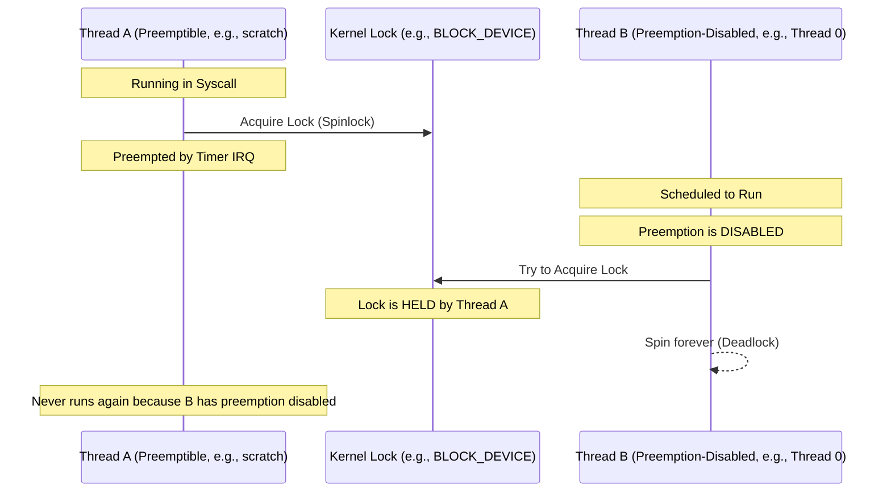
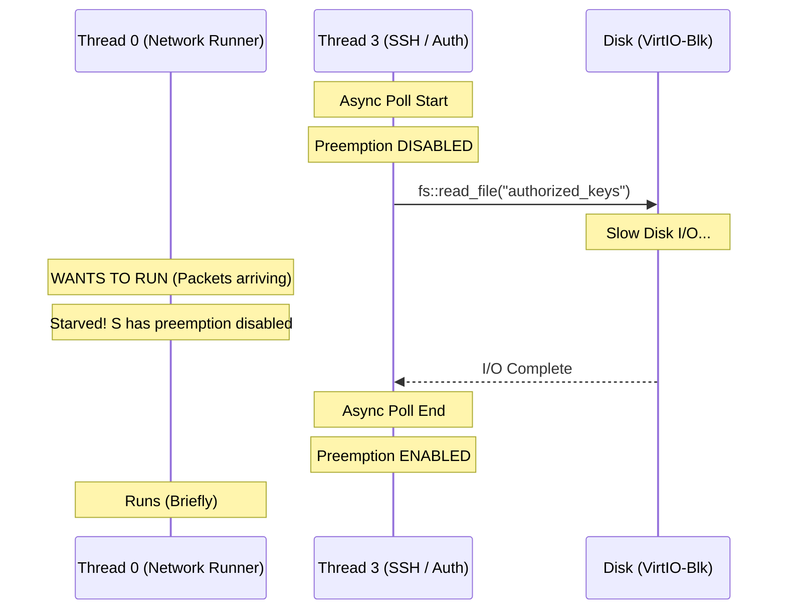

# Networking Slowness and Deadlock Investigation

**Date:** February 9, 2026  
**Status:** Strategy A Fixes Implemented

## 1. Executive Summary

Investigation into extreme networking slowness (3 kbps) and 5-second system hangs revealed a critical architectural flaw: **Priority Inversion Deadlocks** combined with **I/O Starvation**. These issues were caused by the interaction between preemptible userspace threads and preemption-disabled kernel async tasks.

## 2. The Priority Inversion Deadlock

### Scenario
The deadlock occurred because global kernel locks (VFS, Block Device) were not protected against preemption.

### The Fix
Modified `with_fs` and `with_device` to **disable preemption before acquiring the spinlock**. This ensures that the thread holding the lock cannot be switched out until it releases the lock.

## 3. The I/O Starvation Loop

### Scenario
Async tasks (SSH, TLS) were calling slow synchronous filesystem functions while holding the "preemption disabled" flag.

### The Fix
Updated `src/async_fs.rs` to **temporarily enable preemption during synchronous I/O**. This allows the network thread to process packets while another thread is waiting for the hardware block device.

## 4. Strategy A: Immediate Improvements

| Component | Change | Impact |
|-----------|--------|--------|
| **TLS Transport** | 10ms sleep → 1ms sleep | ~10x throughput for HTTPS |
| **VFS / Block** | Disable preemption on lock | Prevented 5s hangs (Deadlocks) |
| **Async FS** | Enable preemption during sync I/O | Prevented network starvation |
| **Syscall** | Revert iterations to 50 | Stable responsiveness |
| **Scheduler** | Revert ratio to 4 | Fair CPU distribution |

## 5. Remaining Issue: TCP Underflow Panic

During heavy load, a panic still occurs in `smoltcp-0.12.0/src/wire/tcp.rs:81`: `attempt to subtract sequence numbers with underflow`. 

**Next Steps:**
1.  Verify if stability fixes (deadlock prevention) reduced the frequency of this panic.
2.  If it persists, it indicates internal state corruption in `smoltcp` likely caused by concurrent access that survived Strategy A.
3.  **Strategy B (Smoltcp Migration)** is the long-term solution to provide a robust, synchronized interface to the network stack.
