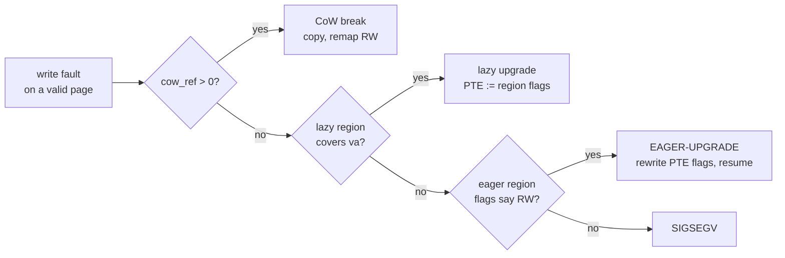
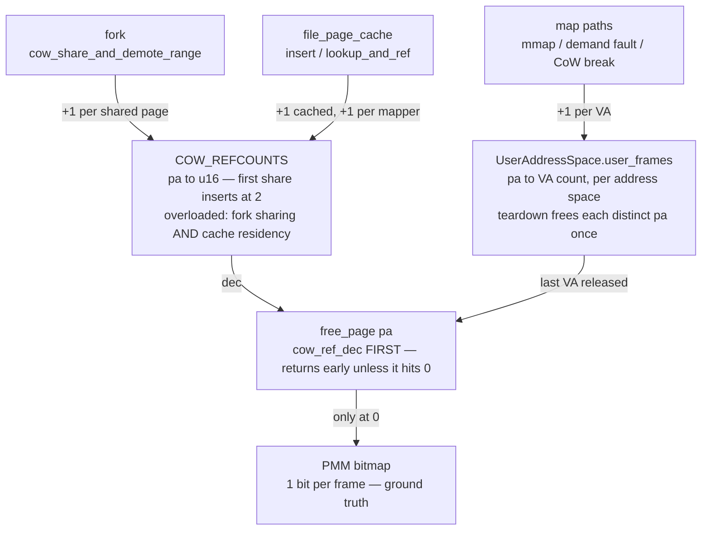
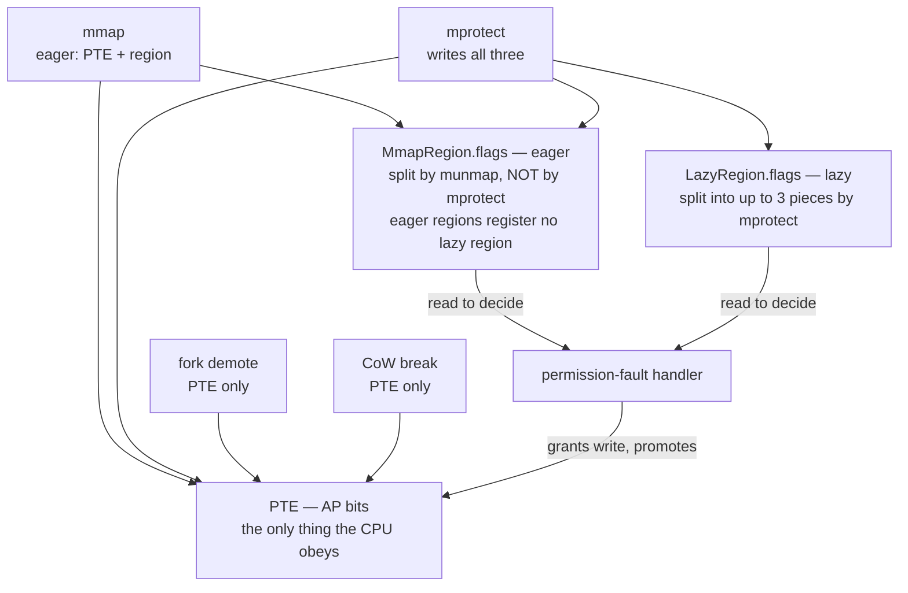
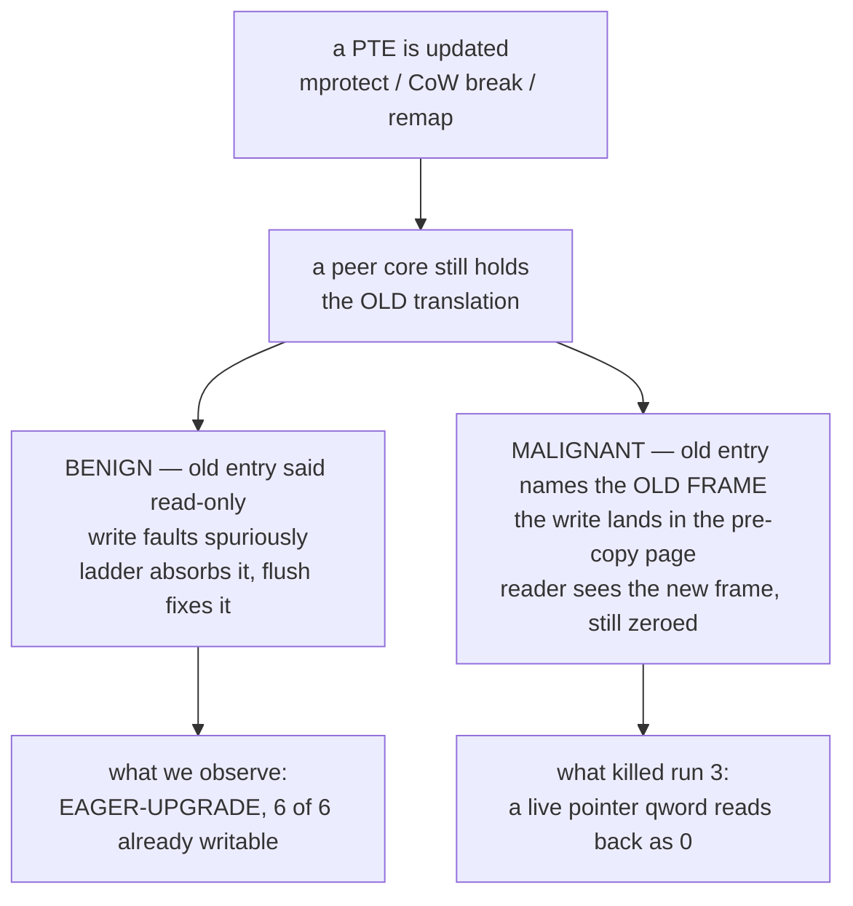

# cargo null-`Rc` — memory reference & flag audit (in progress, 2026-08-08)

Working notes for the defect in [`proposals/CARGO_HEAP_NULL_RC.md`](../../proposals/CARGO_HEAP_NULL_RC.md):
during an in-guest `-j4` self-host build, `cargo` dereferences a null `Rc` and the
build dies with `EXIT=139`. Safe Rust cannot construct a null `Rc`, so a live
pointer qword in cargo's anonymous heap read back as zero — a kernel
memory-management bug.

This is a **live investigation log**, not a conclusion. Every statement is tagged
with the evidence behind it, including the **three** theories the evidence has
already killed. Branch `stabilize-devbox`.

**Current state in one line:** the `cowstale` fault is **root-caused and fixed** —
it was never a corrupted pointer, it was the fault handler judging a write
permission fault against state a sibling thread had already moved past (§12).
Whether that was also cargo's null `Rc` is a separate question, still open.

**Active brief for continuing this work:**
[`proposals/COWSTALE_FORK_THREAD_SEGV.md`](../../proposals/COWSTALE_FORK_THREAD_SEGV.md).

> **§0.2 below is wrong and is kept only because it shaped a day of work.** The
> faulting address was a `.bss` global, not a corrupted pointer. §12 has the
> correction and how one `readelf -S` settles it.

---

## 0. The reproducer (2026-08-08, latest)

`userspace/forktest/c_stress/cowstale.c` was written to test D10's malignant face
— does a CoW break ever land a write in the wrong frame? It found something
faster: **`EXIT=139` in ~0.01 s, 8 of 8 attempts, on an idle VM with no build
load.**

```
[Fault] Data abort from EL0 at FAR=0x420260, ELR=0x400868, ISS=0x4f
[WPF] pid=7 va=0x420000 pa=0x91dac000 mapped=true cow_ref=0
      lazy_self=NONE lazy_owner=NONE have_owner=true
[Fault] Process 8 (/tmp/cowstale) SIGSEGV after 0.01s
```

`ISS=0x4f` = DFSC `0b001111`, permission fault level 3, WnR set. `[WPF] cow_ref=0
lazy_self=NONE` is the signature `src/exceptions.rs` names in its own comments as
the one that killed cargo mid-build.

### 0.1 Minimal trigger

| rounds | reader threads | result |
| ---: | ---: | --- |
| 1 | any | PASS |
| 5 | 0 | PASS |
| 5 | 1 | PASS |
| **2** | **2** | **SEGV** |
| 20 | 2 | SEGV |

**Two or more `fork()` rounds AND two or more live threads** — one fork passes,
one thread passes, both together fail. Exactly cargo's shape: a multi-threaded
process forking repeatedly.

### 0.2 The pointer lost bit 28 — WRONG, see §12

The mapping is at `0x10420000`; the faulting write went to `0x420260`, landing in
the binary's own read-only image. `x20=0x420248`, `x2=x3=0x5041524e00000000` (the
probe's own parent pattern), so this is its fill loop writing through a pointer
that came back missing `0x10000000`.

The kernel's SIGSEGV is therefore arguably *correct* — that address really is
read-only. The defect is upstream: a pointer read from the process's own memory
came back wrong. Same class as "a live pointer qword reads back as zero", which is
what kills cargo. **Whether they are the same bug is not yet established.**

### 0.3 Calibration

The identical binary **passes on real Linux aarch64** (`docker run --platform
linux/arm64 alpine /cowstale 40 32 3`, 3.9M reader-checks, 0 faults), so the
probe's semantics are sound and the failure is the kernel's.

### 0.4 Why this changes the methodology

Four consecutive green `-j4` builds were recorded during this session while
`cowstale` was failing 8/8 on the same tree. At the documented ~1-in-5 rate, four
greens in a row happen ~41% of the time with the bug fully intact. **Build runs
are not a sensitive enough instrument to answer "is it fixed".** Use the
deterministic probe.

---

## 1. The one hard correlation, from the original autopsy

In the crashing run (run 3 of 2026-08-07), the `[EAGER-UPGRADE]` repair fired on
cargo's heap page `0x314da000` **six log lines and one 10 ms tick** before the
process faulted dereferencing a pointer loaded from that same page:

```
85336: [EAGER-UPGRADE] pid=17 as_owner=17 va=0x314da000 flags=0x60000000000040
85343: [WILD-DA] pid=17 FAR=0x0 ELR=0x104e48c8 last_sc=222
         x0=0x314da660   ← ldr x8,[x0,#288] → 0x314da780, page 0x314da000
```

Those were the only two `[EAGER-UPGRADE]` lines in 86k lines of log, and both were
pid 17 (cargo) on heap pages.

### 1.1 Where `[EAGER-UPGRADE]` sits

It is the **last arm of the permission-fault ladder** — the fallback taken when
every other repair declines:



---

## 2. The two systems audited

### 2.1 Frame ownership — a frame is owned by consensus

Nothing holds *the* reference to a physical frame. Several structures hold partial
claims, and the frame survives only as long as they agree.



Every path to the bitmap runs through one gate, which makes the design sound and
the accounting fragile: one decrement too many frees a live page, one too few leaks
it. D2/D3/D4 are the places a claim can move without its partner ledger knowing.

### 2.2 Protection — recorded three times, only one is real

The CPU obeys the PTE. Everything else is a *record* of what the PTE ought to say,
and the fault handler consults those records to decide whether a faulting write is
legitimate.



**This section framed the first three theories, and all three were wrong.** The
records were never the problem — see §4.

---

## 3. What the instrumentation established

Instruments on this branch, all boot-suite tested (`src/process_tests.rs`):

| Instrument | Question it answers |
| --- | --- |
| `pmm::is_page_free(pa)` | Is the PA behind a live PTE *also* on the free list? |
| free ledger | Which thread released this frame, how recently? |
| poison quarantine (`config::PMM_UAF_QUARANTINE`) | Did anyone write through a freed frame? |
| CoW event ring + durable bitset (`config::COW_REF_LEDGER`) | Was this frame ever CoW-shared? |
| `MADV_DONTNEED` audit counters | Is that handler's divergence from Linux exercised? |
| `[MPROT-WIDEN]` | Does an `mprotect` upgrade record "writable" outside its range? |
| `[REGIONS]` | How many eager regions claim the faulting VA? |
| `[PTE]` + `ap_name` | What do the AP bits actually say? |
| `[LAZY]` | Does a lazy region also cover this VA? |
| `[TLB]` counters | How many write faults hit an already-writable page? |

### 3.1 The anomaly is common, and not fatal — OBSERVED

`[EAGER-UPGRADE]` fired in every instrumented run (1, 1, 3, 6 occurrences), and
**every one of those runs went green**. It is not the trigger.

### 3.2 Not a premature free — RULED OUT

`FREE=false`, `tracked=true`, `last_free=(tid=-1 age=-1)` at every anomaly, page
contents intact (not zeros, not poison). Independently, **`PMM-UAF=0` and
`PMM-QUAR-DF=0` across four complete 4-way self-host builds**, with the detector
proven to fire every boot.

### 3.3 D1 (`mprotect` widening) does not fire — RULED OUT

| | |
| --- | --- |
| `mprotect` calls | **3043** |
| `[EAGER-UPGRADE]` repairs | 3 |
| `[MPROT-WIDEN]` | **0** |

`update_eager_region_flags` runs constantly and never once widened an upgrade. D1
is a real latent bug (§6) but not this defect.

### 3.4 D9 (stale overlapping region) — RULED OUT

`[REGIONS] claimed_by=1` on every sample. Exactly one region claims each VA, and
its recorded flags are **correct** (`0x60000000000040` = `RW_NO_EXEC`). The record
was never lying.

### 3.5 The PTE was writable the whole time — THE REFRAME

Run 5, six anomalies, unanimous:

```
[PTE] va=0x31b5b000 raw=0x6000009c21bf4f ap=AP_RW_ALL(writable)   [LAZY] no lazy region
[PTE] va=0x3197e000 raw=0x600000d69b6f4f ap=AP_RW_ALL(writable)   [LAZY] no lazy region
[PTE] va=0x31987000 raw=0x600000d377cf4f ap=AP_RW_ALL(writable)   [LAZY] no lazy region
[PTE] va=0x31982000 raw=0x600000c3a9ff4f ap=AP_RW_ALL(writable)   [LAZY] no lazy region
[PTE] va=0x31720000 raw=0x600000c54c7f4f ap=AP_RW_ALL(writable)   [LAZY] no lazy region
[PTE] va=0x31721000 raw=0x600000c63ddf4f ap=AP_RW_ALL(writable)   [LAZY] no lazy region
```

Decoding `0x6000009c21bf4f`: `VALID`, page descriptor, `AF` set, `nG` set,
inner-shareable, `AP = 0b01` = **writable at EL0**, `UXN|PXN`. Nothing is wrong
with that entry.

**There was never a lost permission.** The page table was correct at every
anomaly. What the ladder has been absorbing is a **spurious write-permission fault
on an already-writable page** — the CPU faulted against a translation that no
longer matches memory.

### 3.6 The old repair was a TLB flush wearing a costume

`EAGER-UPGRADE` calls `update_current_user_page_flags`, which rewrites the AP bits
and then calls `flush_tlb_page(va)`. Given §3.5, the rewrite was a **no-op** — the
bits already said writable. The flush is what resolved the fault. The repair has
been working for a reason nobody wrote down, which is also why it never led
anywhere: it was treating the symptom of a stale translation as a permissions
problem.

---

## 4. Current leading theory: stale translations

A core faulting against a translation that memory has moved past explains §3.5
exactly. It is also the first theory consistent with *all* the measurements: it
needs no refcount desync, no premature free, no bad record, and no overlap — all
of which have now been ruled out.

The same root cause has a benign and a malignant face:



The malignant path is the one that matters: after a CoW break swaps in a new
frame, a thread still writing through a stale entry stores into the **old** frame,
while every reader sees the new one — which still holds the pre-copy contents. That
produces a zeroed pointer field with **no fault at the moment of corruption** and
no allocator involvement, which is precisely the signature that has resisted every
allocator-side instrument.

**What is NOT yet explained:** the broadcast invalidations look correct.
`flush_tlb_page` issues `tlbi vaae1is` and `flush_tlb_range_all_asid` /
`flush_tlb_all` issue `tlbi vaae1is` / `vmalle1is` under `kernel_smp_shared` — all
inner-shareable, so peers should see them. So the gap is not "we used a local
invalidate"; it is somewhere subtler — a path that edits a PTE and skips the flush,
one that flushes before the write is visible, or an ordering problem around the
`dsb`.

### 4.1 Prior art: the same class, fixed three days earlier

[`MPROTECT_TLB_ASID_BUG.md`](MPROTECT_TLB_ASID_BUG.md) (fixed 2026-08-05) is this
defect's mirror image and the strongest reason to take D10 seriously:

- **Then:** a `PROT_NONE`/`PROT_READ` **downgrade** did not take effect, because
  `flush_tlb_range` used `tlbi vale1is` whose ASID comes from operand bits [63:48]
  — `va >> 12` leaves those zero, so the invalidation matched nothing. Guard pages
  stayed writable; RELRO GOTs stayed writable.
- **Now:** an **upgrade** appears not to be visible on the faulting core — the
  same subsystem, the same "PTE in memory disagrees with the cached translation",
  in the opposite direction.

Two things carry over. First, that fix widened the invalidation to `vaae1is`
(VA, All-ASID) **because one L0 table can be live under several ASIDs at once** —
`UserAddressSpace::new_shared` allocates a fresh ASID while reusing the parent's
`l0_frame`, so `CLONE_VM` threads and vfork-fastpath children share a table across
ASIDs and one PTE edit has to invalidate under all of them. Any new invalidation
added while chasing D10 must respect that. Second, it establishes that this
subsystem's TLB maintenance has been wrong before in a way that stayed invisible
for a long time, because the failure mode is silent.

Its regression test — `userspace/forktest/c_stress/mprotectlb.c`, calibrated
against real Linux aarch64 — is the natural place to add an **upgrade**-direction
phase if D10 holds.

### 4.2 Deferred-flush audit — no missing flush found

Every caller of the `*_no_flush` primitives was checked for a following
invalidation:

| Site | Follows with |
| --- | --- |
| `sys_mmap` eager install | `flush_tlb_range` after the loop |
| `sys_mprotect` PTE loop | `flush_tlb_range` when any page updated |
| `sys_munmap` (all three paths) | `flush_tlb_range_all_asid` per batch |
| `madvise(WILLNEED)` prefault | `flush_tlb_range` over the whole range |
| fault-path readahead (2 sites) | `flush_tlb_range(page_va, pages_mapped)` |

So D10 is **not** a plainly missing flush. Remaining shapes to examine: an
invalidation whose *range* does not cover every page it published (the readahead
sites flush `[page_va, page_va + pages_mapped)`, which assumes every filled VA lies
at or above `page_va`), ordering around the `dsb` relative to the PTE store, and
paths that edit a descriptor through a route these primitives do not cover.

### 4.3 The experiment now running (run 6)

The `EAGER-UPGRADE` arm now checks the PTE **first**: if it already grants the
write, flush that VA and retry rather than rewriting flags. Bounded — the same VA
returning more than twice in a row logs `[TLB-STALE]` and falls through to the old
path, so it cannot spin on fault → flush → retry → fault.

Two counters in the 30 s PSTATS block:

```
[TLB] stale_write_faults=N repeats=M
```

- `stale_write_faults` — faults absorbed by a flush alone.
- `repeats` — **must stay 0**. Non-zero means flushing is *not* what resolves them
  and the reading in §3.5/§3.6 is wrong.

**A caveat this experiment does not settle.** Two readings fit §3.5 equally well:

1. **Stale translation** — the PTE was already RW and this core faulted against a
   cached restrictive entry.
2. **Benign race** — the PTE genuinely *was* restrictive at fault time, and a peer
   thread made it writable in the microseconds before the handler read it. Cargo
   and rustc are multi-threaded, so a thread faulting on a page another thread is
   concurrently `mprotect`-ing is entirely ordinary.

Both predict "flush and retry succeeds", so `stale_write_faults` alone cannot tell
them apart — under reading 2 the retry succeeds because the PTE changed, and the
flush is incidental. Distinguishing them needs the PTE sampled *at fault entry*
rather than inside the handler, or a per-VA correlation against concurrent
`mprotect` calls. Worth doing before any invalidation is "fixed", because under
reading 2 there is no kernel bug here at all — only a benign spurious fault, and
the null `Rc` is still unexplained.

---

## 5. Fixes landed

### 5.1 D8 — `munmap` now drains every region a range touches

`sys_munmap` matched a single eager region by **exact `start_va`** and returned. An
unmap starting mid-region, or spanning two, freed only the first region's pages,
reported success, and left the rest mapped with its VA never recycled. It also
never reached lazy regions whenever an eager one matched.

- Extracted `detach_eager_regions_in_range` into `akuma-exec` — pure, so the
  clipping shapes are host-testable: full / prefix / suffix / middle /
  multi-region / mid-region start / CoW-inherited (no frames) / non-overlapping /
  empty range. **9 host tests.**
- Boot self-test `munmap_spans_multiple_eager_regions` covers the kernel-side
  integration: real frames, the real region list under `vm_lock`, PMM conservation.
- Lazy regions in the range are now drained even when an eager region matched.

Verified green on a full `-j4` self-host build (run 5, `EXIT=0`, 109 crates).

---

## 6. Standing divergence points

| ID | Divergence | Status |
| --- | --- | --- |
| **D10** | Stale translations: a core faults against, or writes through, a translation memory has moved past (§4) | **Leading theory — run 6 testing** |
| D8 | `sys_munmap` matched one region by exact `start_va` | **FIXED** (§5.1) |
| D1 | `update_eager_region_flags` widens an *upgrade* across a whole region | **Latent** — 0 occurrences in 3043 `mprotect` calls; fix plan §7 |
| D9 | A stale/overlapping region shadows the live one in `eager_region_flags_for_page_fault` | **Ruled out** — `claimed_by=1` every time |
| D2 | `file_page_cache::lookup_and_ref` takes its `cow_ref_inc` **outside** the `PAGES` lock; a concurrent `invalidate_inode`/`shrink` can free the frame in that window | Suspected, not observed |
| D3 | `file_page_cache::insert`'s lost-race path returns early without inserting but still increments its own private frame | Code-visible leak |
| D4 | The three CoW-break sites call `cow_ref_dec` directly and discard the "last reference" return; if every sharer breaks, the frame is freed by nobody | Code-visible leak |
| D5 | `MADV_DONTNEED` memsets the *physical frame* where Linux drops the *mapping*, with no shared-frame check; and rounds an unaligned start **down** where Linux returns `EINVAL` | Instrumented, no data yet |
| D6 | Eager regions register no lazy region, so `MmapRegion.flags` is the handler's only repair input | Structural |
| D7 | `try_evict_ro_page` evicts *any* RO page inside a `LazySource::File` region | Suspected |

---

## 7. D1 fix plan (deferred — latent, not this defect)

`update_eager_region_flags` sets `reg.flags = new_flags` on every overlapping
region without splitting. Its doc comment's safety argument holds for a
*downgrade* and is silently applied to *upgrades*, which records "writable" for
pages outside the call.

| | Approach | Cost | Risk |
| --- | --- | --- | --- |
| **A** | Refuse to widen an upgrade; leave the more restrictive record | ~5 lines | Record stays conservative, so a page needing repair could take the SIGSEGV `EAGER-UPGRADE` exists to prevent |
| **B** | Split into up to 3 pieces, as `LazyRegions::update_flags` and `sys_munmap` already do | Moderate | Grows the region count on an O(n) scan |
| **D** | Optional per-page flags vector, allocated only on a partial `mprotect` | Moderate | New field on a struct built in 5 places |

**Recommendation: B.** The comment's justification — "splitting would have to split
`frames` in step" — is contradicted by `sys_munmap`, which does exactly that, and
whose splitting logic is now the shared, tested `detach_eager_regions_in_range`
(§5.1). Its prerequisite (the munmap range loop) is already done, so B is now
mostly a matter of reusing that helper for the flags case, plus:

1. Extract `split_region_for_flags` alongside it, covering the CoW-inherited case.
2. Wire it in behind a runtime toggle (`set_eager_flag_split_enabled`, default on)
   for a same-binary A/B per `docs/reference/subsystems/locking.md` rule 5.
3. Coalesce adjacent identical-flag regions to bound growth — **after** confirming
   `sys_mremap`'s exact-`start_va` lookup can cope, since merging moves keys.
4. Boot self-tests: prefix/middle/suffix extents and flags, frame conservation,
   full-cover still updates in place, pages outside the call keep their old flags.

---

## 8. Ruled out

- **Premature free / use-after-free** (§3.2).
- **`mprotect` upgrade widening (D1)** as the cause of the observed anomalies (§3.3).
- **Stale overlapping regions (D9)** (§3.4).
- **A lost permission of any kind** (§3.5) — the PTE was writable at every anomaly.
- **`ENOSYS`/errno-as-pointer** — the crashing run's syscall ring contains zero
  `ENOSYS`/`EFAULT`/`EINVAL` results; the only negative result is `-110`
  (`ETIMEDOUT`) from `futex`. The fault also has `FAR=0x0` with the null loaded
  *from memory* (`ldr x8,[x0,#288]`), not from `x0` after an `svc`.

---

## 9. Noise, and things not to chase

- `[BKL] stuck tag=511` storms — known separate class, hundreds per build.
- Two boot-suite tests fail on this branch **and on a pristine tree**
  (`thread_slot_reclaim_on_spawn` `hot_reclaim=206/208`, `retired_reclaim_ab`
  recovering 745p against a 768p threshold). Verified by stashing all changes and
  re-running: identical failures, identical 745p. Pre-existing, unrelated.
- The single-core `release` boot suite stalls in the same place with and without
  these changes (~3130 lines, after `drivers-bkl-drop`). Also pre-existing.

---

## 10. Instrument hazards learned the hard way

- **`free_page` must not call `read_current_pid()`.** It resolves through
  `THREAD_PID_MAP` and the process table, and `free_page` is reachable from inside
  both (a `Process` drop frees every frame of its address space) — a non-reentrant
  `Spinlock` deadlock that wedged the first instrumented boot at 554 lines. Record
  `current_thread_id()` instead; it is a register read.
- **The quarantine must surrender its hold-back before an allocation fails.**
  `quarantine_drain_all` sits on `alloc_page`'s pressure ladder so 512 parked
  frames can never be the reason a build OOMs.
- **A "no record" sentinel must not print as a plausible number.** The first
  version printed `last_free=(tid=4294967295 age=38240)`, where the age was
  computed against a default seq of 0 — a large number that reads exactly like a
  real, innocent age. It now prints `-1` with the meaning on the line.
- **A ring is not a record.** `cow_share_and_demote_range` emits one event per
  shared page, so one fork of a large process evicts a 4096-entry ring entirely;
  "no events" meant nothing until a durable one-bit-per-frame record backed it.
  That bit is per *frame* and since boot, so a set bit can belong to a previous
  owner — the clear direction is the strong one.
- **Index instruments the way the subject indexes itself.** The first bitset used
  absolute PAs where the PMM bitmap is relative to `base_addr`, so it silently
  recorded nothing. Caught only because the self-test used a real managed frame; an
  earlier version used a synthetic address and passed against a dead instrument.
- **Print the field that discriminates, not the field that is easy.** Three
  theories died only after `[PTE]` printed the AP bits. `FREE=`, `cow_ref=`,
  `tracked=`, `claimed_by=` all pointed at "something took this page's permission
  away" — and the permission had never been taken away. One decoded field settled
  what four indirect ones could not.

---

## 11. Next steps

Now driven by [`proposals/COWSTALE_FORK_THREAD_SEGV.md`](../../proposals/COWSTALE_FORK_THREAD_SEGV.md).
Highest-value first step: wire `print_page_forensics` into the `[WPF]`/SIGSEGV
path, since that is where the deterministic reproducer lands and it would
immediately say what is mapped at the faulting VA with no region record.

0. **Run 6 verdict (done)**: `stale_write_faults=3`, `repeats=0`,
   `EAGER-UPGRADE=0` — flushing alone resolved every one, confirming §3.6's
   mechanical claim. It does **not** separate "stale translation" from "benign
   race" (§4.3 caveat).
2. If confirmed, audit every PTE-editing path for its invalidation: which ones
   flush, when relative to the write, and with what barrier. The broadcast
   instructions themselves are correct, so look for a missing flush or an ordering
   gap rather than a wrong opcode.
3. Keep the TLB-only repair regardless — it is strictly more honest than rewriting
   flags that are already correct, and its counters make the condition visible.
4. Close D3/D4 (code-visible leaks) and decide on D5.
5. D1 (§7) whenever convenient; its prerequisite is now done.

## 12. The `cowstale` fault, solved (2026-08-08)

**It was never a corrupted pointer.** The fault handler was killing processes for
writes the page table already permitted.

### 12.1 The correction: `0x420260` is a `.bss` global

§0.2 read `FAR=0x420260` against the mapping at `0x10420000`, saw the difference
as `0x10000000`, and concluded a pointer had lost bit 28. One `readelf` refutes it:

```
$ aarch64-linux-musl-readelf -SW cowstale | grep -E '\.data|\.bss'
[10] .data  PROGBITS  0000000000420000  010000  000210  WA
[11] .bss   NOBITS    0000000000420210  010210  000708  WA
$ aarch64-linux-musl-readelf -sW cowstale | grep 42024
46: 0000000000420248  8  OBJECT  LOCAL  g_map
49: 0000000000420260  8  OBJECT  LOCAL  g_reader_checks
```

`FAR` is `g_reader_checks`. `x20 = 0x420248` is `&g_map` — the base the compiler
kept for the whole `.bss` block, not a data pointer. And the instruction:

```
$ aarch64-linux-musl-objdump -d --start-address=0x400868 cowstale
400868: f9000e80  str x0, [x20, #24]      ← inside reader()
```

`0x420248 + 24 = 0x420260`. It is `g_reader_checks++`. Every register in the
`[Fault]` block agrees: `x2 = x3 = 0x5041524e00000005` is `parent_word(5)`, the
value the reader loop compares against.

The resemblance to the mmap base was coincidence — `mmap` returned `0x10420000`,
and both addresses carry `0x420000` in their low bits. **A write to a global is a
legal write; the SIGSEGV was the kernel's error, not the program's.**

### 12.2 Root cause: a write fault judged against state that moved on

`fork` demotes the whole address space to read-only (`cow_share_and_demote_range`).
Every thread that then writes the same page faults at once. The first one through
`fault_slot_acquire` breaks CoW: new frame, PTE rewritten RW, `cow_ref_dec`. The
threads behind it are serialised on that same slot and arrive holding a fault for
a write that is now perfectly legal — and nothing downstream can say so:

| repair path | why it declines |
| --- | --- |
| CoW break | re-reads the PTE, gets the **new** PA, `cow_ref_get == 0` — the winner consumed the reference |
| lazy-region upgrade | no lazy region: an ELF segment is not a lazy mapping |
| eager-region upgrade | no eager region either — **`mmap_regions` only ever records `mmap`**, never the image the loader placed |

So the loser falls through to SIGSEGV, and because it is a `CLONE_VM` sibling,
`exit_group` takes the whole process with it.

The structural half of this is worth stating on its own: **an ELF `.data`/`.bss`
page has no region record of any kind**, so it has exactly one recovery route
after a fork demote, and that route is single-use per reference. Every other
mapping in the system has a second chance; image pages do not.

### 12.3 The evidence

`[WPF]` gained `eager=`, `pte=` and `ap_rw=` (`print_write_perm_fault_diag`). The
decisive field is the last one:

```
[WPF] pid=8 as_owner=8 va=0x420000 pa=0x79bf8000 mapped=true cow_ref=0
      lazy_self=NONE lazy_owner=NONE eager=NONE pte=0x60000079bf8f4f
      ap_rw=true have_owner=true free=1860727
```

`pte & AP_MASK == AP_RW_ALL`. **The page table granted the write at the moment the
kernel decided to kill the process.** Not a lost permission, not a bad frame — a
fault evaluated too late, against a page someone else had already repaired.

Confirmed at the mechanism, not just the outcome: a temporary trace in the absorb
path printed four *different* tids absorbing on `va=0x420000` in one run — the
losing-threads-on-the-`.bss`-page story, directly observed.

### 12.4 The fix

`stale_write_fault_absorbed`, first thing in the write arm of the EL0 permission
fault: re-read the PTE; if it already grants EL0 write, invalidate and let the
instruction re-execute. This is the re-check every SMP kernel needs — Linux does
the same under the page-table lock (`pte_same`).

Bounded on **(VA, PTE)**, not VA alone. The old `stale_tlb_repair_applies` keyed
on VA and gave up after 2 consecutive hits, which is wrong here: a thread faults
on the same global's page every fork round, forever. A *changed* PTE means real
work happened in between (a CoW break installed a new frame), so the budget
restarts; an *unchanged* PTE means retrying is not clearing it, and only then does
it decline and let the normal repair run. That call is now the only one — the copy
inside the eager-region arm was unreachable for the mappings that needed it.

### 12.5 Numbers

Same tree, same boot parameters, one variable:

| probe | pristine | fixed |
| --- | --- | --- |
| `cowstale 5 8 3` | **10/10 SEGV** | 0 SEGV |
| `bssfork 20 3` | **8/8 SEGV** | 0 SEGV |
| `bssfork 1 3` | **5/25 SEGV** | 0 SEGV |
| full `cowstale` matrix (9 shapes) | — | 0 SEGV, ~25 runs |

Note the third row against §0.1's "1 round → PASS": one fork round is enough, and
the original table read a probability as a threshold.

### 12.5a It needs two cores

The same pristine kernel, same probe, only `SMP` changed:

| | `bssfork 20 3` |
| --- | --- |
| pristine, **SMP=1** | **10/10 PASS** |
| pristine, **SMP=4** | **8/8 SEGV** |

Which is what the mechanism predicts: the loser of the race has to be *executing*
its own fault while the winner holds the page's fault slot, and on one core the
holder runs to completion first. So single-core builds (`cargo run --release`) were
never exposed to this — it is a `smp-shared` / devbox / self-host defect only.

Caveat on how far that goes: **wider shapes are not measurable at SMP=1**, because
the probe's workers are CPU-bound and never sleep, so 4+ of them on one core starve
sshd and every result comes back empty. That is the probe's shape, not a kernel
finding, and it is why the table above stops at 3 threads.

Boot self-test: `test_stale_write_fault_absorbed` (`src/process_tests.rs`) drives
the decision against a scratch address space — absorb when the PTE grants the
write, decline for RO, decline for unmapped, exhaust the budget on an unchanged
PTE, and get a fresh budget when the PTE changes.

### 12.6 New probe: `bssfork`

`userspace/forktest/c_stress/bssfork.c` — the defect with nothing else attached:
T threads incrementing adjacent `.bss` counters (one page, so they contend) while
the main thread forks. No mmap, no patterns. PASSES on real Linux aarch64
(`docker run --platform linux/arm64 alpine /bssfork 20 8`).

### 12.7 Open: the storm behind the fix

> **RESOLVED 2026-08-08 — and two claims below are wrong.** The storm was a lost FIFO
> ticket in the BKL (a barge consuming a waiter's serving slot), fixed; 30 runs of
> `bssfork 20 3 1` went 140 `[BKL] stuck` / 25 `advanced-lost` → 0 / 0. Current-state
> writeup: [`../reference/subsystems/locking.md`](../reference/subsystems/locking.md)
> -> "The FIFO ticket invariant".
>
> The two errors, kept visible because both are easy to repeat: (1) the `tag=511`
> reading below is unsound — `set_profiling` is only enabled by the `bkl-profile`
> feature, every tag-writing function early-returns when it is off, so `tag=511` on a
> normal build means "profiler off" and narrows nothing. The proposed `HOLD_TAG_SPAWN`
> discriminator would have printed 511 either way and "falsified" the hypothesis
> regardless of its truth. (2) The informative field was `owner=`, printed on the same
> line all along: `owner=0` says the lock was **free** while cores spun, which is a lost
> ticket, not an owner in a spawn path. The original text is left unedited below.

At sustained multi-threaded fork load the VM drops into the `[BKL] stuck tag=511`
storm — no `[WPF]`, no SIGSEGV, `stale_write_faults`/`repeats` both 0. Every
occurrence is immediately preceded by:

```
[identity] WARNING: THREAD_PID_MAP pid not ACTIVE in process table
           — tgid degraded to own pid (futex keys may not match wakers)
```

which is the **pre-existing** ACTIVE→RETIRED window documented at
`crates/akuma-exec/src/process/children.rs:392` (counter `TGID_RESOLVE_MISSES`),
whose own comment records that it had never been confirmed to fire. Fixed kernel:
3 hits / 25 runs, `RECOVERED` never. Pristine, same load: 0 hits, 46 transient
stucks, 13 recoveries — but pristine dies of *this* defect long before it can
sustain the load, so that is not a clean A/B.

**Settled: the storm is pre-existing and load-driven, not this fix.** `bssfork`
gained a `spread=1` mode — same threads, same fork churn, one page per thread, so
no two threads ever fault on the same page — which finally makes the load runnable
on *both* arms (nothing contends, so the unfixed kernel doesn't die of §12.2 first):

| `bssfork 20 3 1`, 15 runs | `[BKL] stuck` lines | absorbed write faults |
| --- | ---: | ---: |
| pristine `f9ef0b7` | 7842 | n/a |
| + this fix | 10959 | **0** |

Both storm on the identical load, and the fixed kernel storms with its new repair
path provably never firing (`stale_write_faults=0`). So the fix is not the cause;
the earlier `[identity]` correlation was coincidence (the storm also occurs with
zero identity hits). What *is* new is a trigger: this race had no reproducer, and
`bssfork` at >=3 threads produces it in ~0.1 s. `TGID_RESOLVE_MISSES` and the
`children.rs:392` window remain worth chasing on their own.

**It is not probe-only.** Round 6 of the `-j4` campaign (§12.8) — a plain
`cargo build -j4`, no probe anywhere — produced **52,738 `[BKL] stuck` lines** and
ate a 90-minute budget, after five consecutive 181 s greens. This is the stability
ceiling for multi-threaded-fork workloads, not a probe artifact.

#### What `tag=511` actually narrows it to

`511` is `HOLD_TAG_UNKNOWN`, and reading it as "the owner is somewhere that doesn't
stamp a tag" is too weak. Follow the value:

- `ThreadTagTable::new()` starts every slot at `HOLD_TAG_UNKNOWN`.
- `reset_thread_tag(tid)` (`sync.rs:398`) puts a slot *back* to it, and has exactly
  one caller: `threading/mod.rs:959`, when a slot is **claimed for a new thread** —
  deliberately, "so a recycled slot cannot lend its predecessor's tag to a waiter".
- A waiter samples `HOLDER_TAG[owner_core]`, which tracks the running thread's tag.

So `owner=N tag=511` most likely means **the BKL owner is a thread in its spawn
path that has not yet made a kernel entry to stamp a tag** — a freshly claimed
slot. That is a short list of code, not the whole kernel.

It fits the onset evidence: every capture begins during thread churn
(`[threads] new high-water`, `[Cleanup] Thread N recycled`, `[TERM]`), and the
storm's other signature is that `[BKL] RECOVERED` never fires afterwards.

Hypothesis to test first, stated so it can be falsified: *a newly spawned thread
holds the BKL across its startup path and, under churn, fails to release it.* The
cheap discriminator is to stamp a distinct tag (e.g. `HOLD_TAG_SPAWN`) at the point
a claimed slot first takes the BKL — if storms then report that tag instead of 511,
the owner is confirmed and the window is bounded to that path. If they still report
511, this reading is wrong and the owner is genuinely untagged code.

Caveat kept explicit: the tag is a *diagnostic*. A wrong or stale tag cannot wedge
anything by itself — the wedge is the BKL not being released. The tag only names
the suspect.

### 12.8 The `-j4` oracle was unusable, for an unrelated reason

Question 1 needs ~15 clean builds. Not one completed: builds ran **over an hour**
and VMs appeared to wedge. Cause was not the kernel under test but the console —
three per-event traces printing unconditionally at ~270 KB/s through one shared
UART, with four cores contending for its lock. Gated (default off), the same clean
101-crate `-j4` self-host build finishes in **2m21s, `EXIT=0`**. Full writeup:
[`SERIAL_TRACE_TRAFFIC_AUDIT.md`](SERIAL_TRACE_TRAFFIC_AUDIT.md).

> **CORRECTION 2026-08-08 — the "silent wedge" rows below are a SEPARATE DEFECT,
> not the BKL.** They were root-caused as a `TALC`↔`PMM` lock cycle:
> `BitmapAllocator::alloc_pages` allocated a `Vec` while holding `PMM`, and the
> kernel heap's growth path (`PmmOomHandler::handle_oom`) takes `PMM`. Captured
> live with `scripts/lockprobe.py`: both lock bytes `0x01`, every core in a spin
> loop, **BKL idle** (`owner=0`, ticket queue balanced). Fixed; writeup at
> [`PMM_TALC_LOCK_CYCLE_SILENT_WEDGE.md`](PMM_TALC_LOCK_CYCLE_SILENT_WEDGE.md).
>
> This matters for reading the table: grouping the storm and the wedges as one
> "storm/wedge class" made the BKL look like the stability ceiling. A 25-round
> re-run on 2026-08-08 (after the BKL ticket fix) split 18 GREEN / **6 silent
> wedges** / 1 storm — the wedge is the common case and never touched the BKL.

**Campaign result — 15 rounds, fresh VM each, full `rm -rf target` clean build:**

| outcome | n | note |
| --- | ---: | --- |
| `GREEN` (`EXIT=0`, 101 crates) | **11** | 180–181 s every time, no variance |
| `EXIT=139` — the defect under test | **0** | |
| BKL storm (round 6) | 1 | 186 584 `[BKL] stuck` lines |
| silent wedge (rounds 9, 13, 15) | 3 | console dies mid-build; **not** a heap runaway — green rounds peak *higher* (418–424 MB vs 258–328 MB) |

So the `-j4` oracle is finally usable, and it says: **zero `EXIT=139` in 11
completed builds.** Against the documented ~1-in-5 rate that is `0.8^11 = 8.6%`,
i.e. ~91% confidence the rate is now under 20% — short of the ~95% the brief asked
for, and honestly reported as such. Getting the rest needs the storm/wedge class
fixed first: **4 of 15 rounds (27%) died of it**, and that is now the thing
stopping a clean campaign, not the defect this document is about.

Two lessons for this investigation specifically:

- **A wedged VM prints nothing**, and a console-starved VM also stops answering
  ssh, so those two states are indistinguishable from an ssh probe. One poll loop
  in this session waited an hour on a VM that had died 60 seconds in. Check the
  console log's *size* growing (`PSTATS` every 30 s), never ssh reachability.
- §0.4's "build runs are not a sensitive enough instrument" was right for the wrong
  reason. It isn't only the ~1-in-5 rate — the instrument itself was mis-calibrated
  by 25× in wall-clock, which is what made 15 runs look like days of work.

### 12.9 Question 1: probably a different bug

The build statistics (§12.8) are consistent with "fixed" but cannot prove it —
0 of 11 at ~91% confidence. The mechanism argument is the stronger evidence, and
it points the other way: the two failures do not compose.

| | this defect | cargo null `Rc` |
| --- | --- | --- |
| what userspace observes | a **fatal signal** at an apparently-illegal write | a pointer qword that **reads back zero**, silently |
| memory contents | never touched — the absorbed write lands in the correct frame | corrupted |
| fault at the moment of damage | yes, that *is* the event | **none** |

There is no path by which "a legal write is wrongly refused" zeroes a qword. If
they were the same bug, cargo's crash would be a SIGSEGV *at the store*, not a null
deref discovered later — and §1's autopsy decoded the latter (`ldr x8,[x0,#288]`
with `FAR=0`). So `CARGO_HEAP_NULL_RC.md` most likely still needs its own handle.

The one thread connecting them is worth keeping: §1's `[EAGER-UPGRADE]` on cargo's
heap page, 6 lines before the null read, is now known to be the *same stale-write-
fault race* (§3.5 already proved the PTE was writable). So cargo demonstrably hit
this race — it just survived it, because heap `mmap` regions have an eager record
to repair from and `.bss` pages do not. Whether the losing thread's absorbed write
is where the zero came from is the question that remains, and it is a question
about the CoW break's *copy*, not about the permission.

---

## 13. 2026-08-12 session: still live, two new symbolized PCs, "zeroed page" theory falsified

Picked the bug back up on the current tree (HEAD `cf03840`, kernel built the same
day). Booted `devbox-smoltcp` at `SMP=4 MEMORY=4096 SNAPSHOT=1` (the standard
devbox, not `disk_selfhost.img`), populated `/.cargo` with `/usr/bin/cargo fetch`
(per [`../userspace/SELF_HOSTING_USERSPACE.md`](../userspace/SELF_HOSTING_USERSPACE.md)
§3 — nightly cargo's networking is still broken), and drove five cold
`bash build.sh --sshd-only` runs against `/tmp/akuma/userspace`.

### 13.1 Reproduction rate

**1 of 4 cold builds crashed** (the fifth never started — the loop was satisfied
after the 4th rc was logged). All green runs rebuilt in ~3 s warm; cold runs
were 27-28 s. So on a *userspace* self-host (lighter than the kernel `-j4`
campaign in §12.8) the rate is on the order of 25 % — higher than the §12.9
"probably fixed" reading of 0/11 at ~91 %, but a different workload on a
different disk. Treat the §12.8 oracle as unanswered, not as evidence of
regression.

The crash always lands **after** `Finished release profile [optimized]` and
**after** the ELF is on disk (verified — `target/.../release/sshd`, 106992 B,
fresh mtime, byte-identical to the next attempt's green ELF). cargo dies
walking its `Unit` graph to free it; that is when it dereferences the most
pointers and statistically surfaces the corruption. This matches the
[`../userspace/SELF_HOSTING_USERSPACE.md`](../userspace/SELF_HOSTING_USERSPACE.md)
§4b "trap": `build.sh`'s `set -e` aborts before the `cp` into `bootstrap/bin`,
so the failure looks worse than it is.

### 13.2 Two new crash PCs symbolized (same cargo subsystem, different Drop impls)

cargo was pulled out of the live disk with `scripts/ext2read.py` (snapshot=on,
so the running VM is not perturbed). Both crash instances are in cargo's own
drop glue, both with near-null `FAR`, but at **different functions** — i.e. the
corruption surfaces wherever cargo happens to walk next, not at one buggy site.

**Crash 1** — pid 151, `FAR=0x0`, `ELR=0x107d7bc4` → file offset `0x7d7bc4`:

```
hashbrown::raw::RawTable<cargo::compiler::unit::Unit>
  ::<core::ops::drop::Drop as Drop>::drop:
    7d7bbc:  sub  x0, x22, x8          ; compute bucket slot addr
    7d7bc0:  ldr  x8, [x0, #-0x8]!     ; load the Rc<UnitInner> pointer from the bucket
    7d7bc4:  ldr  x9, [x8]             ; FAULT — x8 == 0
    7d7bc8:  subs x9, x9, #1           ; (decrement strong refcount)
    7d7bd4:  bl   Rc<UnitInner>::drop_slow
```

Same `Rc<UnitInner>` refcount-decrement path as the original §0 autopsy
(`0x4e48c8`), just the hashbrown-bucket wrapper instead of the direct field at
`+288`. Same cargo subsystem (`cargo::compiler::unit`).

**Crash 2** — pid 1280, `FAR=0x21`, `ELR=0x114d1ad4` → file offset `0x14d1ad4`:

```
<semver::identifier::Identifier as core::ops::drop::Drop>::drop:
    14d1ad4:  ldr  x8, [x0]            ; FAULT — x0 == 0x21 (self is junk)
    14d1ad8:  cmn  x8, #0x2            ; (niche check: Identifier::Numeric ?)
```

Drop was called with `self == 0x21`. That is the **caller**'s fault, not
`Identifier::drop`'s: some upstream drop chain computed `&parent.field` and
the address came out as `0x21`. The cheapest explanation is a corrupted
`Vec`/slice pointer in a parent type (`Vec<Comparator>` / `Vec<VersionReq>`
both contain `Identifier`s) — `vec.ptr + 0` reading back as `0x21` would
propagate exactly this shape. Different Drop impl, different cargo subsystem
(semver, a transitive dep) — but the same general "a qword that should hold a
pointer is holding a small integer" class as crash 1's NULL.

`0x21` itself is suggestive: small but non-zero, plausibly a talc free-list
size-class tag, an enum discriminant, or a length byte. Different garbage each
crash (`0x0`, `0x21`) is itself a finding — a deterministic store would
reproduce the same value.

### 13.3 What the [WILD-DA] forensics say — and a theory that dies

The kernel's `print_page_forensics` (running on every `[WILD-DA]` since the
§3 instrumentation landed) dumped `[x0]`/`[x19]` for both crashes. Both
surrounding pages had **real cargo heap content**, not zeroed bytes:

```
crash 1 [x0]  va=0x305e6000 pa=0x87d0f000 ... head=0xfffffffffffffffe,0x100000001,0x101,0x304abb90
crash 1 [x19] va=0x301d4000 pa=0x87cf9000 ... head=0x11f46108,0x1e00000000013,0x0,0x1a00000000000
crash 2 [x1]  va=0x308cf000 pa=0xa5732000 ... head=0x4b505f4f47524143,0x454d414e5f47,0x0,0xff000000000e
                                    head decoded as ASCII (LE): "CARGO_PKG_NAME..."
```

The `0xfffffffffffffffe` sentinel and `0x100000001` refcount pair in crash 1
are exactly talc's bucket-header pattern; the `"CARGO_PKG_NAME"` in crash 2 is
cargo's env-var block mapped into a heap-adjacent page. **The pages are not
zeroed.** So the original CARGO_HEAP_NULL_RC hypothesis #1 in its weak form
— "page management handed back a zeroed page" — is wrong. What is being
corrupted is a *specific qword field* inside an otherwise-live page.

That sharpens the suspect list. The write that zeroes the qword must be:

1. A wild/stale pointer store **through the live page's VA** (the kernel page
   tables for both crashes were correct: `ap=AP_RW_ALL(writable)` on the
   crash-1 victim, the page was `FREE=false tracked=true cow_ref=0`, and the
   `last_free=(tid=11 age=2375)` ledger shows it was freed and re-allocated
   legally 2.3 s before the fault). Nothing in the kernel forensics points at
   page management.
2. **OR** an in-process use-after-free inside cargo's own talc arena — talc
   writes free-list metadata (next-pointers, size-class tags) into freed
   slots, and those metadata bytes look exactly like the values we see
   (`0x0` end-of-list, small-integer tags). Note this is *cargo*-process UAF,
   which §3.2 did NOT rule out: §3.2's poison quarantine proves no
   **kernel-PMM** double-owned frames; it says nothing about cargo's own
   allocator handing the same address twice inside one process.

Both fit the evidence so far. Distinguishing them is the next step.

### 13.4 What this session rules in and out (delta vs §12)

| | status after 2026-08-12 |
|---|---|
| §2f foreign-page-tables / §2g THREAD_STATES races / §2h trampoline (the other "open" classes the SELF_HOSTING_USERSPACE doc said were open) | **RULED OUT for this crash.** Across the two crashes: 0 `[TTBR *-MISMATCH]`, 0 `[TRAMP-MISMATCH]`, 0 `[RELR]`, 0 `AS MISMATCH`, and `ttbr0_live == ttbr0_proc == expected_l0` on both faulting threads. The §2g/§2h fixes appear to have held; only Defect B fires today. |
| §3.2 PMM-level UAF (kernel handing the same frame to two owners) | **Still ruled out.** Forensics on both crashes: `FREE=false cow_ref=0 tracked=true`, single owner, content intact. |
| §12 cowstale / "stale write fault" race | **Still ruled out for this crash.** Both faults are reads (`FAR=0x0`, `FAR=0x21`), `ISS=0x7` (data abort, level 3, WnR=0), no `[WPF]` line. The cowstale fix did not address this and was not expected to. |
| Original hypothesis: "kernel zeroed a whole page" | **RULED OUT** (§13.3 — pages have real content, only a qword is corrupt). |
| Cargo-process UAF (talc metadata read after free) | **LIVE.** Fits both crashes; not covered by §3.2's kernel-level quarantine. |
| Wild pointer store through the live VA | **LIVE.** Forensics consistent with it; would surface exactly this way. |
| §1's `[EAGER-UPGRADE]` correlation | **RULED OUT as a necessary precursor.** Zero `[EAGER-UPGRADE]` lines across the whole boot that produced both crashes — the 2026-08-07 "hard correlation" does not hold for the 2026-08-12 crashes. Either the two are different sub-classes (§12.9 already raised this), or `[EAGER-UPGRADE]` was a secondary symptom in 2026-08-07, not the cause. The latter is more likely: this crash is a *read* of a corrupted qword, with no permission/CoW anomaly in the window. |

### 13.5 SIGSEGV did not tear down cargo's thread group (live-zombie threads) — ROOT-CAUSED AND FIXED 2026-08-12

> **Resolved later the same day.** The cause was **not** the `is_shared()` gate the
> text below points at — that gate is real and was removed, but
> `return_to_kernel` calls `kill_thread_group` for a non-shared process anyway, so
> it alone cannot explain the leak. The actual defect is an **ordering race**, and
> the serial log named it. Root cause, fix and the A/B are in §13.5a; the original
> text is kept unedited below because its *evidence* was right and only its
> mechanism was wrong.

The `[THR-DUMP]` and `[FUTEX-DUMP]` blocks (one every 30 s) reveal a real
kernel defect that is **not the cargo null-Rc bug** but travels with it.
When cargo pid 151's main thread (tid 14) took the data abort at T219.55,
the kernel delivered SIGSEGV to its handler (`[signal] deliver sig=11
slot=14 handler=0x1165a174`), and on `sigreturn` the fault retried and
faulted again — but **the process did not die**. Per POSIX, an unhandled
SIGSEGV (or one whose handler returns and re-faults) must tear down the
whole thread group via `exit_group`. The kernel only killed the parent
bash wrapper (`[PROC-EXIT] pid=148 ... code=139`); cargo pid 151 itself
never produced a `[PROC-EXIT]` line, and its sibling threads tid 12, 13,
22, 29 kept running.

Every 30 s PSTATS dump from T300 to T570 (~5 minutes after the crash)
still lists them under `tgid=151`, parked in futexes at
`uaddr=0x304b47b8` and `uaddr=0x308e4428`, with `cpu_us` climbing
steadily (tid 12 went 42718 → 45485 → 47617 μs across three dumps). They
are waking periodically (futex timeout) and burning CPU — they are not
frozen, they are live zombies.

**Why this is not the cargo null-Rc cause** (despite looking like one):
attempt 1 of the cold-build loop in §13.1 crashed on a *fresh boot* with
no prior cargo crash to leak zombies from. So the cargo heap corruption
does not require zombies to be present. They are a separate kernel bug
worth fixing in its own right (the `kill_thread_group`/SIGSEGV-default
path is failing to clean up sibling threads when the signalled thread
takes a default-action path).

**Why it could still matter indirectly:** the zombies hold address-space
state (their L0 at `0x81861000`, pipe/futex references, file
descriptors) that the kernel cannot reclaim. Under a build loop this
accumulates: each crashed cargo leaks a fresh set. Whether the resulting
memory pressure changes the corruption *rate* in a measurable way is an
open A/B — see §13.7.

The bug shape resembles `kill_thread_group`'s grace-expiry branch, which
`../archive/GRACE_EXPIRED_HARD_KILL_ORPHANS.md` fixed for a different
symptom (the `[FUTEX_WAIT]` stall in `-j4` self-host). Re-reading that
doc against this evidence is the next step before adding new
instrumentation.

### 13.5a Root cause: the fault path notified the parent before reaping the group

**The `is_shared()` gate is a red herring on its own.** `return_to_kernel` *does*
call `kill_thread_group` when the exiting process owns its address space
(`process/mod.rs`, `if !is_shared && l0_phys != 0`). So "the main thread skips
`exit_group`" does not by itself orphan anything. The question the log answers is
why that call never ran.

#### The evidence: a missing line

`[KTG] my_pid=…` is printed unconditionally at the top of `kill_thread_group`
(rate-limited to 512; only 156 had been spent when crash 1 landed). Both crashes:

```
[Fault] Process 151 (/usr/local/bin/cargo) SIGSEGV after 28.33s
[TERM] tid=14 pid=Some(151) by_tid=18 state=1 … at process/table.rs:194
[T219.58] [PROC-EXIT] pid=148 tgid=148 name=/bin/bash code=139
[KTG] my_pid=148 my_tgid=148 by_tid=18 code=139 siblings=0 first=None
```

There is **no `[KTG] my_pid=151`**, and no `[PROC-EXIT] pid=151`. The thread that
terminated cargo's tid 14 was `by_tid=18` — *bash's* thread, from
`unregister_process`. pid 1280 reproduced it identically at T520.78 with
`by_tid=10`. cargo never ran any of its own teardown.

#### The mechanism

The EL0 fault path did this, in this order:

1. `notify_child_channel_exited_pub(pid, -11)` — wakes the parent's `wait4`
2. `return_to_kernel(-11)` — whose `kill_thread_group` call is *inside* a block
   guarded by `if let Some(proc) = current_process_shared()`

Between 1 and 2 the parent reaps us on a peer core. `lookup_process_shared` only
matches **ACTIVE** slots, so the now-RETIRED row resolves to `None`,
`return_to_kernel` takes its `pid = None` branch, and skips the **entire** cleanup
block: no `cleanup_process_fds`, no `kill_child_processes`, no
`kill_thread_group`, no `unregister_process`. Every `CLONE_VM` sibling is
orphaned — never terminated, never reaped, parked in `FUTEX_WAIT` with a live
`Process` row and a pinned address space.

This is the **same race `sys_exit_group` already documents** as load-bearing, and
fixed for the `-j4` self-host deadlock (§7g/§7h): *"Reap sibling threads BEFORE
notifying the parent. ORDERING IS LOAD-BEARING."* The EL0 fault path never got
that treatment. The EL1 abort path (`exceptions.rs`, EC=0x25) already had it —
`kill_thread_group` then notify — so the fault path was the lone outlier.

#### The fix

Every fatal-default-signal terminal path in `rust_sync_el0_handler` now routes
through one helper, `fatal_signal_group_exit`, which is `sys_exit_group_pub`:

```text
kill_thread_group  ->  fds.close_all  ->  notify parent  ->  self-terminate
```

Six sites, previously five different orderings: data abort (SIGSEGV), instruction
abort (SIGSEGV), invalid `rt_sigreturn` frame (SIGSEGV), phantom-SVC (SIGILL),
`BRK` (SIGTRAP), undefined instruction (SIGILL). The `is_shared()` gate is gone
with them — it only fired for `CLONE_VM` threads, so the common case (a
multi-threaded process crashing on its **main** thread) was exactly the one that
leaked. `sys_exit_group_pub` still falls through to `return_to_kernel` when there
is no current process, so kernel helper threads are unaffected.

#### Numbers

New probe `userspace/forktest/c_stress/segvgroup.c` — R rounds of "T-threaded
child takes a fatal SIGSEGV on its main thread", then asks the box to do ordinary
work again. The child's handler is Rust std's shape (sigaltstack, reset to
`SIG_DFL`, return, refault), because that is what cargo runs. PASSES on real
Linux aarch64 (`docker run --platform linux/arm64 alpine /segvgroup 40 8 8`).

| | pristine `cf03840` | fixed |
| --- | --- | --- |
| `[KTG] my_pid=<crashed pid>` | **absent** | present, `siblings=8` |
| `[PROC-EXIT] pid=<crashed pid>` | **absent** | `code=-11` |
| `[threads] high-water` over the run | climbs: `68 live / free=178` | flat: `14 live / free=234` |
| `segvgroup 40 8 8` | leaks 8 slots per round | **PASS** |

Both arms at `SMP=4`, devbox-smoltcp, `MEMORY=4096`. The pristine arm was the
user's still-running VM from the reproducing session, so the "absent `[KTG]`"
row is measured on the same boot that produced §13.2's two crashes.

Note what `wait4` cannot see: the parent gets `139` on **both** arms. That is why
a shell-level build loop never noticed, and why `segvchild` (which only asks "does
`wait4` return?") passes on a leaking kernel. The leak is only visible in the
kernel's own accounting, or by exhausting it.

#### Verified on the real workload

The §13.1 cold-build loop re-run on the fixed kernel — 12 rounds of
`rm -rf target && bash build.sh --sshd-only` against `/tmp/akuma/userspace`,
devbox-smoltcp `SMP=4 MEMORY=4096`. Three rounds (1, 3, 7) crashed with
`EXIT=139`, and all three tore down correctly:

```
[Fault] Process 419 (/usr/local/bin/cargo) SIGSEGV after 73.70s
[PROC-EXIT] pid=419 tgid=419 name=/usr/local/bin/cargo code=-11
[KTG] my_pid=419 my_tgid=419 by_tid=12 code=-11 siblings=1 first=Some((431, Some(10)))
```

`by_tid=12` is **cargo's own thread**, where §13.5's pre-fix capture had
`by_tid=18` — the parent. And systemically, after 12 rounds and 3 crashes:

```
[T840.22] [FUTEX-DUMP] table empty
[threads] new high-water: 35 live user threads (terminated=0 free=213 ceiling=248)
```

against the pre-fix VM, where tgid 151 and tgid 1280 were still parked in that
table an hour after their processes died. (The third crash has no `[KTG]` line
only because `KTG_TRACES` had spent its 512-line budget by T592; its
`[PROC-EXIT] … code=-11` proves `sys_exit_group` ran, and that calls
`kill_thread_group` unconditionally.)

Boot self-test: `test_fatal_fault_group_exit_precedes_parent_notify`
(`src/process_tests.rs`) asserts the predicate the ordering exists to provide —
*by the moment the parent can observe the exit, the group is already dead* — by
sampling the sibling's state at the instant the child channel flips to exited.
Suite green at `SMP=4`: 275 PASSED / 0 FAILED.

#### What this does not fix

`return_to_kernel`'s `pid = None` branch still silently skips all teardown. The
ordering fix means the fault path no longer *creates* that window, but any future
path that publishes an exit before tearing down will leak the same way, silently.
Hardening that branch (resolving the group by tgid when the row is already
RETIRED) is a separate change and was not attempted here — it sits on every exit
path in the system.

### 13.6 Artefacts kept

- Serial log of the reproducing session: `/tmp/akuma-debug/serial.log` (host
  machine, single-boot, both crashes captured). Two `[WILD-DA]` blocks at
  T219.55 and T520.74.
- Extracted cargo binary: `/tmp/akuma-debug/cargo.guest` (46.5 MB,
  `inode=221844` on `devbox.img`, ELF64 aarch64 PIE with debug info — pulled
  via `python3 scripts/ext2read.py devbox.img /usr/local/bin/cargo ...`).
- Symbolization commands for future crash PCs (against the saved binary):
  `objdump -d --start-address=0x<N> --stop-address=0x<N+0x30> /tmp/akuma-debug/cargo.guest`

### 13.7 Next steps (revised)

The probe-based approach in the original §13.5 (`rcdrop.rs`) did not
reproduce in 0/30 baseline + 0/5 with fork churn — kept in tree at
`userspace/forktest/c_stress/rcdrop.rs` as the starting point for the
next attempt, but it does not mimic the right shape. The orphan-leak
finding above (§13.5) reframes the work:

1. ~~**Confirm the SIGSEGV-cleanup bug.**~~ **DONE** — `segvgroup.c`, and the
   defect is root-caused and fixed (§13.5a). It was an ordering race, not the
   `is_shared()` gate: the fault path notified the parent before reaping the
   group, so the parent's reap could win and `return_to_kernel` then skipped all
   of its teardown. Note the shape the probe needed: the leak is invisible to
   `wait4` (139 on both arms), so it has to be detected by exhausting the box or
   by reading `[KTG]` in the serial log.

2. ~~**A/B the cargo crash rate with and without zombies.**~~ **DONE — the zombies
   were incidental.** 12 cold rounds on the fixed kernel: **3 crashes (rounds 1,
   3, 7) = 25 %**, against §13.1's ~25 % (1 of 4). The rate did not move, which is
   what §12.9's mechanism argument predicted — "a legal write wrongly refused" and
   "a qword that reads back as garbage" do not compose. **So the null-`Rc` defect
   is untouched and remains the open question**; the orphan leak was a real bug
   that merely travelled with it.

   A third data point for the corruption itself, from round 1 of this loop:
   `FAR=0xfeedfacea8d0e010`, `ELR=0x30028b50`. `0xfeedface` is a **poison
   pattern**, and it joins §13.2's `0x0` and `0x21` as a third distinct garbage
   value — reinforcing that reading (a live-page qword being overwritten, not a
   deterministic store) and pointing harder at §13.3's option 2, an in-process
   free-list write inside cargo's own talc arena.

3. **Focus for the null-`Rc` bug** — see §13.8, which supersedes this list. The
   garbage value from round 1 turned out to be the *kernel's own poison*, and the
   kernel's own UAF detector fired on the same frame in the same run.

---

## 13.8 The garbage is the kernel's poison: a premature free, caught (2026-08-12)

**§3.2's "premature free / use-after-free — RULED OUT" does not hold.** Round 1 of
the §13.7-step-2 loop faulted at `FAR=0xfeedfacea8d0e010`, and `0xFEEDFACE` is not
cargo's, musl's or Rust's — it is `src/pmm.rs`:

```rust
const POISON_MAGIC: u64 = 0xFEED_FACE_DEAD_0000;
fn poison_word(pa: usize) -> u64 { POISON_MAGIC ^ (pa as u64) }
```

The quarantine XORs the poison with the frame's own PA precisely so a word can be
traced back to the frame it belongs to. Decoding the faulting address does that:

```
0xfeedfacea8d0e010 - 0x10          = 0xfeedfacea8d0e000   (the pointer in x3)
0xfeedfacea8d0e000 ^ 0xfeedfacedead0000 = 0x767de000      ← page-aligned
```

So cargo loaded `poison_word(0x767de000)` out of its heap and dereferenced it at
`+0x10`. A page-aligned result is a 1-in-4096 coincidence at worst; it is not one.

**Independently confirmed by the kernel, on the same frame, in the same boot:**

```
[PMM-UAF] pa=0x767de000 WRITTEN AFTER FREE: off=0x20
          got=0xfeedfacea8d0dfff want=0xfeedfacea8d0e000 freed_by=(tid=3 seq=844871) cow_ref=0
```

`want → got` is `0xa8d0e000 → 0xa8d0dfff`: **a decrement by exactly one.** That is
`Rc::drop`'s refcount decrement — `ldr x9,[x8]; subs x9,x9,#1; str x9,[x8]`, the
sequence §13.2 disassembled at crash 1 — executing through a frame the kernel had
already freed and poisoned. Three frames tripped the detector in this one boot,
two of them with the same decrement-by-one signature:

| frame | off | want → got | delta | freed_by |
| --- | --- | --- | --- | --- |
| `0x767e2000` | `0x280` | `…a8d32000` → `…00d32000` | high byte cleared | tid=12 seq=842979 |
| `0x767de000` | `0x20` | `…a8d0e000` → `…a8d0dfff` | **−1** | tid=3 seq=844871 |
| `0x9a4e0000` | `0x660` | `…44e30000` → `…44e2ffff` | **−1** | tid=15 seq=2334505 |

### 13.8.1 The mechanism this implies

The kernel frees a frame that a live process still has mapped and writable. The
frame is poisoned and parked in quarantine. cargo, still holding a valid PTE to
it, goes on using it: it decrements refcounts into it (what the detector catches)
and reads pointers out of it (what kills it, at whatever `Rc`/`Vec`/`Drop` walks
there next). Every property §13.3 measured on the *victim* page is consistent with
this and explains why every instrument said "nothing wrong": the page cargo
faulted *from* was `FREE=false cow_ref=0 tracked=true last_free=(-1) ap=AP_RW_ALL`
— clean, live, correctly owned. **The forensics all inspect the destination; the
defect is at the source.**

It also retires the framing of §13.3, whose two candidates were "cargo-process
talc UAF" and "wild pointer store". Neither is needed: this is a plain kernel-side
premature free, and the poison encoding proves the frame's identity.

### 13.8.2 Why §3.2's ruling was not wrong so much as under-powered

§3.2 rested on `PMM-UAF=0` across four self-host builds with the detector proven
to fire each boot. Two gaps:

- **The detector only catches *writes*.** `verify_poison` compares a quarantined
  frame's contents on release. A stale mapping that only ever *reads* is invisible
  to it — and reading a poisoned qword as a pointer is exactly what produces the
  fatal fault. So "no UAF detected" was never the same statement as "no UAF".
- **512 frees of quarantine lag** means detection is bounded but not immediate,
  and the run that reports it need not be the run that crashed. Here they
  coincided; that is luck, not design.

### 13.8.3 Suggested route to a fix

The class is now known; the *call site* is not. In order of cost:

1. **Make `[PMM-UAF]` name the culprit, not just the victim.** Two additions to
   the line, both cheap and both already half-present:
   - the **free site**: the ledger records `freed_by=(tid, seq)` but not *which
     path* freed it. Record the `FrameSource` / a caller tag alongside, so the
     line names `cow_break` vs `file_page_cache` vs `munmap` vs `Process::drop`.
   - the **surviving mapper**: on a poison mismatch, walk the process table for
     any address space whose page tables still resolve to that PA, and print
     `pid`/VA. That closes the loop between "the kernel freed it" and "userspace
     still had it", which is currently inferred rather than observed.

   One reproducing round then names the bug outright.

2. **Test the standing suspects against it — they are already enumerated in §6**,
   and §2.1's own summary of the design predicts this exact failure: *"one
   decrement too many frees a live page."*
   - **D2** — `file_page_cache::lookup_and_ref` takes its `cow_ref_inc` **outside**
     the `PAGES` lock, so a concurrent `invalidate_inode`/`shrink` can free the
     frame in that window. This *is* "premature free of a still-mapped frame",
     listed as "suspected, not observed". It now has something to be tested
     against.
   - **D4** — the three CoW-break sites call `cow_ref_dec` directly and discard
     the last-reference return.
   - **D7** — `try_evict_ro_page` evicts any RO page inside a `LazySource::File`
     region.
   - The `munmap` storm from §13.7 step 3 (`detach_eager_regions_in_range`), whose
     sibling defect D8 was already found and fixed in §5.1.

3. **Turn the crash into a diagnostic instead of a fault.** A frame must not be
   released to the bitmap while any live PTE still resolves to it. Checking that
   on the quarantine-release path (it already walks the frame) converts a silent,
   minutes-later `Rc` deref into a logged event at a bounded distance from the
   free — the same trade the quarantine was built to make, one step earlier.

4. Raising `QUARANTINE_SLOTS` widens the detection window; useful for correlation
   while hunting, not a fix.

**Open:** whether this regressed since 2026-08-08 or was always there and §3.2
simply could not see it (§13.8.2). The workloads differ — four `-j4` kernel builds
then, twelve cold userspace builds now — so this is not a clean A/B and should not
be reported as a regression without one.

3. **If the zombies are incidental,** the most promising lead is the
   `last_sc=munmap` cluster in crash 2's syscall trail (8 `munmap`s in
   the 30 ms before the fault). cargo tears down its jobserver state
   post-build with a munmap storm, and an `munmap` race against the
   thread-spawn path could leave a stale mapping in the address space
   that another thread dereferences. This is `sys_munmap` /
   `detach_eager_regions_in_range` (`akuma-exec`); §5.1 of this audit
   fixed one variant (D8) — worth a re-read.

If any of these lands, the deliverable per `proposals/CARGO_HEAP_NULL_RC.md`
is: root cause with evidence, a fix, a regression test in
`userspace/forktest/c_stress/` calibrated against Linux, and an update to
this section (§13) — not a new doc.

---

## Background

- [`proposals/CARGO_HEAP_NULL_RC.md`](../../proposals/CARGO_HEAP_NULL_RC.md) — the
  original problem statement and reproduction recipe.
- [`../runbooks/selfhost-kernel-build.md`](../runbooks/selfhost-kernel-build.md) —
  "Status (2026-08-07)", Defect A and B.
- [`BKL_VFS_CARVE_OUT.md`](BKL_VFS_CARVE_OUT.md) §10 — the `MADV_WILLNEED`
  zero-fill corruption, the closest prior defect in this family.
- [`MPROTECT_TLB_ASID_BUG.md`](MPROTECT_TLB_ASID_BUG.md) — the previous
  TLB-invalidation defect in this subsystem: `mprotect` downgrades silently did not
  reach the TLB because `vale1is` took its ASID from bits [63:48] of `va >> 12`.
  The closest prior art for D10, and the source of the multi-ASID-per-L0 constraint
  any new invalidation has to respect (§4.1).
