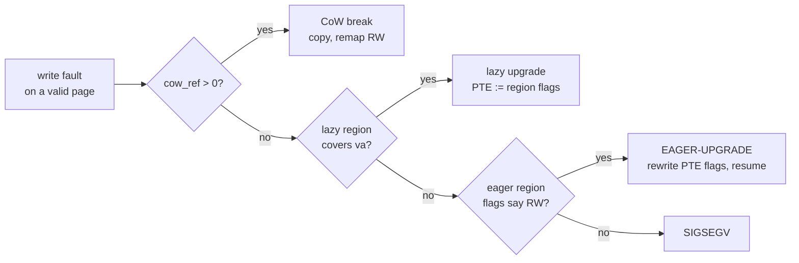
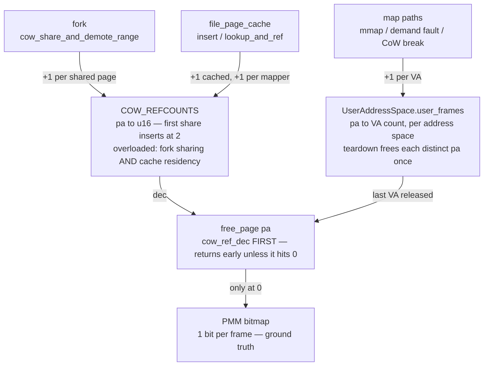
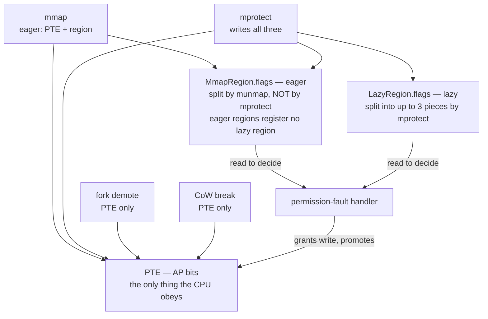
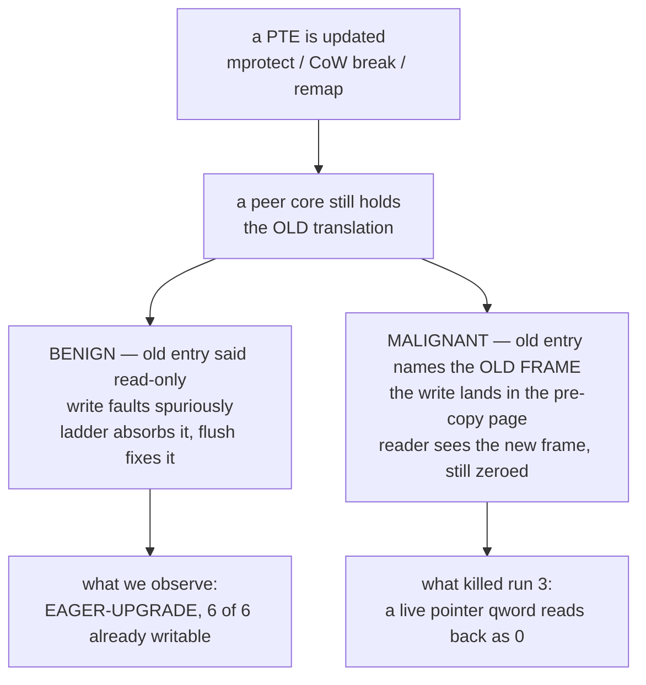

# cargo null-`Rc` — memory reference & flag audit (in progress, 2026-08-08)

Working notes for the defect in [`proposals/CARGO_HEAP_NULL_RC.md`](../../proposals/CARGO_HEAP_NULL_RC.md):
during an in-guest `-j4` self-host build, `cargo` dereferences a null `Rc` and the
build dies with `EXIT=139`. Safe Rust cannot construct a null `Rc`, so a live
pointer qword in cargo's anonymous heap read back as zero — a kernel
memory-management bug.

This is a **live investigation log**, not a conclusion. Every statement is tagged
with the evidence behind it, including the **three** theories the evidence has
already killed. Branch `stabilize-devbox`.

**Current state in one line:** the `[EAGER-UPGRADE]` anomaly turned out not to be a
lost permission at all — the page table was correct every time — and a purpose-built
probe (`cowstale`) now reproduces a fault in the same class **deterministically in
0.01 s**, replacing the ~1-in-5 ten-minute build as the oracle (§0).

**Active brief for continuing this work:**
[`proposals/COWSTALE_FORK_THREAD_SEGV.md`](../../proposals/COWSTALE_FORK_THREAD_SEGV.md).

---

## 0. The reproducer (2026-08-08, latest)

`userspace/forktest/c_stress/cowstale.c` was written to test D10's malignant face
— does a CoW break ever land a write in the wrong frame? It found something
faster: **`EXIT=139` in ~0.01 s, 8 of 8 attempts, on an idle VM with no build
load.**

```
[Fault] Data abort from EL0 at FAR=0x420260, ELR=0x400868, ISS=0x4f
[WPF] pid=7 va=0x420000 pa=0x91dac000 mapped=true cow_ref=0
      lazy_self=NONE lazy_owner=NONE have_owner=true
[Fault] Process 8 (/tmp/cowstale) SIGSEGV after 0.01s
```

`ISS=0x4f` = DFSC `0b001111`, permission fault level 3, WnR set. `[WPF] cow_ref=0
lazy_self=NONE` is the signature `src/exceptions.rs` names in its own comments as
the one that killed cargo mid-build.

### 0.1 Minimal trigger

| rounds | reader threads | result |
| ---: | ---: | --- |
| 1 | any | PASS |
| 5 | 0 | PASS |
| 5 | 1 | PASS |
| **2** | **2** | **SEGV** |
| 20 | 2 | SEGV |

**Two or more `fork()` rounds AND two or more live threads** — one fork passes,
one thread passes, both together fail. Exactly cargo's shape: a multi-threaded
process forking repeatedly.

### 0.2 The pointer lost bit 28

The mapping is at `0x10420000`; the faulting write went to `0x420260`, landing in
the binary's own read-only image. `x20=0x420248`, `x2=x3=0x5041524e00000000` (the
probe's own parent pattern), so this is its fill loop writing through a pointer
that came back missing `0x10000000`.

The kernel's SIGSEGV is therefore arguably *correct* — that address really is
read-only. The defect is upstream: a pointer read from the process's own memory
came back wrong. Same class as "a live pointer qword reads back as zero", which is
what kills cargo. **Whether they are the same bug is not yet established.**

### 0.3 Calibration

The identical binary **passes on real Linux aarch64** (`docker run --platform
linux/arm64 alpine /cowstale 40 32 3`, 3.9M reader-checks, 0 faults), so the
probe's semantics are sound and the failure is the kernel's.

### 0.4 Why this changes the methodology

Four consecutive green `-j4` builds were recorded during this session while
`cowstale` was failing 8/8 on the same tree. At the documented ~1-in-5 rate, four
greens in a row happen ~41% of the time with the bug fully intact. **Build runs
are not a sensitive enough instrument to answer "is it fixed".** Use the
deterministic probe.

---

## 1. The one hard correlation, from the original autopsy

In the crashing run (run 3 of 2026-08-07), the `[EAGER-UPGRADE]` repair fired on
cargo's heap page `0x314da000` **six log lines and one 10 ms tick** before the
process faulted dereferencing a pointer loaded from that same page:

```
85336: [EAGER-UPGRADE] pid=17 as_owner=17 va=0x314da000 flags=0x60000000000040
85343: [WILD-DA] pid=17 FAR=0x0 ELR=0x104e48c8 last_sc=222
         x0=0x314da660   ← ldr x8,[x0,#288] → 0x314da780, page 0x314da000
```

Those were the only two `[EAGER-UPGRADE]` lines in 86k lines of log, and both were
pid 17 (cargo) on heap pages.

### 1.1 Where `[EAGER-UPGRADE]` sits

It is the **last arm of the permission-fault ladder** — the fallback taken when
every other repair declines:



---

## 2. The two systems audited

### 2.1 Frame ownership — a frame is owned by consensus

Nothing holds *the* reference to a physical frame. Several structures hold partial
claims, and the frame survives only as long as they agree.



Every path to the bitmap runs through one gate, which makes the design sound and
the accounting fragile: one decrement too many frees a live page, one too few leaks
it. D2/D3/D4 are the places a claim can move without its partner ledger knowing.

### 2.2 Protection — recorded three times, only one is real

The CPU obeys the PTE. Everything else is a *record* of what the PTE ought to say,
and the fault handler consults those records to decide whether a faulting write is
legitimate.



**This section framed the first three theories, and all three were wrong.** The
records were never the problem — see §4.

---

## 3. What the instrumentation established

Instruments on this branch, all boot-suite tested (`src/process_tests.rs`):

| Instrument | Question it answers |
| --- | --- |
| `pmm::is_page_free(pa)` | Is the PA behind a live PTE *also* on the free list? |
| free ledger | Which thread released this frame, how recently? |
| poison quarantine (`config::PMM_UAF_QUARANTINE`) | Did anyone write through a freed frame? |
| CoW event ring + durable bitset (`config::COW_REF_LEDGER`) | Was this frame ever CoW-shared? |
| `MADV_DONTNEED` audit counters | Is that handler's divergence from Linux exercised? |
| `[MPROT-WIDEN]` | Does an `mprotect` upgrade record "writable" outside its range? |
| `[REGIONS]` | How many eager regions claim the faulting VA? |
| `[PTE]` + `ap_name` | What do the AP bits actually say? |
| `[LAZY]` | Does a lazy region also cover this VA? |
| `[TLB]` counters | How many write faults hit an already-writable page? |

### 3.1 The anomaly is common, and not fatal — OBSERVED

`[EAGER-UPGRADE]` fired in every instrumented run (1, 1, 3, 6 occurrences), and
**every one of those runs went green**. It is not the trigger.

### 3.2 Not a premature free — RULED OUT

`FREE=false`, `tracked=true`, `last_free=(tid=-1 age=-1)` at every anomaly, page
contents intact (not zeros, not poison). Independently, **`PMM-UAF=0` and
`PMM-QUAR-DF=0` across four complete 4-way self-host builds**, with the detector
proven to fire every boot.

### 3.3 D1 (`mprotect` widening) does not fire — RULED OUT

| | |
| --- | --- |
| `mprotect` calls | **3043** |
| `[EAGER-UPGRADE]` repairs | 3 |
| `[MPROT-WIDEN]` | **0** |

`update_eager_region_flags` runs constantly and never once widened an upgrade. D1
is a real latent bug (§6) but not this defect.

### 3.4 D9 (stale overlapping region) — RULED OUT

`[REGIONS] claimed_by=1` on every sample. Exactly one region claims each VA, and
its recorded flags are **correct** (`0x60000000000040` = `RW_NO_EXEC`). The record
was never lying.

### 3.5 The PTE was writable the whole time — THE REFRAME

Run 5, six anomalies, unanimous:

```
[PTE] va=0x31b5b000 raw=0x6000009c21bf4f ap=AP_RW_ALL(writable)   [LAZY] no lazy region
[PTE] va=0x3197e000 raw=0x600000d69b6f4f ap=AP_RW_ALL(writable)   [LAZY] no lazy region
[PTE] va=0x31987000 raw=0x600000d377cf4f ap=AP_RW_ALL(writable)   [LAZY] no lazy region
[PTE] va=0x31982000 raw=0x600000c3a9ff4f ap=AP_RW_ALL(writable)   [LAZY] no lazy region
[PTE] va=0x31720000 raw=0x600000c54c7f4f ap=AP_RW_ALL(writable)   [LAZY] no lazy region
[PTE] va=0x31721000 raw=0x600000c63ddf4f ap=AP_RW_ALL(writable)   [LAZY] no lazy region
```

Decoding `0x6000009c21bf4f`: `VALID`, page descriptor, `AF` set, `nG` set,
inner-shareable, `AP = 0b01` = **writable at EL0**, `UXN|PXN`. Nothing is wrong
with that entry.

**There was never a lost permission.** The page table was correct at every
anomaly. What the ladder has been absorbing is a **spurious write-permission fault
on an already-writable page** — the CPU faulted against a translation that no
longer matches memory.

### 3.6 The old repair was a TLB flush wearing a costume

`EAGER-UPGRADE` calls `update_current_user_page_flags`, which rewrites the AP bits
and then calls `flush_tlb_page(va)`. Given §3.5, the rewrite was a **no-op** — the
bits already said writable. The flush is what resolved the fault. The repair has
been working for a reason nobody wrote down, which is also why it never led
anywhere: it was treating the symptom of a stale translation as a permissions
problem.

---

## 4. Current leading theory: stale translations

A core faulting against a translation that memory has moved past explains §3.5
exactly. It is also the first theory consistent with *all* the measurements: it
needs no refcount desync, no premature free, no bad record, and no overlap — all
of which have now been ruled out.

The same root cause has a benign and a malignant face:



The malignant path is the one that matters: after a CoW break swaps in a new
frame, a thread still writing through a stale entry stores into the **old** frame,
while every reader sees the new one — which still holds the pre-copy contents. That
produces a zeroed pointer field with **no fault at the moment of corruption** and
no allocator involvement, which is precisely the signature that has resisted every
allocator-side instrument.

**What is NOT yet explained:** the broadcast invalidations look correct.
`flush_tlb_page` issues `tlbi vaae1is` and `flush_tlb_range_all_asid` /
`flush_tlb_all` issue `tlbi vaae1is` / `vmalle1is` under `kernel_smp_shared` — all
inner-shareable, so peers should see them. So the gap is not "we used a local
invalidate"; it is somewhere subtler — a path that edits a PTE and skips the flush,
one that flushes before the write is visible, or an ordering problem around the
`dsb`.

### 4.1 Prior art: the same class, fixed three days earlier

[`MPROTECT_TLB_ASID_BUG.md`](MPROTECT_TLB_ASID_BUG.md) (fixed 2026-08-05) is this
defect's mirror image and the strongest reason to take D10 seriously:

- **Then:** a `PROT_NONE`/`PROT_READ` **downgrade** did not take effect, because
  `flush_tlb_range` used `tlbi vale1is` whose ASID comes from operand bits [63:48]
  — `va >> 12` leaves those zero, so the invalidation matched nothing. Guard pages
  stayed writable; RELRO GOTs stayed writable.
- **Now:** an **upgrade** appears not to be visible on the faulting core — the
  same subsystem, the same "PTE in memory disagrees with the cached translation",
  in the opposite direction.

Two things carry over. First, that fix widened the invalidation to `vaae1is`
(VA, All-ASID) **because one L0 table can be live under several ASIDs at once** —
`UserAddressSpace::new_shared` allocates a fresh ASID while reusing the parent's
`l0_frame`, so `CLONE_VM` threads and vfork-fastpath children share a table across
ASIDs and one PTE edit has to invalidate under all of them. Any new invalidation
added while chasing D10 must respect that. Second, it establishes that this
subsystem's TLB maintenance has been wrong before in a way that stayed invisible
for a long time, because the failure mode is silent.

Its regression test — `userspace/forktest/c_stress/mprotectlb.c`, calibrated
against real Linux aarch64 — is the natural place to add an **upgrade**-direction
phase if D10 holds.

### 4.2 Deferred-flush audit — no missing flush found

Every caller of the `*_no_flush` primitives was checked for a following
invalidation:

| Site | Follows with |
| --- | --- |
| `sys_mmap` eager install | `flush_tlb_range` after the loop |
| `sys_mprotect` PTE loop | `flush_tlb_range` when any page updated |
| `sys_munmap` (all three paths) | `flush_tlb_range_all_asid` per batch |
| `madvise(WILLNEED)` prefault | `flush_tlb_range` over the whole range |
| fault-path readahead (2 sites) | `flush_tlb_range(page_va, pages_mapped)` |

So D10 is **not** a plainly missing flush. Remaining shapes to examine: an
invalidation whose *range* does not cover every page it published (the readahead
sites flush `[page_va, page_va + pages_mapped)`, which assumes every filled VA lies
at or above `page_va`), ordering around the `dsb` relative to the PTE store, and
paths that edit a descriptor through a route these primitives do not cover.

### 4.3 The experiment now running (run 6)

The `EAGER-UPGRADE` arm now checks the PTE **first**: if it already grants the
write, flush that VA and retry rather than rewriting flags. Bounded — the same VA
returning more than twice in a row logs `[TLB-STALE]` and falls through to the old
path, so it cannot spin on fault → flush → retry → fault.

Two counters in the 30 s PSTATS block:

```
[TLB] stale_write_faults=N repeats=M
```

- `stale_write_faults` — faults absorbed by a flush alone.
- `repeats` — **must stay 0**. Non-zero means flushing is *not* what resolves them
  and the reading in §3.5/§3.6 is wrong.

**A caveat this experiment does not settle.** Two readings fit §3.5 equally well:

1. **Stale translation** — the PTE was already RW and this core faulted against a
   cached restrictive entry.
2. **Benign race** — the PTE genuinely *was* restrictive at fault time, and a peer
   thread made it writable in the microseconds before the handler read it. Cargo
   and rustc are multi-threaded, so a thread faulting on a page another thread is
   concurrently `mprotect`-ing is entirely ordinary.

Both predict "flush and retry succeeds", so `stale_write_faults` alone cannot tell
them apart — under reading 2 the retry succeeds because the PTE changed, and the
flush is incidental. Distinguishing them needs the PTE sampled *at fault entry*
rather than inside the handler, or a per-VA correlation against concurrent
`mprotect` calls. Worth doing before any invalidation is "fixed", because under
reading 2 there is no kernel bug here at all — only a benign spurious fault, and
the null `Rc` is still unexplained.

---

## 5. Fixes landed

### 5.1 D8 — `munmap` now drains every region a range touches

`sys_munmap` matched a single eager region by **exact `start_va`** and returned. An
unmap starting mid-region, or spanning two, freed only the first region's pages,
reported success, and left the rest mapped with its VA never recycled. It also
never reached lazy regions whenever an eager one matched.

- Extracted `detach_eager_regions_in_range` into `akuma-exec` — pure, so the
  clipping shapes are host-testable: full / prefix / suffix / middle /
  multi-region / mid-region start / CoW-inherited (no frames) / non-overlapping /
  empty range. **9 host tests.**
- Boot self-test `munmap_spans_multiple_eager_regions` covers the kernel-side
  integration: real frames, the real region list under `vm_lock`, PMM conservation.
- Lazy regions in the range are now drained even when an eager region matched.

Verified green on a full `-j4` self-host build (run 5, `EXIT=0`, 109 crates).

---

## 6. Standing divergence points

| ID | Divergence | Status |
| --- | --- | --- |
| **D10** | Stale translations: a core faults against, or writes through, a translation memory has moved past (§4) | **Leading theory — run 6 testing** |
| D8 | `sys_munmap` matched one region by exact `start_va` | **FIXED** (§5.1) |
| D1 | `update_eager_region_flags` widens an *upgrade* across a whole region | **Latent** — 0 occurrences in 3043 `mprotect` calls; fix plan §7 |
| D9 | A stale/overlapping region shadows the live one in `eager_region_flags_for_page_fault` | **Ruled out** — `claimed_by=1` every time |
| D2 | `file_page_cache::lookup_and_ref` takes its `cow_ref_inc` **outside** the `PAGES` lock; a concurrent `invalidate_inode`/`shrink` can free the frame in that window | Suspected, not observed |
| D3 | `file_page_cache::insert`'s lost-race path returns early without inserting but still increments its own private frame | Code-visible leak |
| D4 | The three CoW-break sites call `cow_ref_dec` directly and discard the "last reference" return; if every sharer breaks, the frame is freed by nobody | Code-visible leak |
| D5 | `MADV_DONTNEED` memsets the *physical frame* where Linux drops the *mapping*, with no shared-frame check; and rounds an unaligned start **down** where Linux returns `EINVAL` | Instrumented, no data yet |
| D6 | Eager regions register no lazy region, so `MmapRegion.flags` is the handler's only repair input | Structural |
| D7 | `try_evict_ro_page` evicts *any* RO page inside a `LazySource::File` region | Suspected |

---

## 7. D1 fix plan (deferred — latent, not this defect)

`update_eager_region_flags` sets `reg.flags = new_flags` on every overlapping
region without splitting. Its doc comment's safety argument holds for a
*downgrade* and is silently applied to *upgrades*, which records "writable" for
pages outside the call.

| | Approach | Cost | Risk |
| --- | --- | --- | --- |
| **A** | Refuse to widen an upgrade; leave the more restrictive record | ~5 lines | Record stays conservative, so a page needing repair could take the SIGSEGV `EAGER-UPGRADE` exists to prevent |
| **B** | Split into up to 3 pieces, as `LazyRegions::update_flags` and `sys_munmap` already do | Moderate | Grows the region count on an O(n) scan |
| **D** | Optional per-page flags vector, allocated only on a partial `mprotect` | Moderate | New field on a struct built in 5 places |

**Recommendation: B.** The comment's justification — "splitting would have to split
`frames` in step" — is contradicted by `sys_munmap`, which does exactly that, and
whose splitting logic is now the shared, tested `detach_eager_regions_in_range`
(§5.1). Its prerequisite (the munmap range loop) is already done, so B is now
mostly a matter of reusing that helper for the flags case, plus:

1. Extract `split_region_for_flags` alongside it, covering the CoW-inherited case.
2. Wire it in behind a runtime toggle (`set_eager_flag_split_enabled`, default on)
   for a same-binary A/B per `docs/reference/subsystems/locking.md` rule 5.
3. Coalesce adjacent identical-flag regions to bound growth — **after** confirming
   `sys_mremap`'s exact-`start_va` lookup can cope, since merging moves keys.
4. Boot self-tests: prefix/middle/suffix extents and flags, frame conservation,
   full-cover still updates in place, pages outside the call keep their old flags.

---

## 8. Ruled out

- **Premature free / use-after-free** (§3.2).
- **`mprotect` upgrade widening (D1)** as the cause of the observed anomalies (§3.3).
- **Stale overlapping regions (D9)** (§3.4).
- **A lost permission of any kind** (§3.5) — the PTE was writable at every anomaly.
- **`ENOSYS`/errno-as-pointer** — the crashing run's syscall ring contains zero
  `ENOSYS`/`EFAULT`/`EINVAL` results; the only negative result is `-110`
  (`ETIMEDOUT`) from `futex`. The fault also has `FAR=0x0` with the null loaded
  *from memory* (`ldr x8,[x0,#288]`), not from `x0` after an `svc`.

---

## 9. Noise, and things not to chase

- `[BKL] stuck tag=511` storms — known separate class, hundreds per build.
- Two boot-suite tests fail on this branch **and on a pristine tree**
  (`thread_slot_reclaim_on_spawn` `hot_reclaim=206/208`, `retired_reclaim_ab`
  recovering 745p against a 768p threshold). Verified by stashing all changes and
  re-running: identical failures, identical 745p. Pre-existing, unrelated.
- The single-core `release` boot suite stalls in the same place with and without
  these changes (~3130 lines, after `drivers-bkl-drop`). Also pre-existing.

---

## 10. Instrument hazards learned the hard way

- **`free_page` must not call `read_current_pid()`.** It resolves through
  `THREAD_PID_MAP` and the process table, and `free_page` is reachable from inside
  both (a `Process` drop frees every frame of its address space) — a non-reentrant
  `Spinlock` deadlock that wedged the first instrumented boot at 554 lines. Record
  `current_thread_id()` instead; it is a register read.
- **The quarantine must surrender its hold-back before an allocation fails.**
  `quarantine_drain_all` sits on `alloc_page`'s pressure ladder so 512 parked
  frames can never be the reason a build OOMs.
- **A "no record" sentinel must not print as a plausible number.** The first
  version printed `last_free=(tid=4294967295 age=38240)`, where the age was
  computed against a default seq of 0 — a large number that reads exactly like a
  real, innocent age. It now prints `-1` with the meaning on the line.
- **A ring is not a record.** `cow_share_and_demote_range` emits one event per
  shared page, so one fork of a large process evicts a 4096-entry ring entirely;
  "no events" meant nothing until a durable one-bit-per-frame record backed it.
  That bit is per *frame* and since boot, so a set bit can belong to a previous
  owner — the clear direction is the strong one.
- **Index instruments the way the subject indexes itself.** The first bitset used
  absolute PAs where the PMM bitmap is relative to `base_addr`, so it silently
  recorded nothing. Caught only because the self-test used a real managed frame; an
  earlier version used a synthetic address and passed against a dead instrument.
- **Print the field that discriminates, not the field that is easy.** Three
  theories died only after `[PTE]` printed the AP bits. `FREE=`, `cow_ref=`,
  `tracked=`, `claimed_by=` all pointed at "something took this page's permission
  away" — and the permission had never been taken away. One decoded field settled
  what four indirect ones could not.

---

## 11. Next steps

Now driven by [`proposals/COWSTALE_FORK_THREAD_SEGV.md`](../../proposals/COWSTALE_FORK_THREAD_SEGV.md).
Highest-value first step: wire `print_page_forensics` into the `[WPF]`/SIGSEGV
path, since that is where the deterministic reproducer lands and it would
immediately say what is mapped at the faulting VA with no region record.

0. **Run 6 verdict (done)**: `stale_write_faults=3`, `repeats=0`,
   `EAGER-UPGRADE=0` — flushing alone resolved every one, confirming §3.6's
   mechanical claim. It does **not** separate "stale translation" from "benign
   race" (§4.3 caveat).
2. If confirmed, audit every PTE-editing path for its invalidation: which ones
   flush, when relative to the write, and with what barrier. The broadcast
   instructions themselves are correct, so look for a missing flush or an ordering
   gap rather than a wrong opcode.
3. Keep the TLB-only repair regardless — it is strictly more honest than rewriting
   flags that are already correct, and its counters make the condition visible.
4. Close D3/D4 (code-visible leaks) and decide on D5.
5. D1 (§7) whenever convenient; its prerequisite is now done.

## Background

- [`proposals/CARGO_HEAP_NULL_RC.md`](../../proposals/CARGO_HEAP_NULL_RC.md) — the
  original problem statement and reproduction recipe.
- [`../runbooks/selfhost-kernel-build.md`](../runbooks/selfhost-kernel-build.md) —
  "Status (2026-08-07)", Defect A and B.
- [`BKL_VFS_CARVE_OUT.md`](BKL_VFS_CARVE_OUT.md) §10 — the `MADV_WILLNEED`
  zero-fill corruption, the closest prior defect in this family.
- [`MPROTECT_TLB_ASID_BUG.md`](MPROTECT_TLB_ASID_BUG.md) — the previous
  TLB-invalidation defect in this subsystem: `mprotect` downgrades silently did not
  reach the TLB because `vale1is` took its ASID from bits [63:48] of `va >> 12`.
  The closest prior art for D10, and the source of the multi-ASID-per-L0 constraint
  any new invalidation has to respect (§4.1).
