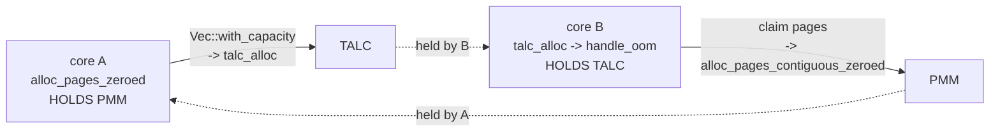

# The PMM ↔ TALC lock cycle: the silent all-core wedge

**Date:** 2026-08-08. **Branch:** `stabilize-devbox`. **Kernel at capture:**
`e96b918` + the BKL ticket fix, `release-smp-shared` + `devbox-smoltcp,no-tests`,
SMP=4, MEMORY=14336, HVF, `disk_selfhost.img`.
**Status:** root-caused and fixed; `-j4` campaign verification in progress at time
of writing.

**One line:** `BitmapAllocator::alloc_pages` allocated a `Vec` **while holding the
`PMM` spinlock**, and the kernel heap's growth path takes `PMM` — a cycle between
two non-reentrant spinlocks that froze all four cores with no console output.

Current-state writeup (the doc to read first):
[`../reference/subsystems/memory.md`](../reference/subsystems/memory.md) →
"PMM ↔ heap lock flow".

---

## 1. Why this was invisible for so long

It was filed under someone else's name. [`CARGO_NULL_RC_MEMORY_REFERENCE_AUDIT.md`](CARGO_NULL_RC_MEMORY_REFERENCE_AUDIT.md)
§12.8 recorded a 15-round `-j4` campaign as:

| outcome | n |
| --- | ---: |
| `GREEN` | 11 |
| BKL storm | 1 |
| **silent wedge** | **3** |

and grouped all four deaths as one "storm/wedge class", with the BKL as the
presumed culprit. They are **two unrelated defects**, and the silent one — the
majority — never touches the BKL at all.

Three properties conspired to hide it:

- **No output.** The `PMM` side spins inside `with_irqs_disabled`, so the stuck
  core takes no timer IRQ: no preemption, no `PSTATS` heartbeat, no panic.
- **It looks alive.** ~399% host CPU. Every core is in a *spin loop*, so a
  CPU-usage check says "busy", not "hung".
- **The locks are anonymous.** Both are `spinning_top::RawSpinlock` — a single
  bool, no owner field. Nothing in the kernel can say who holds one, so there is
  no watchdog, no `[BKL] stuck`-style diagnostic, and no recovery.

§12.8 also noted the wedges were "**not** a heap runaway — green rounds peak
*higher* (418–424 MB vs 258–328 MB)". That observation was correct and, read
today, is a clue: the wedge is not about running *out* of heap, it is about the
moment the heap decides to *grow*.

## 2. The defect

`src/pmm.rs`, before the fix:

```rust
fn alloc_pages(&mut self, count: usize) -> Option<alloc::vec::Vec<PhysFrame>> {
    ...
    let mut result = alloc::vec::Vec::with_capacity(count);   // ← HEAP ALLOCATION
    ...
}

pub fn alloc_pages_zeroed(count: usize) -> Option<alloc::vec::Vec<PhysFrame>> {
    let frames = crate::irq::with_irqs_disabled(|| {
        let mut pmm = PMM.lock();          // ← PMM HELD
        let result = pmm.alloc_pages(count)?;   // ← ...across the allocation
        ...
    })?;
```

The intended order is **`TALC → PMM`**, and the heap side honours it:
`PmmOomHandler::handle_oom` runs with `TALC` held (talc hands it `&mut Talc`) and
takes `PMM` beneath it; `reclaim_to_pmm` uses `try_lock` so a reentry from inside
`malloc` declines rather than self-deadlocking. `alloc_pages` supplied the
reverse edge.



**It does not need two cores.** If that `Vec::with_capacity` is itself the
allocation that exhausts the heap, `handle_oom` runs on the same core and calls
`alloc_pages_contiguous_zeroed` → `PMM.lock()`, which this core already holds.
`RawSpinlock` is not reentrant, so it spins against itself forever. That makes
this a candidate for the single-core freeze in
[`EXECVE_STACK_LEAK_OOM_HANG.md`](EXECVE_STACK_LEAK_OOM_HANG.md) — same shape
(SMP=1, ~100% CPU, serial dead, no panic, "final-spin PC not yet captured live"),
though that has **not** been re-confirmed against this fix and remains a separate
open question.

## 3. The capture

Taken with [`../../scripts/lockprobe.py`](../../scripts/lockprobe.py) against
QEMU's gdbstub (`GDB=1`), on a VM wedged mid-`-j4`:

```
allocator::TALC @ 0x402db750: 0x01   <- HELD
pmm::PMM        @ 0x402460b8: 0x01   <- HELD
BKL: owner=0, next_ticket == now_serving      (idle — NOT the BKL)

CPU#0 __rust_dealloc+64                 spinning on TALC
CPU#1 alloc_pages_contiguous_zeroed+40  spinning on PMM
CPU#2 __rust_dealloc+60                 spinning on TALC
CPU#3 talc_alloc+80                     spinning on TALC
```

Reproducible: five wedges in the campaign landed on that same small PC set.

### 3.1 How the locks were named without any debug info

The kernel ships `.symtab` but no DWARF, and **adding DWARF was rejected** — it
changed the loaded image by ~100 KB (1.51 MB vs 1.41 MB), unacceptable for a
~1-in-6 timing-sensitive race. Instead, each stuck PC sits in a
test-and-test-and-set inner loop:

```
40157a08: isb
40157a0c: ldrb  w10, [x8, #0x750]     ; x8 = adrp 0x402db000
40157a10: cbnz  w10, 0x40157a08       ; spin while nonzero
40157a14: ldaxrb w10, [x20]
```

so `adrp`-base + displacement **is** the lock address — `0x402db750` — and
`info symbol` names it `akuma::allocator::TALC`. This works even when no register
holds a pointer to the lock, which was the case here.

### 3.2 Corroboration

- `PC-MOVED` between samples on one core (`__rust_dealloc+60` ↔ `+64`) proves
  these are live spin loops, not stale HVF register state.
- Host CPU ~399% throughout, i.e. all four vCPUs burning.
- Console: **1** `[BKL] stuck` line (versus 3153 in the BKL storm) — the BKL is
  not involved.

## 4. The other defect, for contrast

One round in the same campaign was a genuine BKL storm, and it looks nothing
alike:

| | BKL storm | silent wedge |
| --- | --- | --- |
| `KERNEL_LOCK` | **HELD**, `owner=4` (core 3) | free, `owner=0` |
| `[BKL] stuck` lines | 3153 (3147 × `owner=4`) | 1 |
| cores | 3 × `KernelLock::acquire` spin; holder in the EL1 sync-exception path | 3 × `TALC`, 1 × `PMM` |
| host CPU | ~398% | ~399% |
| frequency | 1 of 7 deaths | 6 of 7 deaths |

The storm's holder sat at `exception_vector_table+0x200` (`b sync_el1_handler`)
with `X30 = sync_el1_handler+20` and `PSTATE=0x3c5` (EL1h, DAIF all masked) —
consistent with a `fault → handler → eret → refault` loop, which reproduces
byte-identical register state every pass because the handler epilogue restores
exactly what its prologue pushed. **That reading is not proven** and the storm
remains open; `ESR_EL1`/`FAR_EL1` from a live storming core would settle it, and
`lockprobe.py` can now read them.

## 5. The fix

`alloc_pages` → `alloc_pages_into(count, &mut result)`, with the caller reserving
capacity **before** taking the lock:

```rust
let mut frames: alloc::vec::Vec<PhysFrame> = alloc::vec::Vec::new();
if frames.try_reserve_exact(count).is_err() { return None; }   // outside the lock
let ok = crate::irq::with_irqs_disabled(|| {
    let mut pmm = PMM.lock();
    pmm.alloc_pages_into(count, &mut frames)                    // pushes, never grows
    ...
});
```

The scan stops at exactly `count`, so `push` never reallocates. Blast radius was
one caller — `smp.rs`'s `alloc_pages` is an unrelated bump allocator that returns
`Option<usize>`.

### 5.1 Rule

**Never allocate on the heap while holding `PMM`.** This also applies to the
`Spinlock<BTreeMap<..>>` statics in `pmm.rs` (`COW_FAULT_LOCK`, `COW_REFCOUNTS`):
a map insert can allocate, so they nest into `TALC` too. One known **latent**
instance remains: `pmm::init` holds `PMM` and calls `alloc::vec!` — boot-only,
single-threaded, and gated on `config::COW_REF_LEDGER`, so it cannot deadlock
today, but it is the same mistake.

## 6. Regression tests

| test | file | what it does |
| --- | --- | --- |
| `pmm_heap_lock_order` | `src/tests.rs` | Single-core: 8 rounds of batch page alloc interleaved with heap traffic sized to force `handle_oom`. Asserts PMM conservation. |
| `pmm_heap_lock_order_smp` | `src/process_tests.rs` | Two worker threads churn the heap while the main thread hammers `alloc_pages_zeroed`, so `TALC`-held and `PMM`-held paths overlap in time. |

> **A regression here HANGS the suite, it does not fail it.** The `PMM` side
> spins with IRQs masked, so there is no console, no panic, no test verdict.
> "The suite stopped printing at this test" *is* the failure signal.

Result at SMP=4: `pmm_heap_lock_order` PASS; `pmm_heap_lock_order_smp` PASSED
(`batches=34 churn_rounds=68 workers=2`); `Memory Tests: ALL PASSED`.

### 6.1 Three ways the SMP test was wrong first

Each would have shipped a green test that proved nothing, so they are worth
repeating:

1. **`churn_rounds=0`.** Placed in `src/tests.rs`, the workers spawned but never
   ran — the memory suite executes before the scheduler can schedule them. Moved
   to `src/process_tests.rs`, alongside the other SMP tests.
2. **It wedged the suite in a `[BKL] stuck owner=1` storm at 397% CPU.** A boot
   self-test runs BKL-held and `yield_now()` does **not** drop the BKL, so a
   tight 1.5 s alloc loop owned the lock and starved every peer. Now uses
   `sleep_us` and a 400 ms window.
3. **The conservation check was inverted-strict.** It asserted
   `free_after == free_before` and failed with `free_after` *higher* (393067 vs
   392499): concurrent churn legitimately **returns** spans to the PMM via
   `reclaim_to_pmm`, and worker stacks are freed at exit. The real invariant is
   "no leak" — `free_after >= free_before`.

## 7. Campaign data

Baseline, unfixed kernel (`600640711bfb2e1d71963fc9db2d7928`), 2 parallel lanes,
fresh VM + `rm -rf target/aarch64-unknown-none` per round:

| outcome | n |
| --- | ---: |
| `GREEN` | 18 |
| silent wedge | 6 |
| BKL storm | 1 |
| **`EXIT=139`** | **0** |

25 rounds, 28% death rate — statistically unchanged from §12.8's 27% (4/15),
which is expected: the BKL ticket fix that preceded this addressed the *storm*,
and the storm was never the common case.

Verification on the fixed kernel (`27903e0ef22d07e75c2a3acd85a49b93`), identical
recipe. Because `devbox-smoltcp` builds with `no-tests`, the pmm change is the
only delta between the two binaries:

| outcome | baseline | **fixed** |
| --- | ---: | ---: |
| `GREEN` | 18 | **20** |
| **silent wedge (this defect)** | **6** | **0** |
| BKL storm (a *different*, open defect) | 1 | 2 |
| `EXIT=139` | 0 | 1 |
| rounds | 25 | 23 |

**The silent wedge is gone: 6/25 → 0/23.** Fisher exact two-sided **p = 0.023**;
and if the rate were truly unchanged, seeing zero in 23 rounds has probability
`0.76^23 = 0.0018` (~1 in 550). That is the fix, measured on the workload the
defect was found in.

Two honest caveats:

- **The BKL storm did not improve** (1 → 2) and is expected not to: it is the
  page-table use-after-free in
  [`PAGE_TABLE_UAF_BKL_STORM.md`](PAGE_TABLE_UAF_BKL_STORM.md), and `TALC`/`PMM`
  both read **free** during it. It is now the dominant remaining failure.
- **One `EXIT=139` appeared** (0/25 baseline → 1/23 fixed), i.e. the original
  `CARGO_HEAP_NULL_RC` class, which was never fixed — only unobserved. The fault
  was an instruction abort *from EL0* at `enter_user_mode+528` with `SPSR=0x0`
  (the stale-`Process`/AS-MISMATCH shape), which has no mechanical connection to
  moving a `Vec` reservation outside a lock. 0/25 vs 1/23 is Fisher p≈0.48, i.e.
  indistinguishable from chance — but it is **not** evidence of absence and
  should be watched.

### 7.1 Method notes

- **Never let a rebuild land mid-campaign.** Lanes boot whatever ELF is in
  `target/`, so building the fix while they run silently swaps arms. The baseline
  lanes were stopped *before* the fix was built.
- **A wedged VM and a console-starved VM are indistinguishable over ssh.** Check
  console *size* growth, and check the storm case explicitly — a storming VM
  prints harder than a healthy one, so a growth-only check calls it alive and
  burns the whole round budget (§12.8 lost 90 minutes that way).
- **`cargo build` does not regenerate `akuma.bin`.** A stale `.bin` from a
  *different feature set* was sitting in `target/` at the start of this session
  (3.6 MB, boot-test build) where the campaign kernel is 1374 KB.

## Background

- [`CARGO_NULL_RC_MEMORY_REFERENCE_AUDIT.md`](CARGO_NULL_RC_MEMORY_REFERENCE_AUDIT.md)
  §12.7–§12.8 — where these wedges were first counted, and filed under the BKL.
- [`EXECVE_STACK_LEAK_OOM_HANG.md`](EXECVE_STACK_LEAK_OOM_HANG.md) — a 2026-08-02
  single-core freeze with the same outward signature; candidate instance of this
  cycle, unconfirmed.
- [`../reference/subsystems/locking.md`](../reference/subsystems/locking.md) —
  lock inventory and the BKL's own rules.
- [`../reference/scripts/multi-vm.md`](../reference/scripts/multi-vm.md) —
  `lockprobe.py` usage and the three traps in reading its output.
