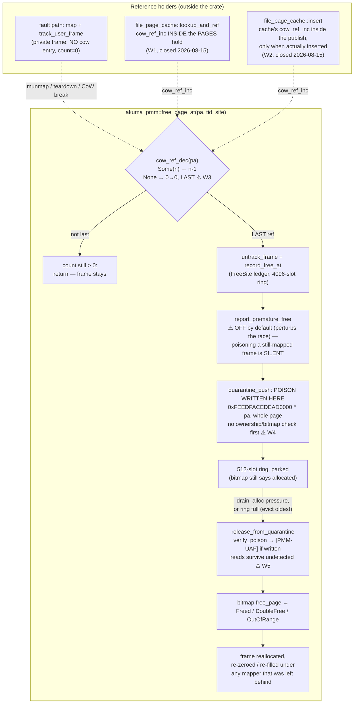
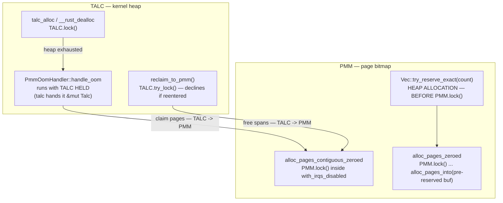

# Memory

Current-state architecture for physical memory (PMM), the kernel heap, CoW
fork, and userspace address spaces. For debugging, see
[`../../runbooks/debug-memory-oom.md`](../../runbooks/debug-memory-oom.md).

> **Stability: C (active risk).** Highest-churn subsystem through 2026-06.
> Four items still OPEN: per-run kernel-heap creep; reclaim-after-OOM below
> ~5 MB; a full process table panicking instead of failing the spawn (see
> [OPEN: a full process table still panics the
> kernel](#open-a-full-process-table-still-panics-the-kernel)); and the
> user-page escalation giving up while parked memory is still inside its
> reclaim cooldown (see [KNOWN GAP: a premature give-up while memory is merely
> cooling](#known-gap-a-premature-give-up-while-memory-is-merely-cooling)),
> which is also currently invisible at runtime. The recurring
> bug class is *region-boundary computed with a wrong constant* — verify any
> new region math against the invariants below.

## Memory layout

### Physical (QEMU `virt`)

| Range | Use |
|---|---|
| `0x00000000–0x3FFFFFFF` | Device MMIO (GIC dist `0x08000000`, GIC CPU `0x08010000`, UART `0x09000000`, fw_cfg `0x09020000`, VirtIO `0x0a000000`, GICv3 redist `0x080a0000`/`0x080b0000`) |
| `0x40000000` | RAM_BASE |
| `0x40100000` | Kernel load (ARM64 Image `text_offset`=1 MB) |
| `0x40200000` | DTB (QEMU-placed) |
| above `_kernel_phys_end` | 1 MB boot stack (linker-derived `STACK_BOTTOM`/`STACK_TOP`) + 2-page guard |

### Kernel regions (computed by `compute_memory_layout`)

- **Code+Stack** = `max(ram/16, MIN_CODE_AND_STACK_BYTES)`; extreme clamped via `MEM_CALC_CLAMP_MB`=4. **Invariant:** must cover `BOOT_STACK_TOP + 1 MB guard`.
- **Heap** = dynamic (seeded ~1 MB `size` / ~4 MB `release`, grows from PMM). The "fixed 16 MB heap" in `archive/MEMORY_LAYOUT.md` is **superseded**.
- **User pages** = remainder.
- **Device MMIO VAs:** L0[1] → `0x80_0000_0000+` (GIC), `0x80_0000_2000` (UART), `0x80_0000_4000` (VirtIO). **Invariant:** devices must NOT live in L0[0] (the bun 93 MB collision).

### Userspace VA (small binary)

```
0x00400000   code (.text/.data/.bss)
brk          heap (dynamic lazy region, grows up)
0x0a000000   VirtIO device pages (L2[80])
0x10000000   mmap region (grows up; jumps over kernel_va_end())
~0x3FFFF000  user stack (grows down; auto-sized, 128 KB at ≤256 MB)
0x40000000+  kernel RAM identity-mapped (EL1-only 2 MB blocks)
```

Large binaries (bun 93 MB) push brk into `0x05–0x09`; mmap placed above
`0x80000000`. `kernel_va_end()` = `round_up(ram_base+ram_size, 1GB)` (dynamic;
was hardcoded `0xC0000000`).

**Boot page tables:** 1 GB L1 blocks (L1[0] device, L1[1]/[2] RAM);
`mmu::extend_boot_ram_identity_map()` adds L1[3..] for RAM > 2 GB.

## PMM (physical memory manager)

`src/pmm.rs`. Bitmap allocator, 1 bit per 4 KB page. All ops wrapped in
`with_irqs_disabled` + `PMM.lock()`.

| API | Purpose |
|---|---|
| `alloc_page` / `alloc_page_zeroed` | Single page (zeroed via `phys_to_virt` + cache clean) |
| `alloc_page_zeroed_user` | Gated by `USER_PAGE_RESERVE`=16 (user pages can't drain the last kernel reserve). On starvation walks the [pressure ladder](#alloc_page_zeroed_users-pressure-ladder) before returning `None` |
| `alloc_pages_contiguous_zeroed(count)` / `free_pages_contiguous` | Thread stacks |
| `free_page` | Returns `FreeOutcome { Freed, DoubleFree, OutOfRange }`; only `Freed` decrements `ALLOCATED_PAGES` |
| `cow_ref_inc(pa)` / `cow_ref_dec(pa) -> bool` | CoW refcounts (separate from bitmap). `dec` true ⇒ last ref, caller frees. |
| `stats()`, `double_free_count()` | `/Total/Allocated/Free`; the desync canary |

**Untracked-frame policy:** never free a frame you didn't track (leak is
recoverable; over-free crashes the kernel).

### Frame lifecycle: the free pipeline

Everything below `free_page_at` lives in `crates/akuma-pmm/src/lib.rs`; the
reference-taking paths on the left live in `src/file_page_cache.rs` and the
fault path. The one gate that decides whether a frame is actually released is
`cow_ref_dec` — everything after it *assumes the caller was entitled*.



`alloc_pages_contiguous_zeroed`/`free_pages_contiguous` (thread stacks) bypass
this pipeline entirely — no `cow_ref_dec`, no ledger, no quarantine (⚠ W6).

#### What the pipeline does NOT synchronize (the corruption surface)

Each ⚠ above is a window through which a frame can be freed — and poisoned —
while a live mapping still holds it. This is the mechanism class behind the
self-host `.rlib` corruption (`rust-lld` reading `0xFEEDFACE…` poison as file
content, `docs/archive/HANDOFF_MAPPED_PAGE_PREMATURE_FREE.md`): the victim
*reads* poison as ordinary data, so no kernel fault, no `[PMM-POISON]`, no
`[PMM-UAF]` — every instrument stays silent.

- **W1 — `lookup_and_ref` incs outside the `PAGES` hold** — **CLOSED
  2026-08-15** (`src/file_page_cache.rs`, the "D2" suspect). All three free
  paths (`insert`-eviction, `invalidate_inode`, `shrink`) remove the entry
  *under* `PAGES` and then `cow_ref_dec`. A mapper that copied the entry and
  dropped the lock, but had not yet inc'd, was invisible to them: dec 1→0
  freed and poisoned the frame, then the late inc **resurrected** it (a fresh
  entry at count 2 on a quarantined frame) and the mapper installed poison as
  file content. The fix takes the mapper's reference *inside* the `PAGES`
  hold — "entry present ⇒ the cache's reference is still alive ⇒ the inc
  cannot land on zero". `cow_ref_get` was already called under that hold on
  the eviction scan, so the lock order (`PAGES` → `COW_REFCOUNTS`-leaf) was
  established.
- **W2 — `insert`'s cache reference landed after the closure**, and landed
  unconditionally — **CLOSED 2026-08-15**. On the lost-race early return it
  inflated a private frame's count (one leaked frame per race). Worse,
  between publishing the entry and the inc, the entry was visible while the
  count reflected **only the mappers**: if every mapper unmapped inside that
  window (a hit incs 0→2, its unmap decs 2→1, the inserting process's
  teardown decs 1→0), the frame was freed and poisoned with a live cache
  entry still pointing at it — the next `lookup_and_ref` hit handed the freed
  frame to a new mapper as valid file content. The fix takes the cache's
  reference inside the publish closure, only when the entry was actually
  inserted; the boot-suite lost-race check in `process_tests.rs` pins it.
- **W3 — an untracked dec means "free it".** `cow_ref_dec` on a PA with no
  entry returns `true` (single-owner semantics). Correct for genuinely
  private frames — but it converts *any* unbalanced dec anywhere in the tree
  into a silent premature free. Every poison event in the 2026-08 logs shows
  exactly this signature: `[COW-HIST] … dec 0->0` with no matching inc.
  Since 2026-08-15 `cow_ref_inc` distinguishes *creating* the entry from
  incrementing one, and a created entry whose frame is currently parked in
  the quarantine prints `[PMM-RESURRECT]` (with the free record and CoW
  history) and bumps `cow_resurrection_count()` — one relaxed atomic load,
  only on the inc-from-zero path, so unlike `PMM_PREMATURE_FREE_CHECK` it
  cannot perturb the race. **`[PMM-RESURRECT]` must never print.** An inc
  that lands *after* the frame already left quarantine is still invisible;
  the untracked-dec policy itself is unchanged.
  Note the victims on record are not all cache pages: several `[WILD-DA]`
  autopsies show a **writable private** page (`AP_RW_ALL`, a 2-page anonymous
  region) freed by *another thread's* `munmap` with `dec 0->0` — the file
  cache never serves writable pages, so at least one route is two address
  spaces tracking the same PA with **no `COW_REFCOUNTS` entry at all**: a
  share whose `cow_ref_inc` never happened (the fork/CoW-share or
  install-race class), not a cache reference miscount.
- **W4 — a stale free is trusted, and poison is written before any check.**
  `quarantine_push` poisons the page immediately; the double-free guards
  (`QUAR_PRESENT`, and the bitmap check) only catch frames *still parked* or
  *still free*. A stale free of a frame that already left quarantine and was
  reallocated poisons the **new owner's** live data on the spot. The
  `QUAR_PRESENT` set is also a 2048-slot direct-mapped hash on PFN low bits:
  a collision evicts an older parked PA from the set, so its second free is
  misattributed (contained later by the bitmap check, but the report lies).
- **W5 — the quarantine only detects *writes*.** `verify_poison` at drain
  compares the page against its poison; a victim that only *reads* (the
  linker, a `.rlib` consumer) never trips it. The one instrument that fires
  at the moment a still-mapped frame is poisoned —
  `PMM_PREMATURE_FREE_CHECK` → `report_premature_free` — is **off by
  default** because armed it perturbs the race away (10/10 green against a
  25 % baseline). Poisoning a mapped page is therefore currently
  unobservable in the failing configuration.
- **W6 — the contiguous path bypasses everything**, and
  `free_pages_contiguous` decrements `ALLOCATED_PAGES` by the full `count`
  even when some pages in the run were already free — `free_count()` drifts
  upward, and the reclaim ladder (`next_reclaim_step`) then misjudges
  pressure from a wrong number.

The `[PMM-UAF]` events on record carry one more diagnostic gift: `got` is
frequently `want − 1` or `want − 2` — a *decrement* of the poison word, i.e. a
refcount-shaped write through a stale mapping (the cargo null-`Rc` autopsy
shape, `docs/archive/CARGO_NULL_RC_MEMORY_REFERENCE_AUDIT.md`).

## PMM ↔ heap lock flow

Two independent spinlocks govern all memory allocation, and **they call each
other**:

- `pmm::PMM` (`0x402460b8` in a `release-smp-shared` build) — the page bitmap.
- `allocator::TALC` — the kernel heap.

Both are `spinning_top` `RawSpinlock`s: a **single bool, no owner field, not
reentrant**. Nothing records who holds one, so neither a self-deadlock nor a
cycle can be detected at runtime — the box simply stops.

**The intended order is `TALC → PMM`**, stated in `reclaim_to_pmm`'s own
comment. `handle_oom` runs with TALC held and takes PMM beneath it;
`reclaim_to_pmm` uses `try_lock` so a reentry from inside `malloc` declines
instead of self-deadlocking. The PMM side keeps to the same order by
construction: `alloc_pages_zeroed` (`pmm.rs:1311`) reserves its result `Vec`'s
capacity with `try_reserve_exact` (`pmm.rs:1321`) **before** calling
`PMM.lock()` (`pmm.rs:1326`), and the locked helper it calls,
`Pmm::alloc_pages_into(count, &mut result)` (`pmm.rs:318`), only ever `push`es
into that pre-reserved buffer — a `debug_assert!` at its top (`pmm.rs:319`)
enforces the precondition that the caller reserved capacity first. No heap
allocation happens while `PMM` is held.



**Historical bug, FIXED in commit `159c3db`.** `Pmm::alloc_pages` (since
removed) used to build its result with `alloc::vec::Vec::with_capacity(count)`
— a heap allocation — *while `PMM.lock()` was already held*. That was the
reverse edge and it closed a real cycle: core A held PMM and wanted TALC
(`alloc_pages_zeroed` → `Vec::with_capacity` → `talc_alloc`) while core B held
TALC and wanted PMM (`talc_alloc` → `handle_oom` →
`alloc_pages_contiguous_zeroed`) — worse than an ordinary ABBA because a single
core could deadlock against itself if that same `Vec::with_capacity` was the
allocation that exhausted the heap, and because the PMM side spins inside
`with_irqs_disabled`, so the stuck core could take no timer IRQ — no
preemption, no `PSTATS`, no console, indistinguishable from outside from a
console-starved VM. The fix hoists the reservation above the lock (the
reserve-before-lock flow diagrammed above) and changes the locked helper to
fill an already-capacity'd buffer instead of growing one itself.

### Rule

**Never allocate on the heap while holding `PMM`.** Compute into a fixed-size
buffer, or allocate the container *before* taking the lock and fill it after —
`alloc_pages_zeroed` above is the reference example. The same applies to any
`Spinlock` in `pmm.rs` holding a heap container — `COW_REFCOUNTS`
(`BTreeMap<usize, u16>`, where an insert can allocate) and `COW_EVER`
(`Vec<u64>`, which allocates only while `init` fills it): those nest into TALC
too. (`COW_FAULT_LOCK` was a second such map until 2026-08-13, when it was
deleted — it was a per-PA counter nothing read; `COW_PILE_AUDIT.md` §5.)

### Observed signature

Captured 2026-08-08, before the fix, with
[`scripts/lockprobe.py`](../../../scripts/lockprobe.py) on a `-j4` in-guest
self-host build (SMP=4), 5 of 6 deaths in a 22-round campaign:

```
allocator::TALC @ 0x402db750: 0x01   <- HELD
pmm::PMM        @ 0x402460b8: 0x01   <- HELD
KERNEL_LOCK: owner=0, next_ticket == now_serving   (BKL idle — not the BKL)
CPU#0 __rust_dealloc+64                 spinning on TALC
CPU#1 alloc_pages_contiguous_zeroed+40  spinning on PMM
CPU#2 __rust_dealloc+60                 spinning on TALC
CPU#3 talc_alloc+80                     spinning on TALC
```

All four cores burning ~399% host CPU in test-and-test-and-set loops. The BKL is
idle throughout, which is what distinguishes this from the `[BKL] stuck` storm it
was previously filed with.

Full investigation, including how the locks were named without debug info and the
three ways the regression test was wrong first:
[`../../archive/PMM_TALC_LOCK_CYCLE_SILENT_WEDGE.md`](../../archive/PMM_TALC_LOCK_CYCLE_SILENT_WEDGE.md).

Regression tests: `pmm_heap_lock_order` (`src/tests.rs`, single-core) and
`pmm_heap_lock_order_smp` (`src/process_tests.rs`, cross-core). **Both detect a
regression by HANGING the boot suite, not by failing** — the `PMM` side spins
with IRQs masked, so there is no verdict to print.

## Kernel heap allocator

`src/allocator.rs`. **Not a slab** — a dynamic linked-list/talc allocator:
`talc::Talc<PmmOomHandler>` behind a `Spinlock`.

- **Growth:** seeded with a small bootstrap arena; `PmmOomHandler::handle_oom`
  claims contiguous pages from PMM. `HEAP_GROW_PAGES`=64 amortised; under
  pressure `heap_grow_backoff` halves `n` toward `needed` (kills the
  fragmentation abort).
- **Reclaim:** `reclaim_to_pmm()` returns wholly-free spans;
  `claimed_span_report()` exposes live/pinned spans.
- **Watermark:** `is_memory_low()` (free heap < 2 MB `HEAP_LOW_WATERMARK`) —
  circuit breaker at fork/clone/spawn/SSH accept.
- **Failure path:** `#[alloc_error_handler]` (`src/allocator.rs:499`) prints
  `[OOM] allocation of N bytes failed`, calls `return_to_kernel(-12)` if
  in-process, else `panic!`.
- **`mark_pmm_ready()`** flips from talc-only to page-backed growth after PMM init.

## CoW fork

- **Share path** (`fork_process`, `COW_FORK_ENABLED`): `cow_share_range` →
  per page `cow_ref_inc(pa)` + child `map_page(RO)` + `track_user_frame`; then
  parent `demote_range_to_ro`; `flush_tlb_asid(0)` (all ASIDs — sibling threads
  share L0 with different ASIDs).
- **Fault path** (write to RO page, `exceptions.rs`): alloc copy,
  `track_user_frame(new)`, `remove_user_frame(old)`, `cow_ref_dec(old)`.
- **Data structure:** `user_frames: BTreeMap<PA, u32>` (refcount = in-AS mapping
  count; was `Vec` → O(n²) munmap, fixed to O(log n)).

### CoW invariants (the desync surface)

1. **The two mechanisms count different things, and are NOT 1:1.** (Corrected
   2026-08-15 — the old "1:1, any new mapping must do both" was wrong, and
   believing it is how frames get freed under their mappers.)

   | | `UserAddressSpace::user_frames` | `COW_REFCOUNTS` |
   |---|---|---|
   | where | `crates/akuma-exec/src/mmu/mod.rs:464`, per address space | `crates/akuma-pmm/src/lib.rs:1102`, global |
   | shape | `BTreeMap<PA, u32>` | `BTreeMap<PA, u16>` |
   | counts | **VAs per PA inside this AS** | **address spaces holding the PA** |
   | answers | "what must teardown free?" (enumeration) | "may `free_page` release this?" (O(1)) |

   The real rule is **"one address space contributes exactly one global
   reference, however many VAs it maps"**. So:

   - A freshly allocated **private** frame is tracked with **no** `cow_ref_inc` —
   `cow_ref_get` returns 0, which legitimately means "single owner, free it".
   13 of the 23 `track_user_frame` sites are this case and are correct.
   - `cow_ref_inc` belongs only where a **second** holder appears: fork
   (`cow_share_and_demote_range`) and the shared file-page cache.
   - The first `inc` on an untracked PA inserts **2**, not 1 (parent + child).

   Neither map can be deleted: only `user_frames` can enumerate, only
   `COW_REFCOUNTS` can answer the free question in O(1). What was consolidated is
   the *counting*.

1a. **Use `UserAddressSpace::adopt_user_frame`, not the two calls by hand.**
   It maintains both maps under **one** `IrqGuard` + `user_frames` hold, decides
   "is this the first VA for this PA here?" from the same map it updates, and
   returns `true` when the caller's reference turned out surplus. Splitting the
   two updates across the `as_lock` hold is what let the count drift below the
   truth and hand a live frame back to the PMM — the frame is then recycled and
   **re-zeroed under its remaining mappers**, which surfaces as unrelated
   processes reading zeros
   ([`../../archive/SELFHOST_ZERO_PAGE_HUNT.md`](../../archive/SELFHOST_ZERO_PAGE_HUNT.md) §6).
   It replaced `drop_surplus_shared_ref`, a separate reconciliation pass that was
   unbalanced on the lost-install-race arm.

   `AsLockHold` is `IrqGuard` + the spinlock, so a pair inside it is both
   uninterruptible locally *and* excluded cross-core for that address space —
   masking IRQs alone would not give the second half at SMP=4. Lock order is
   `as_lock` → `user_frames` → `COW_REFCOUNTS`; the last is a **leaf** and must
   stay innermost. The same principle is stated for fork at
   `crates/akuma-exec/src/process/bkl_guard.rs:44` ("The PTE read, the
   `cow_ref_inc`, and the demote must be in ONE hold").

   Two holders are **not** address spaces and keep calling `cow_ref_*` directly:
   `file_page_cache::insert` (the cache's own reference) and `invalidate_inode` /
   eviction (releasing it). Those are the documented exceptions.
2. `remove_user_frame` is `#[must_use] -> bool` (true ⇒ last ref, caller owns
   the free). munmap loops free **only when it returns true**.
3. `Drop` frees each distinct PA **once** (count is mapping refcount, not alloc
   count).
4. Untracked-frame policy: **don't free** (leak is recoverable; over-free
   crashes kernel).
5. **vfork fast-path** (`VFORK_FASTPATH_ENABLED`, `CLONE_VFORK|CLONE_VM`):
   `new_shared(parent_l0)` (no copy, no demote); `replace_image` drops shared
   view on exec → parent takes zero CoW faults.

## Userspace memory model

- **Page tables:** per-process TTBR0, AArch64 4-level / 4 KB granule.
  `add_kernel_mappings` identity-maps full RAM as EL1-only 2 MB blocks (so
  `phys_to_virt` works during syscalls); device MMIO via shared L0[1].
- **Demand paging:** "lazy regions" (`push_lazy_region` →
  `ensure_user_page_mapped`) for heap, large mmap, stack, large ELF segments
  (`DeferredLazySegment` via `from_elf_path`).
- **mmap:** bump from `0x10000000`, first-fit into `free_regions` on munmap;
  jumps over `kernel_va_end()`; MAP_FIXED may shatter a 2 MB block into L3.
- **Lazy anonymous mmap:** `MAP_PRIVATE` > `MMAP_EAGER_MAX_PAGES`=16 → lazy
  region, zero-on-demand.
- **Stack:** top ~`0x3FFFF000`; auto-sized (128 KB at ≤256 MB by default).
- **Process info page:** `PROCESS_INFO_ADDR`=0x1000 (pid; read only with user
  TTBR0 active).
- **libakuma allocator:** default page-based (mmap per alloc) **or**
  `chunked-allocator` feature (Talc in 64 KB chunks). Deferred-free queue for
  realloc safety.
- **Eviction:** `try_evict_ro_page` + `reclaim_clean_file_pages` evict clean
  `AP_RO_ALL` file-backed pages under pressure (lets models > RAM run).

## OOM decision map

**Stability: B — every path here was read out of the source on 2026-08-13**
(`src/pmm.rs`, `src/allocator.rs`, `crates/akuma-exec/src/process/reclaim.rs`).
Not A: this is the highest-churn subsystem in the tree, so re-verify the line
numbers before relying on them. The *shape* is what this section is for.

Three different callers can run out of memory, and Akuma treats them differently
on purpose: a user page must never be handed out at the cost of the kernel's
ability to *kill the process asking for it*. Read this map before changing any
allocation path — the asymmetry is the whole design.

```
        WHO IS ASKING                    GATE                      ON FAILURE
  ─────────────────────────────  ──────────────────────────  ────────────────────────
  EL0 demand paging              free <= USER_PAGE_RESERVE   None -> caller SIGSEGVs
  (anon fill, ELF load,          (16 pages / 64 KB)          the faulting process.
  file readahead, PROT_NONE      user_alloc_would_starve()   The kernel survives.
  commit)                                │
    pmm::alloc_page_zeroed_user ─────────┘
                                                             ┌── escalation below
  Kernel-internal                NONE — reserve-exempt.      None -> caller-specific.
  (page tables, fault            Deliberately allowed to     A page-table alloc
  completion, the OOM            dip into the reserve.       failure fails one
  kill path itself)                                          syscall, not the box.
    pmm::alloc_page / alloc_page_zeroed

  Kernel heap (talc)             is_pmm_ready(), then grow   Err -> Rust alloc error
    PmmOomHandler::handle_oom    the heap from the PMM       -> panic -> `brk #1`,
                                                             WHOLE-KERNEL abort.
                                                             This is the one that
                                                             takes down the box.

  fork / clone / vfork           is_memory_low():            Err("Kernel memory low")
    (pre-flight, before any      free < 128 pages / 512 KB   -> clone(2) = -ENOMEM.
     work is done)                                           Refuses early rather
                                                             than half-building.
```

The reserve exists precisely so the third row cannot be caused by the first: a
process consuming all of RAM gets SIGSEGV'd while 16 pages remain for the page
tables, heap growth and bookkeeping the kill itself needs.

### The user-page escalation, exactly as written

`pmm::alloc_page_zeroed_user` (`src/pmm.rs:1330`). **The order and the give-up
decision are not in `src/` at all** — they are `memmath::next_reclaim_step`, which is
host-tested; `src/pmm.rs` holds only the effects, as one `loop` that asks for the next
step, performs it, and asks again. Two consequences worth knowing:

- **Progress is judged only by re-reading `free_count()`**, never by a step's return
  value. `drain_retired_under_pressure` declines *silently* inside its cooldown, so a
  step cannot report whether it helped.
- **A step that frees enough short-circuits.** The re-check happens before
  `next_reclaim_step` consults which step already ran, so a successful step 2 means
  steps 3 and 3b never run. (Until 2026-08-13 this was five nested `if`s in which
  step 3's check was a *sibling* of step 2's rather than nested inside it — so under a
  concurrent free-count change, eviction could run without the drain above it having
  been tried. The loop cannot do that.)

```
  alloc_page_zeroed_user()                                   :1330
    │
    ├─ next_reclaim_step(free_count(), done) ── Allocate ─────────┐
    │      │                                       :1347         │
    │      ├─ ReclaimHeap    :1356  allocator::reclaim_to_pmm()   │
    │      │                        fully-free heap   cost: none  │
    │      │                                                      │
    │      ├─ DrainRetired   :1368  drain_retired_under_pressure()│
    │      │                        dead processes'   cost: none  │
    │      │                        address spaces               │
    │      │                        *** HONORS THE 10 ms COOLDOWN │
    │      │                        — memory parked more recently │
    │      │                        than that is NOT collected ***│
    │      │                                                      │
    │      ├─ EvictCleanFilePages   :1376  reclaim_clean_file_pages(512)
    │      │                        cost: 1 disk read per page, on the
    │      │                        next touch by a LIVE process  │
    │      │                                                      │
    │      ├─ ShrinkPageCache :1383  file_page_cache::shrink(512)  │
    │      │                        cost: 1 re-read per future mapper.
    │      │                        Keeps the step above honest: the cache
    │      │                        holds a reference, so without this the
    │      │                        sweep unmaps pages and frees nothing.
    │      │                                                      │
    │      └─ GiveUp         :1353  return None => SIGSEGV        │
    ▼                                                             │
  alloc_page_zeroed() ─> alloc_page()  <──────────────────────────┘
    │  and the base allocator has TWO fallbacks of its own:
    ├─ a. quarantine_drain_all()   :1103   frames parked only to detect UAF;
    │                                      that debt must never fail an alloc
    └─ b. allocator::reclaim_to_pmm()  :1112   (again — it is also step 1)
```

So there are **six** distinct recovery mechanisms, not four, and
`reclaim_to_pmm` appears twice. A change that "adds reclaim to the allocator"
has probably added a seventh; check this list first.

### Where reclaimed memory actually comes from

| Source | Freed by | Cost to something alive |
|---|---|---|
| fully-free kernel-heap spans | `allocator::reclaim_to_pmm` | none — the heap grows one-way; this returns the watermark |
| dead processes' address spaces | `reclaim_retired_processes` | none — but gated by the 10 ms cooldown |
| UAF quarantine | `quarantine_drain_all` | none — pure detection debt |
| clean RO file pages of live processes | `reclaim_clean_file_pages` | one disk read on next touch |
| shared file-page cache entries with no mappers | `file_page_cache::shrink` | one re-read per future mapper |
| the process itself | SIGSEGV | the process dies |

### The constants that decide all of it

| Constant | Value | Meaning |
|---|---|---|
| `USER_PAGE_RESERVE` | 16 pages (64 KB) | floor user allocation may not cross |
| `is_memory_low` `LOW_PAGES` | 128 pages (512 KB) | fork/clone pre-flight refusal |
| `PROCESS_RECLAIM_COOLDOWN_US` | 10 ms | how long a RETIRED slot is ineligible |
| `USER_RECLAIM_BATCH` | 512 pages | eviction batch, amortises the sweep |
| `HEAP_GROW_HEADROOM_PAGES` | see `allocator.rs` | extra span so talc metadata still fits |

`user_alloc_would_starve`, `user_readahead_budget`, `next_reclaim_step`,
`heap_grow_initial_pages` and `heap_grow_backoff` are all **pure functions** of a
free-page count (plus, for `next_reclaim_step`, the step already performed). The first
three live in `akuma_exec::memmath` and are host-tested; the latter two are still in
`src/allocator.rs` and therefore reachable only from the boot suite.

`user_alloc_would_starve` is **not** re-exported from `pmm` any more: since the
escalation became `next_reclaim_step`, the predicate has exactly one consumer, and
asking "would this starve?" without also asking "so what do I do about it?" is how a
sixth ad-hoc reclaim path gets added.

### KNOWN GAP: a premature give-up while memory is merely cooling

Step 2 honors the reclaim cooldown, and the escalation has **no step that waits
for it**. So a process can be SIGSEGV'd for OOM while megabytes sit parked in
RETIRED slots whose only disqualification is that they were retired less than
10 ms ago. On a 2 GB box this is invisible; at the `extreme-size` 4 MB floor one
parked address space is a large share of usable RAM, which makes this a candidate
for tcc/meow failures at the floor.

It is currently **unfalsifiable in the field**: `retired_pages_pending()` and
`retired_process_count()` have **no non-test callers**, so nothing ever prints how
much memory is parked. (This doc's own symptom table used to claim `[PSTATS]`
shows `retired=N/Mp`; no such format string exists in the kernel.) Surfacing that
counter is the prerequisite for testing the hypothesis at all.

The gap is now **pinned by a host test** —
`memmath::tests::give_up_after_the_last_rung_is_the_known_premature_oom` — so the fix
has to change that test deliberately rather than silently. Its sibling,
`fruitless_drain_retired_continues_instead_of_giving_up`, pins the half that is
already correct: a drain that freed nothing because everything is inside the cooldown
must fall through to the remaining steps, never straight to `GiveUp`.

## Reclaim under memory pressure

A dead process's memory does **not** return to the PMM when it exits. Since
Phase 7e's "Free" half, `unregister_process` only RETIREs the slot; the
`Process` drop — which frees every user frame, every page-table frame and the
ASID — happens later, in `table::reclaim_retired_processes`, once a cooldown
(`PROCESS_RECLAIM_COOLDOWN_US`, 10 ms) has outlasted any BKL-dropped window
that could still hold a raw `*Process`. **Do not shorten or bypass that
cooldown**; `reclaim_retired_processes_force` is tests-only.

### `alloc_page_zeroed_user`'s pressure escalation

**Steps** (the word is deliberate — the escalation's decision function is
`next_reclaim_step` / `ReclaimStep`; "rung" is this tree's word for the
`akuma-primitives` extraction ladder and means something else). See the
[OOM decision map](#oom-decision-map) above for the control flow and the two
further fallbacks inside `alloc_page` itself.

Each step is tried only if the previous left free PMM at or below
`USER_PAGE_RESERVE`:

| # | Step | Cost of the memory it frees |
|---|---|---|
| 1 | `allocator::reclaim_to_pmm()` | none — fully-free heap spans |
| 2 | `process::reclaim::drain_retired_under_pressure()` | none — the pages belong to processes that are already dead |
| 3 | `process::reclaim_clean_file_pages()` | one disk read per page, on the next touch by a **live** process |
| 3b | `file_page_cache::shrink()` | one disk read per page, on the next *mapper* of that page |
| 4 | return `None` ⇒ caller SIGSEGVs the faulting process | — |

Step 2 sits above step 3 deliberately: evicting a live process's clean file
pages is the more expensive and more destructive of the two.

Step 3b is not optional garnish — it is what keeps step 3 honest. The shared
file-page cache holds a reference on every frame it caches, so `free_page` from
step 3's sweep decrements instead of freeing. Without 3b, reclaim would unmap
pages, report progress, and return no memory at all. 3b drops only entries whose
frame has **no remaining mappers** (`cow_ref_get(pa) <= 1`), since evicting a
still-mapped page costs a future re-read while freeing nothing now.

## Shared file pages (`src/file_page_cache.rs`)

**Stability: B — verify behaviour.** Landed 2026-08-05.

Read-only file-backed pages are deduplicated on `(inode, file_offset)`, so every
process mapping the same page of the same file shares one physical frame.

Before this, each file-backed demand fault allocated a **private** frame and
copied the file bytes into it. Two processes mapping the same page held two
copies filled by two `read_at` calls — the mechanism behind "`-j4` is slower than
`-j1`" on the self-host build (see
[`runbooks/selfhost-kernel-build.md`](../../runbooks/selfhost-kernel-build.md)
§5.1a).

### The refcount is the existing CoW refcount

No new teardown code exists, and none should be added. `pmm::free_page` already
routes through `cow_ref_dec` and declines to free a frame that still has
references, so process exit, `munmap` and `try_evict_ro_page` all just drop a
reference. The invariant is:

```
refcount = (1 if cached) + (number of address spaces mapping it)
```

An address space contributes **exactly one** reference, because teardown frees
each distinct PA once regardless of how many VAs map it (`user_frames` counts
VAs per PA). The cache takes a reference per *fault*, so a second VA in the same
process mapping an already-held frame hands the surplus back —
`exceptions::drop_surplus_shared_ref`, gated on `AddressSpace::tracks_user_frame`.
Removing that guard leaks a frame per occurrence.

That invariant is also what makes `cow_ref >= 2` a sound test for "another
address space can see this frame", which `MADV_DONTNEED` relies on
([`syscalls/mem.md`](syscalls/mem.md)): a cached page with one mapper reads 2,
and a cached page with `cow_ref == 1` is mapped nowhere, so no VA can reach it.
Writing through a frame without checking that test is what corrupted cargo's heap
([`../../archive/MADV_DONTNEED_SHARED_FRAME.md`](../../archive/MADV_DONTNEED_SHARED_FRAME.md)).

### Eligibility is deliberately narrow

Each rule rules out a correctness bug, not merely a risk:

| Rule | What it prevents |
|---|---|
| mapped read-only to EL0 (`AP_RO_ALL`) | a writable private mapping would need CoW before sharing; ELF data segments stay private |
| page fully covered by file data | a page straddling `filesz` has a zero-fill tail belonging to the *mapping*, so two mappers can legitimately disagree |
| `inode != 0` | the path-only fallback has no stable identity to key on |

### Invalidation is mandatory

A stale shared page is a silent wrong-bytes bug, not a crash: `rustc` mmaps
`.rlib`/`.rmeta` files that `cargo` rewrites, and ext2 reuses inode numbers.
Every mutating VFS entry point calls `vfs::invalidate_file_pages`
(`write_at`, `write_file`, `append_file`, `truncate`, `fallocate`, `remove_file`,
`rename`). `remove_file` and `rename` resolve the inode **before** the mutation,
since afterwards the path no longer names it.

Kill switch: `config::SHARED_FILE_PAGES_ENABLED`. Observability: the `[FPCACHE]`
line in the 30 s PSTATS block — `hits` counts private allocations + `read_at`
sweeps avoided.

### Who actually runs the collector

`process::reclaim` splits "notice pressure" from "run `Process::drop`", because
the drop takes PMM, `ASID_ALLOCATOR`, `SHARED_L0_TABLE` and (via
`Arc<SharedFdTable>`) VFS/socket locks — a caller already holding one
self-deadlocks. So:

- **`request_retired_reclaim()`** — three atomic ops, no locks, no drop code.
  Safe from anywhere, including drop-path lock holders and IRQ context.
- **`drain_retired*()`** — runs the drop. **Only** from these vetted sites,
  each with no drop-path lock held:

| Site | Covers |
|---|---|
| `sys_exit_group` / `sys_exit` terminal park (`src/syscall/proc.rs`) | every clean userspace exit — the common case |
| `return_to_kernel` / `return_to_kernel_from_fault` terminal park | fault-kills and kernel-spawned process exits |
| thread 0's idle loop; the `smp-shared` per-core idle loop | the regime where `netpoll_maint` is starved |
| `alloc_page_zeroed_user` step 2 | demand-paging pressure |
| `netpoll_maint`, 100 ms (pre-existing) | steady state |

Adding a *sixth* site means auditing its ambient lock context first. If you
cannot, call `request_retired_reclaim()` instead and let one of the five
collect.

Runtime toggle `process::reclaim::set_pressure_reclaim_enabled` (default on) is
both the kill switch and the same-binary A/B lever used by
`test_retired_reclaim_pressure_ab`.

### OPEN: a full process table still panics the kernel

`register_process` is **infallible**. On a full-table miss it prints
`Process table full (256 slots)` and `panic!`s — even when every one of those
`MAX_PROCESSES` slots is a RETIRED zombie whose memory is reclaimable and whose
only problem is that no collector has run yet. It deliberately does not reclaim
inline; that call site is ruled out by the self-deadlock in the module note
above, and the ban is correct.

What is *not* correct is the panic. The intended fix is to return an error when
`retired_process_count() > 0` so fork/clone/spawn surface `-EAGAIN` instead of
halting the box — "collector starved, retry" rather than "kernel dead". It was
left out of the pressure-reclaim change because making `register_process`
fallible means threading a `Result` through every fork/clone/spawn caller, a
wider diff than the whole collector mechanism.

Until then the mitigation is indirect: the five drain sites above make a
zombie-full table far less reachable than it was, but they do not make it
impossible — a spawn storm that outruns every collector still ends in the
panic. Treat `Process table full` as this open item, not as a genuine
capacity limit.

### Reading the signature

`[PSTATS]`'s `retired=N/Mp` field is the live form of the detection signature:
`pmm=` pinned near the reserve while `retired=` is non-zero means reclaimable
memory exists and the collectors are starved — not that memory leaked. A high
`retired=` count (approaching `MAX_PROCESSES`=256) is also the run-up to the
`Process table full` panic above.

## Background

- `archive/MEMORY_LAYOUT.md` (partly superseded on heap sizing).
- `archive/USERSPACE_MEMORY_MODEL.md`, `archive/COW_OPTIMIZATIONS.md`.
- `archive/LOW_MEMORY_ENVIRONMENT.md` — the densest source; extreme hardening.
- `archive/HEAP_AND_MEMORY_IMPROVEMENTS.md` — watermark + admission control.
- `archive/OOM_KILL_DEFERRED_RECLAIM_GAP.md` — the risk statement that the
  pressure-reclaim section above closes (triggers, the lock-context constraint
  on call sites, detection signature).
- `archive/BOOT_SUITE_PMM_DEFERRED_RECLAIM.md` — the measurement it came from
  (~35 K pages parked, PMM pinned at the reserve for 500 polls).
- `archive/FILE_PAGE_CACHE_MMAP_AMPLIFICATION.md` — the fix behind "Shared
  file pages" above (per-process private page copies causing `-j4` mmap
  amplification).
- `archive/BKL_PHASE7E_PROCESS_TABLE_RECLAIM.md` — why the free is deferred at
  all, and the self-deadlock that constrains where reclaim may be called.
