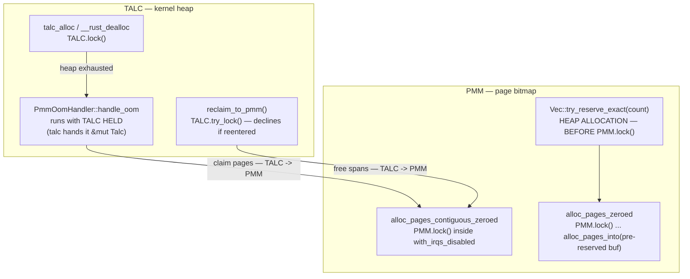

# Memory

Current-state architecture for physical memory (PMM), the kernel heap, CoW
fork, and userspace address spaces. For debugging, see
[`../../runbooks/debug-memory-oom.md`](../../runbooks/debug-memory-oom.md).

> **Stability: C (active risk).** Highest-churn subsystem through 2026-06.
> Three items still OPEN: per-run kernel-heap creep; reclaim-after-OOM below
> ~5 MB; and a full process table panicking instead of failing the spawn (see
> [OPEN: a full process table still panics the
> kernel](#open-a-full-process-table-still-panics-the-kernel)). The recurring
> bug class is *region-boundary computed with a wrong constant* — verify any
> new region math against the invariants below.

## Memory layout

### Physical (QEMU `virt`)

| Range | Use |
|---|---|
| `0x00000000–0x3FFFFFFF` | Device MMIO (GIC dist `0x08000000`, GIC CPU `0x08010000`, UART `0x09000000`, fw_cfg `0x09020000`, VirtIO `0x0a000000`, GICv3 redist `0x080a0000`/`0x080b0000`) |
| `0x40000000` | RAM_BASE |
| `0x40100000` | Kernel load (ARM64 Image `text_offset`=1 MB) |
| `0x40200000` | DTB (QEMU-placed) |
| above `_kernel_phys_end` | 1 MB boot stack (linker-derived `STACK_BOTTOM`/`STACK_TOP`) + 2-page guard |

### Kernel regions (computed by `compute_memory_layout`)

- **Code+Stack** = `max(ram/16, MIN_CODE_AND_STACK_BYTES)`; extreme clamped via `MEM_CALC_CLAMP_MB`=4. **Invariant:** must cover `BOOT_STACK_TOP + 1 MB guard`.
- **Heap** = dynamic (seeded ~1 MB `size` / ~4 MB `release`, grows from PMM). The "fixed 16 MB heap" in `archive/MEMORY_LAYOUT.md` is **superseded**.
- **User pages** = remainder.
- **Device MMIO VAs:** L0[1] → `0x80_0000_0000+` (GIC), `0x80_0000_2000` (UART), `0x80_0000_4000` (VirtIO). **Invariant:** devices must NOT live in L0[0] (the bun 93 MB collision).

### Userspace VA (small binary)

```
0x00400000   code (.text/.data/.bss)
brk          heap (dynamic lazy region, grows up)
0x0a000000   VirtIO device pages (L2[80])
0x10000000   mmap region (grows up; jumps over kernel_va_end())
~0x3FFFF000  user stack (grows down; auto-sized, 128 KB at ≤256 MB)
0x40000000+  kernel RAM identity-mapped (EL1-only 2 MB blocks)
```

Large binaries (bun 93 MB) push brk into `0x05–0x09`; mmap placed above
`0x80000000`. `kernel_va_end()` = `round_up(ram_base+ram_size, 1GB)` (dynamic;
was hardcoded `0xC0000000`).

**Boot page tables:** 1 GB L1 blocks (L1[0] device, L1[1]/[2] RAM);
`mmu::extend_boot_ram_identity_map()` adds L1[3..] for RAM > 2 GB.

## PMM (physical memory manager)

`src/pmm.rs`. Bitmap allocator, 1 bit per 4 KB page. All ops wrapped in
`with_irqs_disabled` + `PMM.lock()`.

| API | Purpose |
|---|---|
| `alloc_page` / `alloc_page_zeroed` | Single page (zeroed via `phys_to_virt` + cache clean) |
| `alloc_page_zeroed_user` | Gated by `USER_PAGE_RESERVE`=16 (user pages can't drain the last kernel reserve). On starvation walks the [pressure ladder](#alloc_page_zeroed_users-pressure-ladder) before returning `None` |
| `alloc_pages_contiguous_zeroed(count)` / `free_pages_contiguous` | Thread stacks |
| `free_page` | Returns `FreeOutcome { Freed, DoubleFree, OutOfRange }`; only `Freed` decrements `ALLOCATED_PAGES` |
| `cow_ref_inc(pa)` / `cow_ref_dec(pa) -> bool` | CoW refcounts (separate from bitmap). `dec` true ⇒ last ref, caller frees. |
| `stats()`, `double_free_count()` | `/Total/Allocated/Free`; the desync canary |

**Untracked-frame policy:** never free a frame you didn't track (leak is
recoverable; over-free crashes the kernel).

## PMM ↔ heap lock flow

Two independent spinlocks govern all memory allocation, and **they call each
other**:

- `pmm::PMM` (`0x402460b8` in a `release-smp-shared` build) — the page bitmap.
- `allocator::TALC` — the kernel heap.

Both are `spinning_top` `RawSpinlock`s: a **single bool, no owner field, not
reentrant**. Nothing records who holds one, so neither a self-deadlock nor a
cycle can be detected at runtime — the box simply stops.

**The intended order is `TALC → PMM`**, stated in `reclaim_to_pmm`'s own
comment. `handle_oom` runs with TALC held and takes PMM beneath it;
`reclaim_to_pmm` uses `try_lock` so a reentry from inside `malloc` declines
instead of self-deadlocking. The PMM side keeps to the same order by
construction: `alloc_pages_zeroed` (`pmm.rs:1311`) reserves its result `Vec`'s
capacity with `try_reserve_exact` (`pmm.rs:1321`) **before** calling
`PMM.lock()` (`pmm.rs:1326`), and the locked helper it calls,
`Pmm::alloc_pages_into(count, &mut result)` (`pmm.rs:318`), only ever `push`es
into that pre-reserved buffer — a `debug_assert!` at its top (`pmm.rs:319`)
enforces the precondition that the caller reserved capacity first. No heap
allocation happens while `PMM` is held.



**Historical bug, FIXED in commit `159c3db`.** `Pmm::alloc_pages` (since
removed) used to build its result with `alloc::vec::Vec::with_capacity(count)`
— a heap allocation — *while `PMM.lock()` was already held*. That was the
reverse edge and it closed a real cycle: core A held PMM and wanted TALC
(`alloc_pages_zeroed` → `Vec::with_capacity` → `talc_alloc`) while core B held
TALC and wanted PMM (`talc_alloc` → `handle_oom` →
`alloc_pages_contiguous_zeroed`) — worse than an ordinary ABBA because a single
core could deadlock against itself if that same `Vec::with_capacity` was the
allocation that exhausted the heap, and because the PMM side spins inside
`with_irqs_disabled`, so the stuck core could take no timer IRQ — no
preemption, no `PSTATS`, no console, indistinguishable from outside from a
console-starved VM. The fix hoists the reservation above the lock (the
reserve-before-lock flow diagrammed above) and changes the locked helper to
fill an already-capacity'd buffer instead of growing one itself.

### Rule

**Never allocate on the heap while holding `PMM`.** Compute into a fixed-size
buffer, or allocate the container *before* taking the lock and fill it after —
`alloc_pages_zeroed` above is the reference example. The same applies to any
`Spinlock<BTreeMap<..>>` in `pmm.rs` (`COW_FAULT_LOCK`, `COW_REFCOUNTS`): a map
insert can allocate, so those nest into TALC too.

### Observed signature

Captured 2026-08-08, before the fix, with
[`scripts/lockprobe.py`](../../../scripts/lockprobe.py) on a `-j4` in-guest
self-host build (SMP=4), 5 of 6 deaths in a 22-round campaign:

```
allocator::TALC @ 0x402db750: 0x01   <- HELD
pmm::PMM        @ 0x402460b8: 0x01   <- HELD
KERNEL_LOCK: owner=0, next_ticket == now_serving   (BKL idle — not the BKL)
CPU#0 __rust_dealloc+64                 spinning on TALC
CPU#1 alloc_pages_contiguous_zeroed+40  spinning on PMM
CPU#2 __rust_dealloc+60                 spinning on TALC
CPU#3 talc_alloc+80                     spinning on TALC
```

All four cores burning ~399% host CPU in test-and-test-and-set loops. The BKL is
idle throughout, which is what distinguishes this from the `[BKL] stuck` storm it
was previously filed with.

Full investigation, including how the locks were named without debug info and the
three ways the regression test was wrong first:
[`../../archive/PMM_TALC_LOCK_CYCLE_SILENT_WEDGE.md`](../../archive/PMM_TALC_LOCK_CYCLE_SILENT_WEDGE.md).

Regression tests: `pmm_heap_lock_order` (`src/tests.rs`, single-core) and
`pmm_heap_lock_order_smp` (`src/process_tests.rs`, cross-core). **Both detect a
regression by HANGING the boot suite, not by failing** — the `PMM` side spins
with IRQs masked, so there is no verdict to print.

## Kernel heap allocator

`src/allocator.rs`. **Not a slab** — a dynamic linked-list/talc allocator:
`talc::Talc<PmmOomHandler>` behind a `Spinlock`.

- **Growth:** seeded with a small bootstrap arena; `PmmOomHandler::handle_oom`
  claims contiguous pages from PMM. `HEAP_GROW_PAGES`=64 amortised; under
  pressure `heap_grow_backoff` halves `n` toward `needed` (kills the
  fragmentation abort).
- **Reclaim:** `reclaim_to_pmm()` returns wholly-free spans;
  `claimed_span_report()` exposes live/pinned spans.
- **Watermark:** `is_memory_low()` (free heap < 2 MB `HEAP_LOW_WATERMARK`) —
  circuit breaker at fork/clone/spawn/SSH accept.
- **Failure path:** `#[alloc_error_handler]` (`src/allocator.rs:499`) prints
  `[OOM] allocation of N bytes failed`, calls `return_to_kernel(-12)` if
  in-process, else `panic!`.
- **`mark_pmm_ready()`** flips from talc-only to page-backed growth after PMM init.

## CoW fork

- **Share path** (`fork_process`, `COW_FORK_ENABLED`): `cow_share_range` →
  per page `cow_ref_inc(pa)` + child `map_page(RO)` + `track_user_frame`; then
  parent `demote_range_to_ro`; `flush_tlb_asid(0)` (all ASIDs — sibling threads
  share L0 with different ASIDs).
- **Fault path** (write to RO page, `exceptions.rs`): alloc copy,
  `track_user_frame(new)`, `remove_user_frame(old)`, `cow_ref_dec(old)`.
- **Data structure:** `user_frames: BTreeMap<PA, u32>` (refcount = in-AS mapping
  count; was `Vec` → O(n²) munmap, fixed to O(log n)).

### CoW invariants (the desync surface)

1. `track_user_frame` count must equal `cow_ref_inc` count (1:1) — ~30
   hand-maintained call sites. Any new mapping of a physical page must do both.
2. `remove_user_frame` is `#[must_use] -> bool` (true ⇒ last ref, caller owns
   the free). munmap loops free **only when it returns true**.
3. `Drop` frees each distinct PA **once** (count is mapping refcount, not alloc
   count).
4. Untracked-frame policy: **don't free** (leak is recoverable; over-free
   crashes kernel).
5. **vfork fast-path** (`VFORK_FASTPATH_ENABLED`, `CLONE_VFORK|CLONE_VM`):
   `new_shared(parent_l0)` (no copy, no demote); `replace_image` drops shared
   view on exec → parent takes zero CoW faults.

## Userspace memory model

- **Page tables:** per-process TTBR0, AArch64 4-level / 4 KB granule.
  `add_kernel_mappings` identity-maps full RAM as EL1-only 2 MB blocks (so
  `phys_to_virt` works during syscalls); device MMIO via shared L0[1].
- **Demand paging:** "lazy regions" (`push_lazy_region` →
  `ensure_user_page_mapped`) for heap, large mmap, stack, large ELF segments
  (`DeferredLazySegment` via `from_elf_path`).
- **mmap:** bump from `0x10000000`, first-fit into `free_regions` on munmap;
  jumps over `kernel_va_end()`; MAP_FIXED may shatter a 2 MB block into L3.
- **Lazy anonymous mmap:** `MAP_PRIVATE` > `MMAP_EAGER_MAX_PAGES`=16 → lazy
  region, zero-on-demand.
- **Stack:** top ~`0x3FFFF000`; auto-sized (128 KB at ≤256 MB by default).
- **Process info page:** `PROCESS_INFO_ADDR`=0x1000 (pid; read only with user
  TTBR0 active).
- **libakuma allocator:** default page-based (mmap per alloc) **or**
  `chunked-allocator` feature (Talc in 64 KB chunks). Deferred-free queue for
  realloc safety.
- **Eviction:** `try_evict_ro_page` + `reclaim_clean_file_pages` evict clean
  `AP_RO_ALL` file-backed pages under pressure (lets models > RAM run).

## Reclaim under memory pressure

A dead process's memory does **not** return to the PMM when it exits. Since
Phase 7e's "Free" half, `unregister_process` only RETIREs the slot; the
`Process` drop — which frees every user frame, every page-table frame and the
ASID — happens later, in `table::reclaim_retired_processes`, once a cooldown
(`PROCESS_RECLAIM_COOLDOWN_US`, 10 ms) has outlasted any BKL-dropped window
that could still hold a raw `*Process`. **Do not shorten or bypass that
cooldown**; `reclaim_retired_processes_force` is tests-only.

### `alloc_page_zeroed_user`'s pressure ladder

Rungs, in order. Each is tried only if the previous left free PMM at or below
`USER_PAGE_RESERVE`:

| # | Rung | Cost of the memory it frees |
|---|---|---|
| 1 | `allocator::reclaim_to_pmm()` | none — fully-free heap spans |
| 2 | `process::reclaim::drain_retired_under_pressure()` | none — the pages belong to processes that are already dead |
| 3 | `process::reclaim_clean_file_pages()` | one disk read per page, on the next touch by a **live** process |
| 3b | `file_page_cache::shrink()` | one disk read per page, on the next *mapper* of that page |
| 4 | return `None` ⇒ caller SIGSEGVs the faulting process | — |

Rung 2 sits above rung 3 deliberately: evicting a live process's clean file
pages is the more expensive and more destructive of the two.

Rung 3b is not optional garnish — it is what keeps rung 3 honest. The shared
file-page cache holds a reference on every frame it caches, so `free_page` from
rung 3's sweep decrements instead of freeing. Without 3b, reclaim would unmap
pages, report progress, and return no memory at all. 3b drops only entries whose
frame has **no remaining mappers** (`cow_ref_get(pa) <= 1`), since evicting a
still-mapped page costs a future re-read while freeing nothing now.

## Shared file pages (`src/file_page_cache.rs`)

**Stability: B — verify behaviour.** Landed 2026-08-05.

Read-only file-backed pages are deduplicated on `(inode, file_offset)`, so every
process mapping the same page of the same file shares one physical frame.

Before this, each file-backed demand fault allocated a **private** frame and
copied the file bytes into it. Two processes mapping the same page held two
copies filled by two `read_at` calls — the mechanism behind "`-j4` is slower than
`-j1`" on the self-host build (see
[`runbooks/selfhost-kernel-build.md`](../../runbooks/selfhost-kernel-build.md)
§5.1a).

### The refcount is the existing CoW refcount

No new teardown code exists, and none should be added. `pmm::free_page` already
routes through `cow_ref_dec` and declines to free a frame that still has
references, so process exit, `munmap` and `try_evict_ro_page` all just drop a
reference. The invariant is:

```
refcount = (1 if cached) + (number of address spaces mapping it)
```

An address space contributes **exactly one** reference, because teardown frees
each distinct PA once regardless of how many VAs map it (`user_frames` counts
VAs per PA). The cache takes a reference per *fault*, so a second VA in the same
process mapping an already-held frame hands the surplus back —
`exceptions::drop_surplus_shared_ref`, gated on `AddressSpace::tracks_user_frame`.
Removing that guard leaks a frame per occurrence.

### Eligibility is deliberately narrow

Each rule rules out a correctness bug, not merely a risk:

| Rule | What it prevents |
|---|---|
| mapped read-only to EL0 (`AP_RO_ALL`) | a writable private mapping would need CoW before sharing; ELF data segments stay private |
| page fully covered by file data | a page straddling `filesz` has a zero-fill tail belonging to the *mapping*, so two mappers can legitimately disagree |
| `inode != 0` | the path-only fallback has no stable identity to key on |

### Invalidation is mandatory

A stale shared page is a silent wrong-bytes bug, not a crash: `rustc` mmaps
`.rlib`/`.rmeta` files that `cargo` rewrites, and ext2 reuses inode numbers.
Every mutating VFS entry point calls `vfs::invalidate_file_pages`
(`write_at`, `write_file`, `append_file`, `truncate`, `fallocate`, `remove_file`,
`rename`). `remove_file` and `rename` resolve the inode **before** the mutation,
since afterwards the path no longer names it.

Kill switch: `config::SHARED_FILE_PAGES_ENABLED`. Observability: the `[FPCACHE]`
line in the 30 s PSTATS block — `hits` counts private allocations + `read_at`
sweeps avoided.

### Who actually runs the collector

`process::reclaim` splits "notice pressure" from "run `Process::drop`", because
the drop takes PMM, `ASID_ALLOCATOR`, `SHARED_L0_TABLE` and (via
`Arc<SharedFdTable>`) VFS/socket locks — a caller already holding one
self-deadlocks. So:

- **`request_retired_reclaim()`** — three atomic ops, no locks, no drop code.
  Safe from anywhere, including drop-path lock holders and IRQ context.
- **`drain_retired*()`** — runs the drop. **Only** from these vetted sites,
  each with no drop-path lock held:

| Site | Covers |
|---|---|
| `sys_exit_group` / `sys_exit` terminal park (`src/syscall/proc.rs`) | every clean userspace exit — the common case |
| `return_to_kernel` / `return_to_kernel_from_fault` terminal park | fault-kills and kernel-spawned process exits |
| thread 0's idle loop; the `smp-shared` per-core idle loop | the regime where `netpoll_maint` is starved |
| `alloc_page_zeroed_user` rung 2 | demand-paging pressure |
| `netpoll_maint`, 100 ms (pre-existing) | steady state |

Adding a *sixth* site means auditing its ambient lock context first. If you
cannot, call `request_retired_reclaim()` instead and let one of the five
collect.

Runtime toggle `process::reclaim::set_pressure_reclaim_enabled` (default on) is
both the kill switch and the same-binary A/B lever used by
`test_retired_reclaim_pressure_ab`.

### OPEN: a full process table still panics the kernel

`register_process` is **infallible**. On a full-table miss it prints
`Process table full (256 slots)` and `panic!`s — even when every one of those
`MAX_PROCESSES` slots is a RETIRED zombie whose memory is reclaimable and whose
only problem is that no collector has run yet. It deliberately does not reclaim
inline; that call site is ruled out by the self-deadlock in the module note
above, and the ban is correct.

What is *not* correct is the panic. The intended fix is to return an error when
`retired_process_count() > 0` so fork/clone/spawn surface `-EAGAIN` instead of
halting the box — "collector starved, retry" rather than "kernel dead". It was
left out of the pressure-reclaim change because making `register_process`
fallible means threading a `Result` through every fork/clone/spawn caller, a
wider diff than the whole collector mechanism.

Until then the mitigation is indirect: the five drain sites above make a
zombie-full table far less reachable than it was, but they do not make it
impossible — a spawn storm that outruns every collector still ends in the
panic. Treat `Process table full` as this open item, not as a genuine
capacity limit.

### Reading the signature

`[PSTATS]`'s `retired=N/Mp` field is the live form of the detection signature:
`pmm=` pinned near the reserve while `retired=` is non-zero means reclaimable
memory exists and the collectors are starved — not that memory leaked. A high
`retired=` count (approaching `MAX_PROCESSES`=256) is also the run-up to the
`Process table full` panic above.

## Background

- `archive/MEMORY_LAYOUT.md` (partly superseded on heap sizing).
- `archive/USERSPACE_MEMORY_MODEL.md`, `archive/COW_OPTIMIZATIONS.md`.
- `archive/LOW_MEMORY_ENVIRONMENT.md` — the densest source; extreme hardening.
- `archive/HEAP_AND_MEMORY_IMPROVEMENTS.md` — watermark + admission control.
- `archive/OOM_KILL_DEFERRED_RECLAIM_GAP.md` — the risk statement that the
  pressure-reclaim section above closes (triggers, the lock-context constraint
  on call sites, detection signature).
- `archive/BOOT_SUITE_PMM_DEFERRED_RECLAIM.md` — the measurement it came from
  (~35 K pages parked, PMM pinned at the reserve for 500 polls).
- `archive/FILE_PAGE_CACHE_MMAP_AMPLIFICATION.md` — the fix behind "Shared
  file pages" above (per-process private page copies causing `-j4` mmap
  amplification).
- `archive/BKL_PHASE7E_PROCESS_TABLE_RECLAIM.md` — why the free is deferred at
  all, and the self-deadlock that constrains where reclaim may be called.
