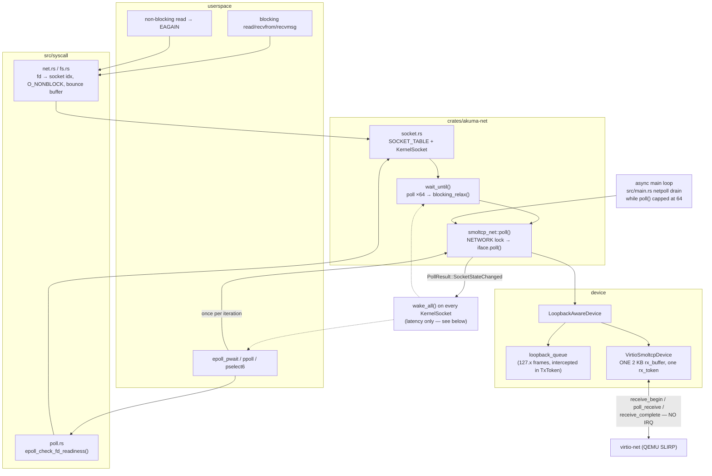

# Networking

Current-state architecture for how packets and socket syscalls flow in Akuma.
For the rump stack internals see [`rump-stack.md`](rump-stack.md).

> **Stability: B (verify behaviour).** The box model, the two stacks, and
> `connect(2)` semantics are settled and pure-function tested.
> [The native data path](#the-native-data-path) was **C** until 2026-08-17,
> when four defects behind
> `archive/SOCKET_DELAYED_FIRST_BYTE_HANG.md` were root-caused and fixed
> (spurious `ETIMEDOUT` caps, unimplemented `SO_RCVTIMEO`, an EPOLLOUT edge
> that never re-armed, and a connecting socket reported as read-closed). It is
> B rather than A because it is still poll-driven with no NIC interrupt and
> posts one RX buffer at a time. Read
> [Divergences from Linux](#divergences-from-linux-native-stack) before
> concluding that a client bug is a client bug.

## The box model

Akuma routes AF_INET (socket-family) syscalls **per box**, keyed on a process's
`box_id`.

- **Box 0** is the root box every process starts in.
- A process can spawn into or `join_box` into another box for isolation.
- Each box has its own network stack assignment: **native (smoltcp)** or
  **rump**.
- The kernel's dispatch hook (`intercept_box_syscall` in `src/rump_proxy.rs`)
  enforces this as a hard guarantee: a socket syscall from a rump box, or any
  syscall on a rump-owned fd, can never fall through to smoltcp.

Source: `src/rump_proxy.rs` (header + `intercept_box_syscall`).

## The two stacks

| | Native (smoltcp) | Rump (NetBSD) |
|---|---|---|
| **NIC** | NIC0 (always present) | NIC1 (`/dev/net/tap0`), needs `RUMP_NIC=1` |
| **L2 path** | In-kernel smoltcp | Userspace `/bin/rump_server` over a raw tap |
| **SSH** | Userspace `/bin/sshd` over smoltcp | Userspace `/bin/sshd` over rump |
| **Default for box 0** | Yes (normal builds) | Yes when `rump-default` feature is on (devbox) |
| **In-kernel HTTPS** | No (`kernel-tls` was deleted — use a userspace tool) | No (use a userspace tool) |

There used to be an additional row here for an in-kernel SSH server that ran
only over smoltcp; it was deleted 2026-08-10 along with the in-kernel shell
behind it — see `docs/archive/BUILTIN_SSH_REMOVAL.md`. SSH is the userspace
`/bin/sshd` (`docs/reference/subsystems/ssh.md`) on both stacks now.

### When is each used?

- **Default build** (`cargo run --release`): box 0 = smoltcp. Rump is opt-in
  per box via a herd `stack=rump` service (see `archive/RUMP_PLUS_HERD.md`).
- **Devbox** (`devbox` feature + `--no-default-features`): smoltcp is compiled
  out entirely. Box 0 = rump. There is no native stack at all.

## How box 0 gets its stack

### Native (default build)

Box 0 starts on smoltcp. NIC0 is initialised by the kernel at boot; DHCP runs
on the in-kernel stack. No userspace process owns the stack.

### Rump-default (devbox)

> **Deferred (2026-07-19):** the default devbox is now **devbox-smoltcp** (box 0
> on the native smoltcp stack + real shared-kernel SMP; see
> [`smp-shared.md`](smp-shared.md)). `rump-default` still works but is no longer
> the recommended devbox.

At boot, `rump_proxy::start_default_stack` (`src/rump_proxy.rs:1284`) runs when
the `rump-default` feature is on:

1. Checks `akuma_net::rump_tap::is_ready()` (NIC1 exists). If not, logs and
   returns — box 0 stays native (no-op in a devbox without `RUMP_NIC=1`).
2. `mark_box_rump(0)` — marks box 0 as a rump box **before** spawning the
   server, so subsequent box-0 socket syscalls route to the proxy (which waits
   for the handshake).
3. Spawns `/bin/rump_server --net --fd 3 --log /var/log/box/0/rump_server.log`
   in box 0. The server's own pid is excluded from interception.
4. `attach_server(0, pid)` — wires the kernel sysproxy channel onto the
   server's fd 3 and handshakes in a kthread (~5s: `rump_init` + DHCP over
   `/dev/net/tap0`).

After that, **every ordinary unboxed process** (login shell, sshd, curl, meow)
has its socket syscalls transparently routed to box 0's `rump_server` over that
channel. No herd box, no `box_root`, no `join_box`.

> `main` does **not** block on the handshake — rump_server's rumpsp fiber is
> cooperatively scheduled and only advances while the host scheduler keeps
> churning. `main` must return so herd starts + the background loop pumps the
> fibers. herd's `sshd` `start_delay_ms` + `restart` cover the ~5s bring-up.
> Source: `src/rump_proxy.rs:1312-1321`.

## Syscall routing detail

For a socket-family syscall (or any syscall on an fd the rump proxy owns),
`intercept_box_syscall` forwards it to the box's `rump_server` over the fd-3
kernel pipe pair. The proxy is **synchronous on the calling thread** — every
round-trip blocks the caller until the server replies.

AF_UNIX socketpairs (syscall 199) are **excluded** from proxying: they are pure
local IPC, never networking, so they always run natively regardless of the
box's stack. This matters for Rust's `std::process::Command`, which uses
`socketpair(AF_UNIX, ...)` as its exec-status channel for every subprocess
spawn. Source: `crates/akuma-rump/src/syscall_translation.rs`,
`archive/OPTIONAL_SMOLTCP.md`.

## `connect(2)` semantics on the native stack

smoltcp's `tcp::Socket::connect` refuses any socket that is not `Closed`, so the
socket layer classifies the current TCP state *before* dialing
(`connect_step`, `crates/akuma-net/src/socket.rs`):

| Socket state | `connect` returns |
|---|---|
| `Closed`, `Listen`, or any teardown state | dials (a real SYN) |
| `Established` | `0` — success |
| `SynSent` / `SynReceived`, non-blocking caller | `EALREADY` |
| `SynSent` / `SynReceived`, blocking caller | waits for completion, **without re-issuing the SYN** |

`Established` answering *success* rather than POSIX's `EISCONN` is deliberate:
the redial is how the standard non-blocking idiom collects a completed connect
(`connect` → `EINPROGRESS` → poll → `connect`), and hiredis — so `redis-cli` —
uses exactly that. Reporting an error there made every local client fail against
a healthy listener.

Failure errnos are **distinct**, which they were not before 2026-08-16:

| Errno | Means |
|---|---|
| `ECONNREFUSED` | the socket reached `Closed` — RST, or the stack gave up |
| `ETIMEDOUT` | still half-open at the 10 s deadline |
| `EADDRNOTAVAIL` | smoltcp `Unaddressable` — unroutable remote, or a zero local port |
| `ENETDOWN` | no network stack at all |

`bind(addr, 0)` allocates an ephemeral port for TCP as well as UDP; storing the
literal 0 made the following `connect` unaddressable. Both rules are
pure-function-tested (`connect_state_tests`, `crates/akuma-net/src/tests.rs`).

There is **no IPv6**: smoltcp is built `proto-ipv4` only, and `sys_socket`
returns `EAFNOSUPPORT` for any domain but `AF_INET` (2) — which is the `errno:
97` line servers print when they try to bind `::` first. See
`archive/DEVBOX_ISSUES.md` Issue 9.

## The native data path

Everything below is the **smoltcp** stack only. The rump stack's data path is
the sysproxy round-trip described in [`rump-stack.md`](rump-stack.md).

### The whole flow



### Nothing here sleeps on a wakeup it can miss

**There is no virtio-net RX interrupt.** `VirtioSmoltcpDevice::receive` is a
two-phase `receive_begin` → `poll_receive` → `receive_complete` sequence with no
IRQ handler behind it; the stack advances only when something calls
`smoltcp_net::poll()`. Four things do:

| Driver | Site | Cadence |
|---|---|---|
| async-main netpoll drain | `src/main.rs` (`while poll()`, capped at 64) | every main-loop iteration |
| `epoll_pwait` / `ppoll` / `pselect6` | `src/syscall/poll.rs` | once per loop iteration; the sleep between iterations is capped at `BLOCKING_POLL_INTERVAL_US` = **10 ms** (1 ms if any polled fd is a rump fd) |
| blocking socket ops | `wait_until` in `crates/akuma-net/src/socket.rs` | up to 64 polls per round, then `blocking_relax()` |
| post-op flush | tail of `socket_send` / `socket_recv` | once per syscall |

The consequence is worth stating plainly, because it rules out a whole class of
hypothesis: **`KernelSocket::wakers` is a latency optimisation, not a
correctness mechanism.** Both waiting shapes re-check their predicate on a
bounded cadence whether or not a wake ever arrives — `sys_epoll_pwait` re-polls
at least every 10 ms, and `wait_until` re-polls after every `blocking_relax()`.
So a socket reader that never wakes cannot be explained by a dropped
`Waker`. Either the readiness predicate stays false, or the bytes never reached
the smoltcp socket. (This is the audit finding that retires the "lost wakeup"
working hypothesis in `archive/SOCKET_DELAYED_FIRST_BYTE_HANG.md`; see
[`../../runbooks/debug-delayed-first-byte.md`](../../runbooks/debug-delayed-first-byte.md).)

### RX is one 2 KB buffer at a time

`VirtioSmoltcpDevice` owns a **single** `rx_buffer: [u8; 2048]` and a single
`rx_token`. A buffer is posted, the device fills it, `receive()` hands it to
smoltcp and posts the next one. smoltcp's `iface.poll()` loops on `receive()`,
but the freshly posted buffer is usually not filled yet by the time
`poll_receive()` is asked, so **a poll pass commonly nets one frame**.

That is a throughput property, not a correctness one — QEMU defers rather than
drops when the guest has no free RX buffer — but it sets the ceiling: a client
parked in `epoll_pwait` drains a burst at roughly one MTU per 10 ms poll pass
until a read makes the loop hot. It is the structural reason a response that
trickles in sub-second chunks behaves nothing like the same body delivered as
one delayed burst.

### Readiness reporting

`epoll_check_fd_readiness` (`src/syscall/poll.rs`) is the single readiness
oracle for `epoll_pwait`, `ppoll` **and** `pselect6`. For a TCP `Socket` fd:

| Reported | Condition | Source |
|---|---|---|
| `EPOLLHUP` | `!is_active()` — socket fully dead; **suppresses IN/OUT** | `socket_is_dead_tcp` |
| `EPOLLIN` | `can_recv()` **or** (`!may_recv()` and the connection reached `Established`) — the second arm is how a FIN surfaces as a readable EOF | `socket_can_recv_tcp` → `tcp_recv_ready` |
| `EPOLLOUT` | `can_send()` | `socket_can_send_tcp` |
| `EPOLLRDHUP` | `!may_recv()` **and** the connection reached `Established` | `socket_peer_closed_tcp` |

Two guards in that table are load-bearing, and each of them is a fixed bug:

- `!is_active()` is deliberately **not** an `EPOLLIN` source. A `Closed` socket
  would otherwise report readable forever and spin the caller through
  `recv → EAGAIN → epoll → EPOLLIN`.
- **"reached `Established`"** (`tcp_reached_established`,
  `crates/akuma-net/src/socket.rs`) is what separates "the peer closed the read
  side" from "the handshake has not finished yet". smoltcp answers both with
  `may_recv() == false`, and in `SynSent` it *also* answers
  `is_active() == true` — so the earlier `is_active() && !may_recv()` test
  advertised a socket that was still shaking hands as readable-at-EOF **and**
  `EPOLLRDHUP`, while a non-blocking `recv` on it returned `Ok(0)`. A client
  that polled inside that one-round-trip window concluded the connection was
  dead and parked forever *without ever sending its request*. Pure-function
  tested (`recv_eof_state_tests`, `crates/akuma-net/src/tests.rs`).

Edge-triggered registrations keep a per-fd `last_ready` mask and report
`revents & !last_ready`. That mask is refreshed only *inside* `sys_epoll_pwait`'s
loop, so a level transition that happens and un-happens between two passes is
invisible and the edge never fires again. The I/O syscalls are the only code that
witnesses those transitions, so **both** directions have to report them:

| Reset hook | Called from | Clears |
|---|---|---|
| `epoll_on_fd_drained(fd)` | `recvfrom` / `recvmsg` / `read` — after every successful read *and* every `EAGAIN` | `EPOLLIN` |
| `epoll_on_fd_write_blocked(fd)` | `sendto` / `sendmsg` / `write` — after every **short** write *and* every `EAGAIN` | `EPOLLOUT` |

The read hook resets on success as well as on `EAGAIN` because BoringSSL and bun
read one TLS record at a time and never drain to `EAGAIN`. The write hook did not
exist until 2026-08-17, and its absence was a hang: a client that filled the
16 KB transmit buffer and then waited for `EPOLLOUT` could wait forever, because
`epoll_pwait` drives `smoltcp_net::poll()` at the top of its own loop and so
often flushed the buffer before it ever observed `can_send()` go false.
Regression: `epoll_edge_rearm_symmetry` in the boot suite.

### Socket lifetime: never bypass the fd refcount

A `KernelSocket` is destroyed by the **last** close, not the first:
`KernelSocket::refs` counts fd-table references, `socket_clone_ref` bumps it
(fork's fd-table copy, `dup`/`dup2`/`F_DUPFD`) and `remove_socket` drops it.
That field exists because the first close used to destroy the socket under every
other fd still using it — the freed table slot **and** the smoltcp handle were
then reused by the next connection, splicing two unrelated TCP streams together
(TLS record bytes inside an SSH session → "message authentication code
incorrect").

The rule that follows: **anything holding a `FileDescriptor::Socket` releases it
through `sys_close`**, which removes the fd-table entry and drops exactly one
reference. Calling `remove_socket(idx)` directly while leaving the fd in the
table drops the socket now and drops it *again* when the owning process is
reaped — and process teardown is deferred, so by then the freed slot may belong
to somebody else.

That is not hypothetical. A boot self-test added on 2026-08-17 did exactly this,
and the second close landed on **sshd's listener** moments after the suite handed
the slot over. The symptom was maximally misleading: sshd bound, listened, and
sat in a healthy non-blocking accept loop forever, while every client got

```
kex_exchange_identification: read: Connection reset by peer
```

— which is the same line an exhausted listener backlog produces (see
`socket::MAX_BACKLOG`). `httpd` on :8080 kept serving normally, so the network
stack looked fine. The tell was sshd's `[PSTATS]` line: `accept=N` climbing with
**no** `clone`, `write` or `close` alongside it, meaning not one connection had
ever been accepted since boot. Compare that against a known-good boot before
suspecting the network.

### Divergences from Linux (native stack)

These are the ones that change observable client behaviour. Several look like
client bugs from userspace.

| Behaviour | Akuma (smoltcp) | Linux |
|---|---|---|
| blocking `read`/`recv` on TCP | blocks indefinitely, or until `SO_RCVTIMEO` | same |
| blocking `write`/`send` on TCP | blocks indefinitely, or until `SO_SNDTIMEO` | same |
| `SO_RCVTIMEO` / `SO_SNDTIMEO` | honoured; `struct timeval`, zero means "block forever", readable back via `getsockopt` | same |
| blocking `connect` | `ETIMEDOUT` after 10 s | ~2 min (`tcp_syn_retries`) |
| blocking UDP `recvfrom` | `ETIMEDOUT` after 10 s | blocks indefinitely |
| blocking `accept` | no timeout | no timeout |
| `SO_RCVBUF` / `SO_SNDBUF` | accepted and ignored; buffers are fixed at 16 KB each direction (`TCP_{RX,TX}_BUFFER_SIZE`) | honoured |
| `shutdown(2)` | no-op returning 0 | half-closes the connection |
| `TCP_NODELAY` | tracked, but Nagle is off unconditionally (`set_nagle_enabled(false)`) and delayed ACK is disabled | configurable |
| listen backlog | a **hard** ceiling of pre-created sockets (8, or 32 with `many-sessions`), not a hint — past it the peer gets RST | soft SYN-queue hint |
| address families | `AF_INET` only; `AF_INET6` is `EAFNOSUPPORT` | both |
| socket budget | 128 fds (`socket::MAX_SOCKETS`) over 32–256 smoltcp sockets depending on features, 32 KB of heap each | ulimit-bound |

The first three rows were the opposite of this until 2026-08-17, and they are
worth knowing about because the old behaviour is what a stale binary or an older
branch still does: a blocking TCP read was capped at **30 s** and a blocking
write at **5 s**, both surfacing as `ETIMEDOUT` at a deadline that existed
nowhere in the client, and `SO_RCVTIMEO`/`SO_SNDTIMEO` were accepted by
`setsockopt` and silently dropped — with no `getsockopt` arm, so a client could
not even detect the loss. `socket_recv`/`socket_send` now take the per-socket
timeout (`KernelSocket::{rcvtimeo_us,sndtimeo_us}`, `None` = forever).
Regression: `socket_timeout_option_roundtrip` in the boot suite.

`userspace/nettest/rust/` has probes that measure every row above from inside
the guest — `nettest-std rcvtimeo` and `nettest-std sweep` in particular. The
procedure is [`../../runbooks/debug-delayed-first-byte.md`](../../runbooks/debug-delayed-first-byte.md).

## Port forwarding (host → guest)

`scripts/cargo_runner.sh` sets up SLIRP `hostfwd` rules:

- NIC0 (`net0`): `SSH_PORT→:22`, `HTTP_PORT→:8080`, `MODEL_PORT→:11434`, etc.
  (`cargo_runner.sh:259`). `SSH_PORT` derives from `INSTANCE`.
- NIC1 (`net1`, rump): `RUMP_SSH_PORT` (default 2223) → `:22` on the rump
  SLIRP (`cargo_runner.sh:166`). This is how you reach the devbox's userspace
  sshd.

## Background

- `archive/SMOLTCP_MIGRATION_SUMMARY.md` — the smoltcp migration post-mortem.
- `archive/OPTIONAL_SMOLTCP.md` — making smoltcp optional for the devbox.
- `archive/NATIVE_STACK_INTERNET.md` — validating the native stack.
- `archive/RUMP_SYSPROXY.md` — the committed sysproxy design.
- `archive/HIJACK_VS_KERNEL_PROXY.md` — why kernel-side routing.
- `archive/REDIS_END_TO_END.md` — the two `connect`/`bind` bugs above, and why
  one errno for every failure hid both of them.
- `../../runbooks/run-redis.md` — a worked end-to-end server on this stack,
  including which guest ports the runner actually forwards.
