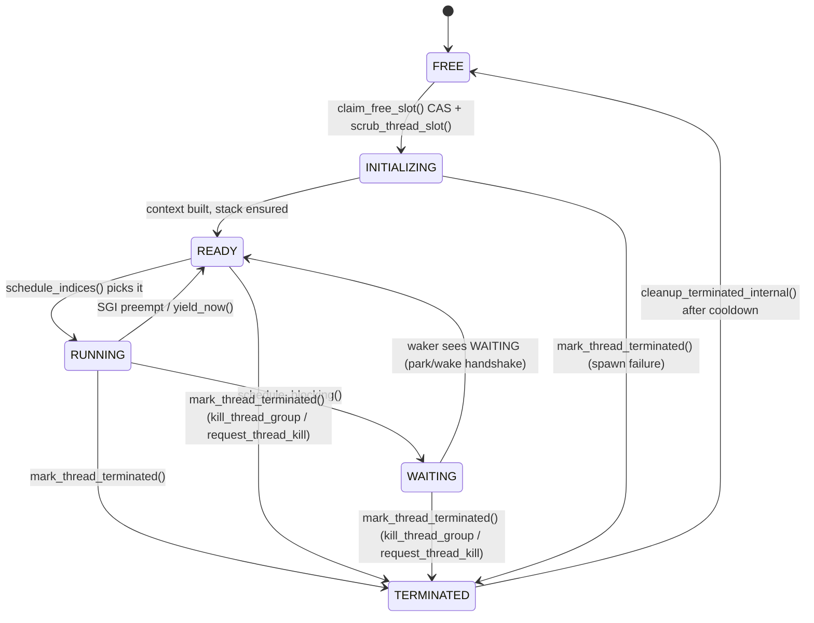
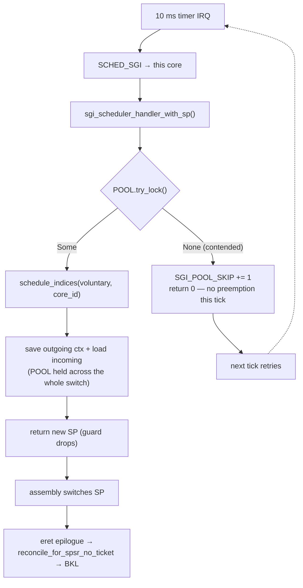

# Scheduler / threads / concurrency

Current-state architecture for preemptive threading, the scheduler, context
switch, synchronization primitives, and blocking.

> **Stability: A (stable)** for everything below **except**
> [The `POOL` gate](#the-pool-gate-shared-smp), which is **C (active risk)** — it carries an
> open, reproducible wedge under shared-SMP fork churn. Threading churn was concentrated in
> Jan–Mar and has been quiet since. The proportional scheduler + SGI preemption model is
> settled. The recurring lesson across the codebase: **never `yield_now()` or
> do slow I/O inside a preemption-disabled closure** — that is the single most
> common cause of hangs (see `../../runbooks/debug-network.md`).

For real (shared-kernel) SMP, see [`smp-shared.md`](smp-shared.md).

## Threading model

- **Preemptive**, fixed-size thread pool. `MAX_THREADS`=256 slots (**64 under
  the `size`/`extreme-size` profile**); defined in `akuma_primitives::preempt`,
  re-exported via `threading/types.rs` and `config`. Runtime cap `THREAD_LIMIT`
  clamped to `[RESERVED_THREADS+1, MAX_THREADS]`.
- **Stacks** come from PMM (`alloc_pages_contiguous_zeroed`); per-thread sizes
  via `USER_THREAD_STACK_SIZE` / `SYSTEM_THREAD_STACK_SIZE` (`config.rs`).
  Stack-overflow detection via canaries (`ENABLE_STACK_CANARIES`).
- **Thread states** (`crates/akuma-exec/src/threading/types.rs:64`):
  `Free → Ready → Running → Terminated`. Tracked in lock-free atomics
  `THREAD_STATES: [AtomicU8; MAX_THREADS]` (`threading/mod.rs:292`; no mutex on the hot path).

### Slot state machine

`THREAD_STATES[tid]` (`crates/akuma-exec/src/threading/mod.rs:292`; the state values
themselves are the `thread_state` constants module, `types.rs:64`) is the lock-free
source of truth. `INITIALIZING` exists so the scheduler cannot pick a slot whose context
is half-built, and the `TERMINATED → FREE` edge is deliberately delayed by a cooldown so
a dying thread is never recycled while a peer still holds a reference to it.

`mark_thread_terminated()` (`threading/mod.rs:1080`, the state store itself at `:1125`) is
an **unconditional store, callable from any state** — not just `RUNNING`. `kill_thread_group`,
`request_thread_kill`, and a spawn failure all terminate a slot directly regardless of
whether it was `READY`, `WAITING`, or still `INITIALIZING`.

The `RUNNING → WAITING → READY` edge is the one with the sharp invariant — see
[Park/wake handshake](#parkwake-handshake--the-invariant). The parking thread may also
take `WAITING → RUNNING` itself, by consuming a sticky wake that arrived before it lost
the CPU.

## Preemption

- **Timer tick → SGI** (Software Generated Interrupt). **1 ms since 2026-08-18**
  (`TIMER_INTERVAL_US`, `src/config.rs`); **10 ms on `extreme-size`** (profile
  gate — the 4 MB single-core box pays for every interrupt). The timer fires,
  the exception handler runs the scheduler. Measurement record:
  `../../archive/SCHEDULING_INVESTIGATION.md` → Resolution.
- `PREEMPT_WAKE_TID` / `WOKEN_STATES`: "sticky wake" flags set by `wake()`,
  consumed in `schedule_indices`. A woken thread runs promptly via the SGI.
- **Preemption watchdog** (`ENABLE_PREEMPTION_WATCHDOG`, default true): warns
  if preemption disabled >100 ms (`PREEMPTION_WATCHDOG_WARN_US`); at 5 s
  (`PREEMPTION_WATCHDOG_PANIC_US`) it prints a rate-limited `[WATCHDOG]`
  critical line and **keeps running** — `check_preemption_watchdog`
  (`akuma-primitives/src/preempt.rs`, re-exported into
  `crates/akuma-exec/src/threading/types.rs:60`) deliberately never panics ("DO NOT
  use panic! here - we're in IRQ context"); the constant is merely *named*
  `PANIC_US`. This is the tripwire for the "yield inside a critical section" bug class.
- `with_irqs_disabled` (`runtime.rs:256`) is the primitive; nesting is counted
  (`preemption_disabled_count`).

## Context switch

- Saves/restores the full trap frame (`THREAD_CURRENT_TRAP_FRAME` per slot) +
  callee-saved regs + TPIDR_EL1 (exception SP) + TTBR0 swap.
- **Same-TTBR0 fast path (2026-08-19):** the switch skips both the
  `msr ttbr0_el1` and the TLB flush when the incoming thread's saved TTBR0
  equals the live register — sibling threads of one process, and all kernel
  threads (shared boot table). Safe because the live-TTBR0 free gate
  (`mmu::any_core_on_l0` + the saved-context arm) forbids freeing/reissuing an
  L0 a core is parked on, so an equal value is provably the same address
  space; page-table edits broadcast (`tlbi ...is`) under smp-shared. The old
  unconditional `tlbi vmalle1` per switch (the ASID-0 crutch — kernel
  translations included, since the kernel lives in the TTBR0 low half) cost
  same-process thread workloads their whole TLB every quantum
  (`../../archive/CROSS_CORE_THREAD_COLLAPSE.md` §1). Cross-AS switches keep
  the full flush. Regression test: `test_same_ttbr0_switch_pingpong`.
- **Key invariant (cross-AS switches):** full local flush after a TTBR0 change —
  all address spaces share ASID 0, so stale entries from the previous AS would
  be valid hits. Stale TTBR0 was the dominant bug class in
  `fork`/`vfork`/`clone_thread`
  (all three call sites now set `child_ctx.ttbr0 = new_proc.address_space.ttbr0()`).

## The `POOL` gate (shared-SMP)

> **Stability: C (active risk).** The wedge described at the end of this section is
> open and reproducible.

`POOL: Spinlock<ThreadPool>` (`threading/mod.rs:2744`) is a **single global lock** guarding
the slot table. Under `smp-shared` it is also what makes the context switch atomic:
`sgi_scheduler_handler_with_sp` holds `POOL` across the *entire* switch — decision,
outgoing context save, and incoming load — **on every path**, unconditionally. It has to,
because `schedule_indices`/`commit_switch` mark the outgoing thread `READY` (so a peer
core may pick it), and a peer that restored a not-yet-saved SP would run a corrupt stack.

Only *half* of that switch is BKL-free, though — "the scheduler SGI runs BKL-free" is
overstated as a blanket claim. Since M5c step-2, a scheduler SGI that preempted **EL0**
runs the whole switch without ever taking the BKL, gated on `interrupted_el0 &&
sched_bklfree_el0_enabled() && irq == SGI_SCHEDULER` (`src/exceptions.rs:2622-2642`). An
SGI that instead preempted **EL1** falls through to `bkl::enter_kernel()`
(`exceptions.rs:2665`) and runs `sgi_scheduler_handler_with_sp` **BKL-held**
(`exceptions.rs:2680`), exactly like any other device IRQ. So the BKL-free path is the
EL0-preempt arm only; the `POOL`-across-the-whole-switch guarantee above holds either way.

The load-bearing consequence: **`POOL` is the gate on all preemption.** The SGI handler
takes it with `try_lock` and, on failure, skips the tick entirely.

`try_lock` rather than `lock` is mandatory, not an optimisation: the handler runs in IRQ
context with `PSTATE.I` masked, so a blocking acquire against a `POOL` held by the very
thread it interrupted would spin forever. Skipping a tick is safe **for a transient
holder** — the comment's "the next tick retries" is only true if the holder is guaranteed
to make progress without being preempted.

### Reasoning about the transitions

Every ordinary `POOL` holder is bounded and lock-free internally, which is why the design
works day to day:

| Holder | Held across | Bounded by |
|---|---|---|
| SGI handler (`try_lock`) | one context switch | register save/load |
| spawn (`spawn_*_thread_*`) | slot claim + context build | no I/O |
| recycle (`cleanup_terminated_internal`) | three short windows, each under `IrqGuard` | per-slot field writes |
| `ensure_slot_stack` | PMM alloc + page zeroing | **no-op on `release`** (slots pre-allocated); only the size profile allocates lazily |
| `idle_halt` (`try_lock`) | post-WFI bookkeeping | skippable |
| diagnostics (`list_kernel_threads`, canary/stack checks) | a read scan | slot count |

So the invariant that keeps preemption alive is:

> A `POOL` holder must never wait on anything that requires **another thread to be
> scheduled**. Doing so is unrecoverable: the thread it is waiting for can only be switched
> in by the SGI handler, and every core's SGI handler skips its tick for as long as that
> holder keeps `POOL` — so the wait blocks the very mechanism that could end it.

That is a circular wait *through the scheduler itself*, and no lock-ordering rule catches
it — there is no global hierarchy in this kernel by design
([`locking.md`](locking.md)). It is also invisible to the existing tripwire: the
**preemption watchdog** only **prints a critical warning** at 5 s of disabled
preemption and keeps running — it never panics (see [Preemption](#preemption) above;
`types.rs:69`) — and it watches the per-thread `PREEMPTION_DISABLED` counters, *not*
consecutive SGI skips. A `POOL`-gated wedge trips no counter, so the watchdog stays
silent through it.

### The observed wedge (open)

Reproduced 2026-08-08 on `release-smp-shared` + `devbox-smoltcp`, SMP=4, under 6
concurrent `bssfork` instances (heavy fork + thread churn):

- `[SGI] POOL contended, skipped N ticks` climbs without bound (69 000+ and still going),
  alternating between just two tids — the message reports the *interrupted* thread, so
  this says two threads keep getting timer IRQs and neither can ever be switched out.
- The console keeps printing, so IRQs and the UART are alive — **the box is not dead, it
  is unscheduled.** ssh stops answering because no userspace thread can be switched in.
- Onset is always thread-churn heavy: a burst of `[PROC-EXIT]` / `[TERM]` /
  `[Cleanup] Thread N recycled` immediately precedes it.
- The preemption watchdog does not fire, per the blind spot above.

**Established:** it is *pre-existing and independent of the BKL ticket accounting* — it
reproduces on both arms of that A/B, on the same load, and the fixed kernel reaches it
with zero `[BKL] stuck` lines, so the two defects do not share a mechanism.

**Not yet established:** which `POOL` holder wedges. `Spinlock` carries no owner, so the
skip message names the *interrupted* thread on the skipping core, never the holder — the
same trap that made `tag=511` useless for the BKL storm (see
[`locking.md`](locking.md#attribution-tooling)). Reading the skipping tid as the culprit
is the mistake to avoid here.

**Cheap discriminator, not yet run:** record the holder. A `POOL_OWNER: AtomicUsize`
(plus a `#[track_caller]` site) stored immediately after every successful `lock()`/
`try_lock()` and cleared before release turns the skip line into a naming of the actual
holder, which reduces the suspect list to a handful of call sites in one run.

## Synchronization primitives

| Primitive | Where | Use |
|---|---|---|
| `with_irqs_disabled(f)` | `runtime.rs:256`, `irq.rs:46` | The base. Disables preemption for a critical section. Nesting counted. |
| `Spinlock<T>` (`spinning_top`) | everywhere | Kernel locks. Always held briefly; IRQs may or may not be disabled — combine with `with_irqs_disabled` if the holder can be interrupted. |
| `with_device(f)` | `src/block.rs:294` | Block-device critical section — **disables preemption before acquiring the spinlock** (the priority-inversion fix). |
| `with_fs` / `with_network` / `with_socket_handle` / `with_table` | syscall/net layers | VFS/network/socket-table critical sections. Same rule: disable preemption, **never `yield_now()` or do slow I/O inside**. |

### The load-bearing rule

> A preemption-disabled closure (`with_fs`, `with_network`,
> `with_socket_handle`) must not `yield_now()`, `schedule_blocking()`, or call
> slow synchronous I/O. If you must, snapshot state, drop the closure, then
> yield/block. Violating this is the #1 cause of whole-system hangs.

## Blocking & wait/wake

- **`yield_now()`** (`threading/mod.rs:2856`) — voluntary yield; thread stays
  `Ready`, wakes promptly, **no SGI**. Use inside `block_on` and any
  cooperative loop.
- **`schedule_blocking(wake_time_us)`** (`threading/mod.rs:3563`) — flips the
  thread to `Waiting`; on wake fires an SGI for immediate context switch.
  **Do NOT use inside `block_on` while the network thread may hold the
  `NETWORK` spinlock** (SGI-during-poll deadlock — see
  `../../runbooks/debug-ssh-latency.md`).
- **`Waker`** (`ThreadWaker`, `threading/mod.rs:3351`, `wake()` at `:3363`) — `wake()` sets the sticky
  `WOKEN_STATES` flag + `PREEMPT_WAKE_TID`. Used by wait queues, epoll, and the
  SSH `current_thread_waker()`.
- **Wait queues** (see `archive/WAIT_QUEUES.md`): a thread registers a `Waker`
  on a wait queue, then `schedule_blocking()`. The producer fires the waker.
  Classic blocking-syscall pattern (pipes, poll, read on a fd).

### Park/wake handshake — the invariant

`WOKEN_STATES` is read in exactly **one** place, `schedule_blocking`. No part of
the scheduler ever reconsiders a `Waiting` thread on account of it. That makes
the following the load-bearing rule of the whole blocking layer:

> A thread must never become `Waiting` *and lose the CPU* without having checked
> the sticky flag at least once after publishing that state.

The two sides fit together only in this order:

| parking thread | waker (any core, or an IRQ on this one) |
|---|---|
| 1. store `WAITING` | a. store `WOKEN_STATES[tid] = true` |
| 2. take `WOKEN_STATES[tid]`; if set, undo `WAITING` and return | b. **if** state is `WAITING`, store `READY` + ring the scheduler |

Steps 1 and 2 are a unit: `publish_waiting_and_take_pending_wake` runs them under
a local IRQ mask, because a context switch on this core can only arrive via IRQ.
Split them and the wake is lost outright — the waker at (b) sees `RUNNING`, so it
leaves nothing behind but a flag nobody will read again, and an untimed waiter
sleeps forever. `schedule_blocking` deliberately asks to be switched out
immediately after step 1 (`voluntary_schedule_flag` + self-SGI), so "the park
loop rechecks the flag eventually" is **not** a substitute; the loop usually
first runs only after the thread has been resumed.

Both `SeqCst` orderings are required, not decorative: they are what guarantees
that if (a) lands after step 2's swap, then step 1's store precedes it, so (b)
observes `WAITING` and does the transition itself.

This is not hypothetical — it is the `-j4` self-host wedge, which cost several
sessions inside the futex layer before being found in the scheduler. Diagnosis
and the `hist=...EpW` signature: `../../runbooks/debug-futex-lost-wakeup.md` §4a.
Regression test: `park_wake_race_tests`
(`crates/akuma-exec/src/threading/mod.rs`).

## Scheduling weights

- **Proportional scheduler** (`schedule_indices`, `threading/mod.rs:2425`).
  `MAIN_THREAD_PRIORITY_BOOST` is legacy (off) — proportional is default.
- **`NETWORK_THREAD_RATIO`** (default 4) — the network thread is boosted every
  N ticks. The boosted thread is the **registered** one
  (`set_network_thread_id`, called by `run_async_main`), not slot 0.
  Historical bug: boost was hardcoded to slot 0 (idle) → SSH staggering.
- **Wake-deadline preemption (on since 2026-08-18).** When the scheduler's
  deadline wake-pass promotes a WAITING thread (sleep/timer expiry), it arms
  `PREEMPT_WAKE_TID` for the earliest-deadline thread so it runs on the NEXT
  switch instead of joining the back of the round-robin queue
  (`WAKE_DEADLINE_PREEMPT` in `threading/mod.rs`). Before this, eligibility
  was not execution: an expired sleeper waited a full round-robin pass, giving
  short sleeps a ~35 ms floor and making every poll-interval cap inert
  (`../../archive/SCHEDULING_INVESTIGATION.md`). The older
  `WAKEUP_LOCALITY_HINT` gate (arming the same hint from explicit
  `ThreadWaker::wake` calls) stays off — measured no gain for the rump
  sysproxy, and re-measured **worse** for llama.cpp thread barriers
  2026-08-19 (`tg16 -t 2` 2.5 → 1.15 tok/s: the single-slot hint preempts the
  producer; `../../archive/CROSS_CORE_THREAD_COLLAPSE.md` §2A).
- **Bounded displacement bypass (on since 2026-08-19, smp-shared only,
  EL0-interrupted ticks only).** On an involuntary tick that interrupted
  USERSPACE and would displace a RUNNING, non-idle thread for another READY
  thread, the scheduler first tries `wake_remote_idle()` (SGIs the lowest
  idle peer core and reports whether one existed); if an idle core can take the
  READY work, this core keeps its thread — for at most
  `DISPLACEMENT_IMMUNITY_TICKS - 1 = 4` consecutive ticks (~5 ms effective
  timeslice), then it rotates exactly as baseline. Applies to both the
  round-robin scan and the network-boost path. **The EL0 gate is load-bearing**:
  an EL1-interrupted thread is a BKL holder ("held iff in EL1"), and the
  per-tick switch is the BKL release valve for long kernel excursions — an
  ungated version wedged the boot suite's FS tests in a `[BKL] stuck` storm
  (thread 0 held the BKL through bulk ext2 I/O forever). Rationale +
  measurements (llama `-t 2` decode 1.6 → 22 tok/s across this + the
  same-TTBR0 switch fix; the unbounded variant starved sshd and is documented
  as a failure): `../../archive/CROSS_CORE_THREAD_COLLAPSE.md` §2B.
  Off smp-shared, `wake_remote_idle` is `|| false` and the bypass is inert.
- **Idle-fallback keep-running (2026-08-19, EL0-interrupted ticks only).** When
  the scan finds NO other non-idle READY thread, a still-RUNNING,
  EL0-interrupted current thread now stays on-core (`return None`) instead of
  being switched out to the per-core idle thread — the old behavior made every
  lone CPU-bound thread bounce core → idle → another core on every tick. Safe
  against double-run: a RUNNING thread is never picked by a peer's scan. Safe
  against BKL starvation: only EL0-interrupted (no BKL held) threads qualify;
  EL1-interrupted, WAITING (blocked), or READY (yielded) currents still fall
  through to the idle switch.

## Real (shared-kernel) SMP

One shared kernel across all cores under real cross-core locks — see
[`smp-shared.md`](smp-shared.md) for bring-up, the shared run queue, and the
BKL carve-outs.

## Background

- `archive/MULTITASKING.md`, `archive/CONCURRENCY.md`, `archive/LOCK_REFERENCE.md`.
- `archive/WAIT_QUEUES.md`, `archive/SYSCALL_BLOCKING.md`.
- `archive/CONTEXT_SWITCH_FIX_2026.md`, `archive/TTBR0_AND_THREADING_FIXES.md`.
- `archive/MULTIKERNEL.md` — the removed one-kernel-per-core design (29
  commits); see `archive/TRIM_FAT_MULTIKERNEL.md` for the removal.
- `archive/SCHEDULING_AUDIT.md` (2026-08-18) — docs-vs-code audit of this
  subsystem; the source of the line references above.
- `archive/SCHEDULING_INVESTIGATION.md` (2026-08-17/18) — the short-sleep
  floor / inert poll-knob investigation and its open measurement matrix.
- `archive/CROSS_CORE_THREAD_COLLAPSE.md` (2026-08-19) — the llama.cpp
  `-t N` 22x decode collapse: the per-switch full-TLB-flush fix, the
  displacement-bypass and wake-hint experiments (one landed, one reverted),
  and the open sync-exception-storm / FPCACHE-thrash items.
