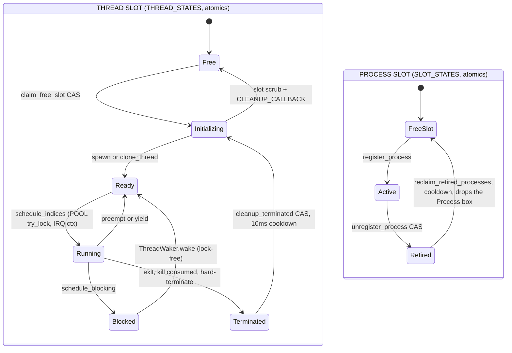

# Thread & thread-group lifecycle — states, edges, and the locks on every leaf

Current-state map of the two coupled state machines — **thread slots** and
**process (thread-group) slots** — with every lifecycle edge annotated with the
locks it takes, and the leaves traced to their lock sets. This is the diagram to
consult before adding any call on a teardown/exit/fault path.

> **Stability: C (active risk).** The leaf traces below found two live defect
> classes on 2026-08-02 (one fixed, one open — see §5). Re-verify the ⚠ tables
> against the code before relying on them.

For scheduling itself see [`scheduler.md`](scheduler.md); for lock discipline
rules see [`locking.md`](locking.md); for the process table see
[`memory.md`](memory.md) and `crates/akuma-exec/src/process/table.rs`.

## 1. The two state machines



The coupling points:

- `THREAD_PID_MAP` (Spinlock) binds tid → pid; written on spawn/clone/fork,
  erased on exit/kill/recycle. The `slot_still_owned_by` guard (dc4684a)
  re-reads it before acting on a pre-yield `thread_id` snapshot.
- `unregister_process` terminates the thread named by `p.thread_id` as a
  backstop for `kill_thread_group`'s grace-gap (see
  `../../archive/STALE_THREAD_SLOT_KILL.md` §5.1 — do **not** "tidy" that
  asymmetry away).
- A RETIRED process's memory is freed only when `drop(Box<Process>)` runs —
  by `netpoll_maint` (100 ms), an idle loop, terminal teardown, or the PMM
  pressure ladder (`process/reclaim.rs`).

## 2. Lifecycle edges and their locks

Lock legend: **M** = acquisition wrapped in `with_irqs_disabled`/`IrqGuard`;
**U** = unmasked; **P** = preemption disabled only (`LifecycleGuard`/
`PreemptGuard`, IRQs stay on).

| Edge | Entry points | Locks taken (in order) | Notes |
|---|---|---|---|
| spawn thread | `spawn_user_thread_initializing`, `spawn_*_fn` | `POOL` M | stack alloc from PMM **inside** the `POOL` hold (`threading/mod.rs:754,870`) |
| clone thread | `clone_thread` | `THREAD_PID_MAP` M; `LAZY_REGION_TABLE` M | P held across the whole clone incl. **raw user writes** of parent/child tid (`process/mod.rs:2799,2803`) |
| fork | `fork_process` | `THREAD_PID_MAP` M; `SHARED_L0_TABLE` M | `SHARED_L0_TABLE` insert **allocates under the lock** (`mmu/mod.rs:421-430`) |
| execve | `do_execve` → `replace_image*` → `enter_user_mode` | VFS/ext2/block (BKL-dropped window); `as_lock` via exclusive access | **eret leaf** — see §4. Frame abandoned on success |
| run → terminated | `mark_thread_terminated`, kill-request consume | none (atomics) | consume site holds the **BKL** across the terminal yield loop |
| exit / exit_group | `sys_exit*` → `return_to_kernel` | `PROCESS_CHANNELS` M, `THREAD_PID_MAP` M, `LAZY_REGION_TABLE` M, pipe/VFS via `cleanup_process_fds` | P for most of it; robust-futex walk touches user memory under P; **`!` leaf** — see §4 |
| kill group P1 | `kill_thread_group` | none (atomics + wakers) | up to 2 s grace-wait under the caller's P |
| kill group P2 | same | pipe/VFS via `cleanup_process_fds`; `PROCESS_CHANNELS` M; `THREAD_PID_MAP` M | then `unregister_process` (below) |
| unregister | `unregister_process` | `THREAD_PID_MAP` M (recycled-slot proof) | CAS ACTIVE→RETIRED; `note_retired` atomics |
| slot recycle | `cleanup_terminated_internal` | `POOL` M (short holds) | `CLEANUP_CALLBACK` re-enters process subsystem (`THREAD_PID_MAP` ×3, `unregister_process`) with no lock held |
| retired reclaim | `reclaim_retired_processes` | none in sweep | `drop(Box<Process>)` = the whole §3 tree |
| pressure drain | `drain_retired_under_pressure` (from `alloc_page_zeroed_user`) | same as reclaim | ambient context = **whatever faulted** — see §5.2 |
| scheduler (IRQ) | `sgi_scheduler_handler_with_sp` | `POOL` **try_lock** M | never blocks; no other subsystem lock reachable from IRQ context |

## 3. The `drop(Box<Process>)` lock tree (teardown leaf)

Every reclaim/drain leaf executes this transitive set
(full trace: `process/table.rs:263` → field drops):

```
drop(Box<Process>)
├─ Process::drop           → PMM (M, per frame)
├─ UserAddressSpace::drop  → SHARED_L0_TABLE (M) → TALC under it (map node dealloc)
│                            user_frames/page_table_frames (M, held ACROSS free loops)
│                            → PMM (M) + COW_REFCOUNTS (M) + FRAME_TRACKER (U, debug)
│                            ASID_ALLOCATOR (M)
├─ SharedFdTable::drop → close_all
│    ├─ fds.table (M) — values().cloned().collect() ALLOCATES under the lock
│    ├─ PIPES (M)                    pipe_close_read/write
│    ├─ SOCKET_TABLE (U,P) → NETWORK (U,P)   remove_socket → smoltcp close
│    ├─ EVENTFDS (M), EPOLL_TABLE (M), PIDFD_TABLE (M), CHILD_CHANNELS (M)
│    └─ RemoteFd → blocking cross-core forward (multikernel only)
└─ String/Vec/BTreeMap/Arc drops → TALC (heap lock) throughout
```

**13 distinct global locks** are reachable from a single `drop(Box<Process>)`.
Any context that can already hold one of them must never run this drop.

## 4. The three abandoned-stack leaves (`-> !`)

These are the special leaves the diagram must make visible: they end a kernel
stack **without unwinding it**. No destructor on the abandoned frames runs; no
lock guard on them is ever released.

| Leaf | Where | What is abandoned |
|---|---|---|
| `enter_user_mode` | initial launch, **every successful execve** (`syscall/proc.rs`) | the whole execve syscall stack |
| `return_to_kernel` / `_from_fault` | process exit, OOM kill (`alloc_error_handler`), fault kill | the interrupted syscall/fault stack, **including any lock guards it held** |
| `el1_fault_recovery_pad` | EL1 abort recovery (`exceptions.rs:1732`) | the faulting kernel frame — its `IrqGuard`s/`SpinlockGuard`s leak permanently |

Rules that follow (violations of each were found live):

1. **Nothing heap-owned may be live across an `eret` leaf.** Violation: execve
   leaked its whole-file ELF buffer (~1.1 MB per `busybox sh` exec) plus
   argv/env every success → kernel heap ratcheted to the ~1 GB wall under
   exec-heavy load (rustc hammer), ending in the `[OOM] … killing process`
   loop. **Fixed 2026-08-02** (`do_execve`/`exec_shebang` drop all heap locals
   before `enter_user_mode`). The same audit applies to anything added to
   `return_to_kernel*` upstream frames.
2. **`return_to_kernel*` and the pressure drain may re-acquire any §3 lock, so
   they must only run from contexts holding none of them.** The drain's module
   doc claims this is vetted; it is true for the idle/exit sites, **unprovable
   for the two hijack leaves** — `alloc_error_handler` and
   `el1_fault_recovery_pad` inherit an arbitrary ambient lock set. A failed
   allocation inside `pipe_write`'s buffer growth (under `PIPES` + IRQs
   masked — the class `syscall/pipe.rs:29-35` already documents) reaches
   `return_to_kernel` → teardown/drain → `PIPES.lock()` → **single-core spin
   with IRQs masked**: 100 % CPU, frozen serial, no panic output.

## 5. Open ⚠ leaf traces (as of 2026-08-02)

### 5.1 Demand-pager runs before the user-copy fixup

`rust_sync_el1_handler` order: CoW resolve → **demand-page**
(`try_resolve_el1_user_copy_lazy_fault` → `alloc_page_zeroed_user` → pressure
ladder → drain) → only then the `copy_*_safe` EFAULT fixup. Consequence:
`copy_*_safe` does **not** protect a lock-holding caller from demand paging.
The comments claiming otherwise are stale and wrong:
`syscall/sync.rs:24-31`, `pmm.rs:770-775`, `process/reclaim.rs` ("vetted
drain sites").

Known demand-page-capable user accesses under a held spinlock (all can enter
the §3 drain while holding their lock):

| Site | Lock held |
|---|---|
| `syscall/sync.rs:116` futex word read | `FUTEX_WAITERS` + IRQs masked |
| `syscall/msgqueue.rs:264-283` msg copies (unbounded len) | `MSGQUEUE_TABLE` + IRQs masked |
| `syscall/timerfd.rs:94-98,152-156` | `TIMERFD_TABLE` |
| `syscall/term.rs:195,241,257,338` | `TerminalState` |
| `syscall/signal.rs:42` old-sigaction copy | `SharedSignalTable.actions` |

The in-tree correct patterns to copy: `syscall/fs.rs:318/353/398` (`drop(ts)`
before the copy), `syscall/poll.rs:334-339` (copy hoisted out of the lock),
`exceptions.rs:1180-1190` (pre-map then write).

### 5.2 Drain ambient-context gap

`drain_retired_under_pressure` fires from the fault path; its ambient lock set
is the faulting syscall's. Combined with §5.1 the drain can re-enter a held
lock. Mitigations under discussion: check the fixup handler before the lazy
resolver enters the pressure ladder, or force `alloc_page_zeroed` (no-drain)
when a `copy_*_safe` window is open.

### 5.3 Alloc-under-lock sites that route to the hijack leaves

`SHARED_L0_TABLE` insert (fork), `fds.table` clone in `close_all`,
`pipe_write` buffer growth, epoll/eventfd interest inserts, heap allocation
inside `with_irqs_disabled` process-table scans
(`process/mod.rs:1077,1226,1251,1302`). Any of these failing under heap
pressure becomes rule-2 hang fuel.

## Verify

- Leak guard: boot devbox-smoltcp, run ≳50 `ssh … '<cmd>'` execs, confirm no
  `[HEAP-GROW]` 256 MB crossing and no `[OOM] allocation of … failed` lines.
- Hang shape triage: serial log **frozen** + 100 % CPU + no `[OOM]` line ⇒
  rule-2 spin (attach lldb to the gdbstub, the PC sits in a `Spinlock` spin
  loop); `[OOM] … killing process` repeating with live PSTATS ⇒ heap
  exhaustion, not yet the hang.

## Background

- `docs/archive/EXECVE_STACK_LEAK_OOM_HANG.md` — the 2026-08-02 investigation
  this doc distills (leak + hang chain, hammer repro, log forensics).
- `docs/archive/STALE_THREAD_SLOT_KILL.md` — the stale-slot kill race and the
  `unregister_process` backstop (§5.1 there: why PHASE 2 must not clear
  `thread_id`; its "the PHASE 2 edit hung the box" evidence is superseded —
  the hang matches the leak/hang chain above).
- `docs/archive/OOM_KILL_DEFERRED_RECLAIM_GAP.md` — why the pressure drain
  exists.
- `docs/archive/BKL_PHASE7E_PROCESS_TABLE_RECLAIM.md` — the earlier
  self-deadlock that ruled out reclaim-from-`register_process`; the same
  argument governs §4 rule 2.
