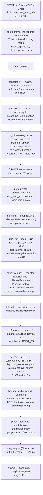

# Boot to init

Embedded inline in `../reference/boot.md`. Keep the two in the same commit.

```mermaid
flowchart TD
    A["QEMU/kvm0 loads ELF at 2 MiB<br/>(PVH note, hvm_start_info at 0x6000)"] --> B["boot.s trampoline (akuma-boot-amd64)<br/>32-bit protected → long mode<br/>boot page tables, physmap, boot stack"]
    B --> C["kmain (main.rs)"]
    C --> D["console::init — COM1 (akuma-comconsole)<br/>+ safe_print! hook (akuma-primitives)"]
    D --> E["gdt_init — GDT+TSS (akuma-gdt)<br/>before the IDT: exception delivery reads the GDT"]
    E --> F["idt_init — every vector reports and halts<br/>(akuma-idt-amd64 + akuma-trap-amd64)<br/>so a wrong kernel is reportable, not a triple fault"]
    F --> G["CR0.WP set — kernel writes honour RO pages"]
    G --> H["akuma-ryzen-amd64::describe<br/>hvm_start_info, memmap, virtio-mmio slots"]
    H --> I["mem::init — heap (akuma-alloc) + PMM (akuma-pmm)<br/>no-op reaper hooks"]
    I --> J["lapic_init — mask PICs (akuma-port), enable xAPIC,<br/>calibrate vs PIT, arm periodic timer (akuma-lapic-amd64)"]
    J --> K["exec_twin::init — register ExecRuntime / ThreadRuntime /<br/>ProcessHooks / X86ArchHooks (akuma-exec, akuma-threading)"]
    K --> L["blk_init — map virtio-mmio window, akuma-virtio block up"]
    L --> M["ext2 mount on device 0 (akuma-ext2, BlockDevice = Vda)<br/>published as ROOT_FS"]
    M --> N["net::net_init — TSC calibration vs PIT (no PIT →<br/>lapic tsc_hz), smoltcp up (akuma-net over akuma-net-nic),<br/>DHCP wait ≤10 s"]
    N --> O["banner (src/banner.txt, verbatim)<br/>epoch= cmdline token → UTC offset store (akuma-primitives::clock)"]
    O --> P["parse_programs: init=/initargs=, then=/thenargs=<br/>(≤4 programs, fixed slots)"]
    P --> Q["run_program(0): read init off ext2, verify ELF magic"]
    Q --> R["spawn → load_task → ring3::enter_user<br/>ring 3, IF set"]
```
