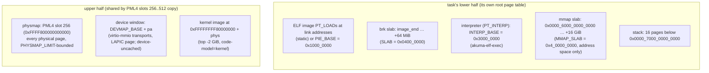

# Memory map

Embedded inline in `../reference/memory.md`. Keep the two in the same commit.

```mermaid
flowchart BT
    subgraph user["task's lower half (its own root page table)"]
        U1["ELF image PT_LOADs at link addresses<br/>(static) or PIE_BASE = 0x1000_0000"]
        U2["brk slab: image_end … +64 MiB<br/>(SLAB = 0x0400_0000)"]
        U3["interpreter (PT_INTERP): INTERP_BASE = 0x3000_0000<br/>(akuma-elf-exec)"]
        U4["mmap slab: 0x0000_6000_0000_0000 … +16 GiB<br/>(MMAP_SLAB = 0x4_0000_0000, address space only)"]
        U5["stack: 16 pages below 0x0000_7000_0000_0000"]
    end
    subgraph kernel["upper half (shared by PML4 slots 256..512 copy)"]
        K1["physmap: PML4 slot 256 (0xFFFF800000000000)<br/>every physical page, PHYSMAP_LIMIT-bounded"]
        K2["device window: DEVMAP_BASE + pa<br/>(virtio-mmio transports, LAPIC page; device-uncached)"]
        K3["kernel image at 0xFFFFFFFF80000000 + phys<br/>(top -2 GiB, code-model=kernel)"]
    end
```
