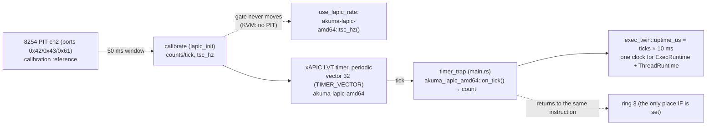

# Scheduling — the tick

Embedded inline in `../reference/scheduling.md`. Keep the two in the same
commit.

```mermaid
flowchart LR
    PIT["8254 PIT ch2 (ports 0x42/0x43/0x61)<br/>calibration reference"] -->|50 ms window| CAL["calibrate (lapic_init)<br/>counts/tick, tsc_hz"]
    CAL -.->|"gate never moves<br/>(KVM: no PIT)"| LAP["use_lapic_rate:<br/>akuma-lapic-amd64::tsc_hz()"]
    CAL --> LVT["xAPIC LVT timer, periodic<br/>vector 32 (TIMER_VECTOR)<br/>akuma-lapic-amd64"]
    LVT -->|tick| TT["timer_trap (main.rs)<br/>akuma_lapic_amd64::on_tick() → count"]
    TT --> CLK["exec_twin::uptime_us = ticks × 10 ms<br/>one clock for ExecRuntime + ThreadRuntime"]
    TT -.->|returns to the same instruction| R3["ring 3 (the only place IF is set)"]
```
