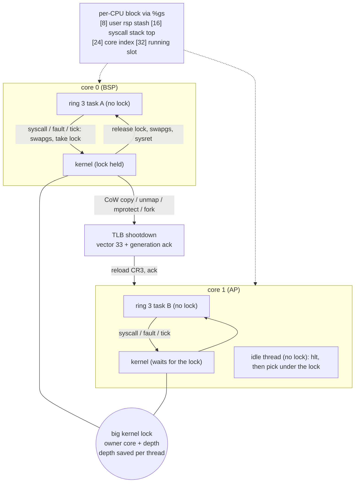

# SMP - the big kernel lock and the per-CPU block

Embedded inline in `../reference/scheduling.md` § SMP. Keep the two in the same commit.

```mermaid
flowchart TB
    subgraph CPU0["core 0 (BSP)"]
      R0["ring 3 task A (no lock)"] -->|syscall / fault / tick: swapgs, take lock| K0["kernel (lock held)"]
      K0 -->|release lock, swapgs, sysret| R0
    end
    subgraph CPU1["core 1 (AP)"]
      R1["ring 3 task B (no lock)"] -->|syscall / fault / tick| K1["kernel (waits for the lock)"]
      K1 --> R1
      I1["idle thread (no lock): hlt, then pick under the lock"]
    end
    LOCK(("big kernel lock<br/>owner core + depth<br/>depth saved per thread"))
    K0 --- LOCK
    K1 --- LOCK
    K0 -->|"CoW copy / unmap / mprotect / fork"| SD["TLB shootdown<br/>vector 33 + generation ack"]
    SD -->|"reload CR3, ack"| CPU1
    PC["per-CPU block via %gs<br/>[8] user rsp stash [16] syscall stack top<br/>[24] core index [32] running slot"] -.-> CPU0
    PC -.-> CPU1
```
