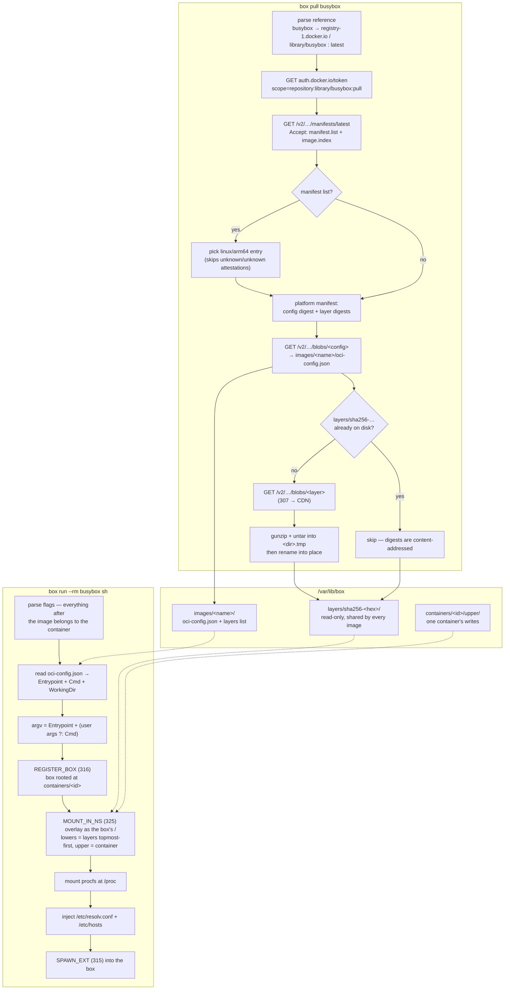

# box

Container management utility for Akuma OS. Creates isolated execution
environments ("boxes") with root directory redirection, process scoping, and
OCI image backing.

## Quick start

```
box pull busybox                                 # pull an image from Docker Hub
box run --rm busybox /bin/busybox echo hi        # run a container
box run --rm -i busybox sh                       # interactive shell in a container
box run --rm --entrypoint curl curlimages-curl -sS https://example.com
box ps                                           # list active boxes
box close demo                                   # stop a box
```

## Commands

| Command | Description |
|---------|-------------|
| `box run [opts] <image> [cmd [args...]]` | Run a container from a pulled image |
| `box pull <image>` | Pull an OCI image (Docker Hub, ghcr.io, etc.) |
| `box images` | List locally stored images |
| `box open <name> [opts] [cmd] [args...]` | Create a plain box and run a command in it |
| `box ps` | List active boxes |
| `box use <name\|id> [opts] <cmd> [args...]` | Run a command inside an existing box |
| `box grab [-d] <name\|id> [pid]` | Reattach terminal to a process in a box |
| `box cp <src> <dest>` | Copy a directory tree |
| `box close <name\|id>` | Stop a box and kill its processes |
| `box show <name\|id>` | Display box details and member processes |
| `box test [--net]` | Run built-in test suite |

### `box run` options

- `--rm` — kill the box and delete the container directory on exit
- `-d` / `--detached` — start in background, print the pid
- `-i` / `--interactive` — keep stdin attached (output is always attached in the
  foreground)
- `--name <id>` — container id (default `<image>-<uptime>`)
- `--entrypoint <path>` — override the image's Entrypoint
- `-w <dir>` / `--workdir <dir>` — override `WorkingDir`
- `-e <K=V>` / `--env <K=V>` — set an environment variable; repeatable. A bare
  `-e <K>` passes `K` through from `box`'s own environment.

Arguments after the image replace the image's **Cmd** and are passed to its
Entrypoint, as `docker run` does.

The environment is the image's `Env` with `-e` applied over it **by name**, so
`-e` replaces an image's value in place rather than appending a duplicate.
Only the first `=` splits a name from its value, so `-e DSN=host=db port=5432`
is one variable. `PATH` is added if the composed list has none — the kernel
treats a supplied environment as the whole environment, so a list without it
would break every bare program name.

### `box open` options

- `--root <dir>` / `-r <dir>` — root directory for the box (default `/`)
- `--image <name>` — legacy: use an image's flat `rootfs/` as the box root.
  **`box pull` no longer creates that directory** — use `box run`.
- `-I` / `--interactive`, `-d` / `--detached`

### `box grab` options

- `-d` / `--detach` — like `screen -d`: if the target process is already
  reattached to another, still-live `box grab`, detach that one (it gets
  `SIGTERM`'d, its own session ends) and take over instead. Without `-d`, a
  target that's already attached elsewhere is refused (`already attached...
  use -d`) rather than silently stealing its channel out from under whoever
  is currently watching it.

`box grab` exits on its own once the grabbed process exits (or once it's
detached by a later `-d` grab) — it doesn't wait for you to notice the
process is gone. See
[`../../docs/archive/REATTACH_STALE_CHANNEL_HANG.md`](../../docs/archive/REATTACH_STALE_CHANNEL_HANG.md)
for why neither of those was true before 2026-08-23.

## How it works

From a name a user types to a process running in a container:



Layer order is where this quietly goes wrong: a registry lists layers
**base-first**, an overlay resolves lookups **topmost-first**, so `layers` is
read back and reversed. Get it backwards and the image still boots — it just
serves the pre-update copy of every file a later layer replaced.

## What of OCI is supported

| Area | Supported | Not yet |
|------|-----------|---------|
| **Distribution** (registry API) | Anonymous pull, Docker Hub bearer tokens, `GET /v2/<name>/manifests/<ref>` by tag *or* digest, `GET /v2/<name>/blobs/<digest>`, 307 redirects to CDN blobs | Push, login/credentials, `_catalog`/tag listing, resumable/chunked blob fetch, `Range` retries |
| **References** | `name`, `name:tag`, `user/name:tag`, `registry[:port]/name:tag`, implicit `library/` + `latest`, `docker.io` → `registry-1.docker.io` | `name@sha256:…` digest pins, digest *verification* of what was downloaded |
| **Image index / manifest list** | OCI `image.index.v1`, Docker `manifest.list.v2`, detection with no top-level `mediaType`, `linux/arm64` (and `aarch64`) selection, skipping `unknown/unknown` attestations | Variant matching (`v8`, `v7`), `os.version`/`os.features`, multi-platform fallback |
| **Manifest** | `config.digest`, `layers[].digest` in order, `layers[].size` | Foreign/URL layers, subject/referrers, annotations |
| **Layers** | `tar+gzip`, whiteouts (`.wh.`) via the kernel overlay, content-addressed dedupe across images, path-traversal rejection at extract | Uncompressed `tar`, `zstd`, `diff_id` verification, layer GC (`box rmi`) |
| **Image config** | `Entrypoint`, `Cmd`, `WorkingDir` (docker `run` override semantics) | `Env`, `User`, `ExposedPort`, `Volumes`, `StopSignal`, `Labels`, `Healthcheck` |
| **Runtime** (OCI runtime spec) | Not implemented here — `box` is its own runtime over the kernel's box/overlay primitives | `config.json` bundles, hooks, cgroups/resource limits, seccomp, capabilities, user namespaces |

Signature and digest verification is the significant gap: a pulled layer is
trusted because the registry served it over TLS, not because its bytes were
hashed. `userspace/herd` has a separate, partial OCI *runtime-spec* config
reader — the two are unrelated code paths today.

## Containers: images, layers, overlay

`box pull` implements the OCI Distribution Spec — image references
(`busybox`, `ubuntu:22.04`, `ghcr.io/owner/repo:tag`), multi-arch manifest lists
(selects `linux/arm64`), 307 redirects to CDN blobs.

Each layer is extracted **once**, into a content-addressed directory shared by
every image that references it:

```
/var/lib/box/layers/sha256-<hex>/          extracted layer, read-only, shared
/var/lib/box/images/<name>/oci-config.json OCI config (Entrypoint, Cmd, …)
/var/lib/box/images/<name>/layers          digest per line, base-first
/var/lib/box/containers/<id>/upper         one container's writable layer
```

`box run` registers a box rooted at the container directory, then asks the
kernel to mount an **overlay** as that box's `/`: the image's layers as
read-only lowers, the container's `upper` on top. Writes copy up into `upper`;
deletes that cannot touch a read-only layer are recorded as `.wh.` whiteouts.
The image is never modified, and two containers of the same image share one copy
of it on disk.

`/etc/resolv.conf` and `/etc/hosts` are injected into `upper` at start — no OCI
image ships them and every networked program expects them — and a `procfs` is
mounted at `/proc`, so `ps` works and shows only the container's processes.

### Limits

- **No nested OCI images.** Composing a container root needs an overlay mount,
  and a boxed process may not mount at all. Nested *boxes* still work.
- A bare Entrypoint is resolved against the standard `PATH` directories by `box`
  itself, not by the container's own `PATH` — the kernel's spawn takes a path,
  not a name, so the lookup has to happen before the process exists. An image
  whose `Env` sets an unusual `PATH` therefore still needs an absolute
  Entrypoint. (The image's `Env` itself *is* passed through, since 2026-08-20.)
- No layer GC (`box rmi`), no digest pinning.

## Testing

Logic is tested on the **host**, where the suite runs in milliseconds:

```bash
cd userspace
cargo test -p box --lib --no-default-features \
    --target $(rustc -vV | grep '^host:' | cut -d' ' -f2)
```

On the target, `box test` covers what a host cannot — the same code compiled for
`aarch64-unknown-none`, and the TLS download path:

```
box test           # on-target smoke: parsing, refs, argv, HTTP header split
box test --net     # + network: busybox manifest and a full layer from Docker Hub
```

See [docs/TESTING.md](docs/TESTING.md). The overlay itself is host-tested in
`crates/akuma-isolation` (`overlay_fs.rs`), and tar header parsing in
`userspace/tar` (`format.rs`).

## Source layout

The crate is split so that everything that is a *decision* can be host-tested.
`box` is a Rust keyword, so the library half is `boxlib`; the binary is still
`box`.

```
src/
  lib.rs       boxlib — the host-testable half (no libakuma, no I/O)
    json.rs      path-addressed reads over the picojson pull parser
    oci_ref.rs   image references → registry, repository, tag, URLs
    manifest.rs  manifest lists, platform selection, config + layer digests
    paths.rs     the /var/lib/box layout, store names, overlay layer order
    spec.rs      image config → argv, `box run` flag parsing, box ids
    boxes.rs     /proc/boxes table parsing and name/id resolution
  main.rs      Command dispatch, box lifecycle (open/close/ps/use/grab/cp)
  run.rs       `box run`: container creation, overlay mount, spawn
  oci.rs       OCI Distribution client (auth, blob download, extraction)
  images.rs    Image store I/O over boxlib::paths
  tests.rs     On-target suite (`box test`)
docs/
  OCI_IMAGE_PULL.md   Pull pipeline architecture
  BOX_RUN.md          Containers, the overlay root, docker compatibility
  TESTING.md          Both test layers, and what belongs in each
```

## Dependencies

- `libakuma` — syscall wrappers, process spawning, filesystem ops
- `libakuma-tls` — HTTPS client (embedded-tls, TLS 1.3, AES-128-GCM)
- `picojson` — JSON. `no_std`, allocation-free, non-recursive pull parser;
  `box` decides when to allocate. Built without `float`, since a manifest has no
  fractional numbers
- `libakuma`, `libakuma-tls` and `akuma-tar` are optional behind the default
  `akuma` feature, so `--no-default-features` leaves a `boxlib` a std host
  target can link and test
- `akuma-tar` (`userspace/tar`) — layer extraction, **linked in, not spawned**.
  It used to run `/bin/tar`, which was silently a busybox applet whose hardlink
  handling expanded a 1.9 MB layer into 467 MB of mode-less copies:
  [`../../docs/archive/BOX_DOCKER_COMPAT.md`](../../docs/archive/BOX_DOCKER_COMPAT.md)

## Kernel integration

- **box_id** — per-box identifier tracked in each process's PCB
- **root_dir** — VFS path scoping via `SubdirFs`
- **ProcFS virtualization** — `/proc/boxes`; a boxed process sees only its box
- **REGISTER_BOX** (316) / **KILL_BOX** (317) — box lifecycle
- **SPAWN_EXT** (315) — spawn into a box
- **MOUNT_IN_NS** (325) — compose a box's mount namespace *from box 0*, including
  the `overlay` fstype that gives a container its root. A box's namespace is
  built entirely from outside, before it runs; boxed processes cannot mount.

The `box` binary is a userspace orchestrator; the kernel enforces the isolation
boundaries. See
[`../../docs/reference/subsystems/containers.md`](../../docs/reference/subsystems/containers.md)
and [`../../docs/runbooks/run-docker-image.md`](../../docs/runbooks/run-docker-image.md).
