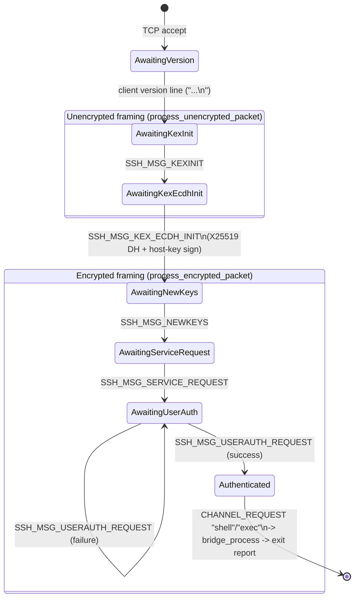

# The Protocol Under Load

`LIMITATIONS.md` already covers the known *structural* ceilings (single OS
thread, cooperative concurrency, no userspace threading, kernel socket
limits). This doc is about something more specific: what happens to the
**wire-protocol state machine** in `protocol.rs` when connections misbehave
or pile up, verified against a live boot rather than just read from the
source. Short version: there is one concrete, easily-triggered,
**unauthenticated remote crash**, and its blast radius is "every session this
process is currently serving" — because of how the concurrency model in
`FLOW.md` is built.

## The state machine



Every state up through `AwaitingNewKeys` reads packets with **no MAC and no
encryption** — that's the protocol, not a bug (there's no key yet). The
important consequence: three of the seven states are wide open to
unauthenticated, unauthenticated-*and*-unencrypted input, straight off the
TCP socket, before a single credential has been checked.

## The bug: unauthenticated remote crash

`process_unencrypted_packet` and `process_encrypted_packet`
(`protocol.rs:713-754`) both compute:

```rust
let padding_len = decrypted[4] as usize;          // client-controlled byte
let payload_len = packet_len - padding_len - 1;   // packet_len is also client-controlled
let payload = decrypted[6..5 + payload_len].to_vec();
```

Neither validates `padding_len < packet_len` before the subtraction. With
`overflow-checks = false` (the workspace's release profile), the subtraction
doesn't panic — it wraps to a huge `usize`. The slice a few lines later does
panic: Rust's slice bounds check is unconditional, `overflow-checks` doesn't
gate it. `panic = "abort"` (same profile) means that panic takes the whole
process down, not just the offending connection's `Future`.

For `process_unencrypted_packet` this is reachable with **zero
authentication and zero valid cryptography** — it's the framing used for
every message before `NEWKEYS`. A client just needs to complete the version
exchange and then send one malformed length-prefixed packet.

### Verified live, twice

Built `devbox-smoltcp` (the profile with **no built-in in-kernel SSH server**
at all — see `overlays/devbox/README.md` — so there's no ambiguity about
which SSH implementation is being exercised) at `SMP=4`, booted it, and sent
this over a raw TCP socket after the version exchange:

```
00 00 00 06 ff 00 00 00 00 00
└─len=6──┘ └pad=255┘
```

`payload_len = 6 - 255 - 1` underflows. Two SSH sessions were open at the
time — call them A (an innocent bystander, just sitting connected) and B
(sends the malformed packet). Result, straight from the kernel's console
log:

```
[herd] Service sshd exited with code  1
[herd] Scheduling restart for sshd
[AS-NEW] pid=3 ... via=spawn
[herd] Starting service: sshd
[herd] Started sshd (pid= 3)
```

**Both** A and B's sockets closed (EOF) at that moment — confirmed by
`recv()` on each returning `b''` right after the crash, not a timeout or a
reset. One malformed packet on connection B killed connection A too, because
both are futures being polled inside the same single `/bin/sshd` process
(`FLOW.md`'s cooperative executor — there is no per-connection process or
thread boundary to contain a crash). `herd`'s `restart = true` respawns the
service (new pid, ~1s later) — the *service* self-heals, but every session
that was live at the moment of the crash is gone, through no fault of its
own. Reproduced this twice in the same boot (two independent PID churns,
`pid=2 → pid=3 → pid=4`, each immediately following a malformed packet sent
in that test run).

`libakuma`'s userspace panic handler is deliberately minimal — no
`format!`, no allocation on the panic path:

```rust
#[panic_handler]
fn panic(_info: &core::panic::PanicInfo) -> ! {
    eprint("PANIC!\n");
    exit(1);
}
```

— which is why the log shows a clean `exited with code 1` rather than a
fault dump; the console line itself didn't survive into this capture (likely
lost in the race between the write and the process teardown), but the
`[TERM] ... by_tid=9` self-termination record at the same tid immediately
before `herd`'s restart message is consistent with exactly this path.

### The in-kernel server has the same bug, but worse

The **in-kernel** SSH server (`crates/akuma-ssh`, not part of `userspace/`,
out of scope to fix here — see `docs/archive/TRIM_FAT_SSHD.md`) shares this
exact logic and the exact same missing check in its own
`process_unencrypted_packet`. The same 10-byte packet against it doesn't
just kill one process — there's no process boundary at all, it's the kernel
itself. It printed a full fault dump (`WARNING: Kernel accessing user-space
address! ... stale TTBR0`) and then **wedged completely**: 100% CPU, zero
response to new connections, no recovery. No supervisor can restart a
kernel. See `docs/archive/TRIM_FAT_SSHD.md` for that finding in full — it's
one more reason that implementation is a candidate for removal rather than a
second copy to keep patched.

### The fix, if wanted

The in-kernel server's own `process_encrypted_packet` (not its unencrypted
one — the fix is inconsistently applied even there) already shows the
one-line guard needed:

```rust
let payload_len = packet_len - padding_len - 1;
if 5 + payload_len > decrypted.len() { return None; }
```

Userspace `sshd`'s `protocol.rs` has neither of its two call sites guarded.
Adding that check to both (`process_unencrypted_packet` and
`process_encrypted_packet`) closes the crash with no behavior change for any
well-formed packet — malformed ones become an ignored/dropped connection
instead of a process-wide crash. Not applied in this pass (analysis +
documentation was the ask); flagging it here as the obvious, low-risk next
step.

## Other load-shaped findings (severity-ordered, not verified live — code
reading only)

1. **Unbounded `input_buffer` growth / no handshake timeout.** `packet_len`
   (a client-supplied `u32`, no upper bound) can request up to ~4 GB before
   either packet function returns `Some`; until then, `session.input_buffer`
   just grows via `extend_from_slice` on every read (`handle_connection`,
   `bridge_process`). There's also no idle/handshake timeout anywhere — a
   client that opens a socket and sends nothing occupies a `sessions` slot
   and its buffer forever. Slow-loris-shaped: enough idle/slow connections
   pin memory and executor slots with no eviction.

2. **Unbounded session count, checked every tick.** `sessions:
   Vec<Pin<Box<dyn Future<Output = ()>>>>` (`main.rs`) has no cap. Every tick
   walks the *entire* `Vec` once (`FLOW.md`'s round-robin poll) — so beyond
   the memory cost, more concurrent connections (even fully idle ones) is a
   direct, linear latency tax on every other connection's poll cadence.

3. **Per-auth-attempt disk I/O, no caching.** `load_authorized_keys()`
   (`auth.rs:154`) does a fresh `open` + read-loop + `close` of
   `/etc/sshd/authorized_keys` on **every** `SSH_MSG_USERAUTH_REQUEST` with
   `publickey` — and a real OpenSSH client sends at least two per login (an
   unsigned key-query, then the signed attempt). Under concurrent-login load
   this is pure multiplied syscall overhead for a file that essentially never
   changes between logins. Not a bug, a real throughput cost.

4. **`AwaitingVersion`'s `continue` drops already-buffered bytes on the
   floor until the next read.** `handle_connection` (`protocol.rs:768-776`):
   after consuming the version line out of `input_buffer`, it `continue`s
   back to `stream.read()` *without* draining whatever else was already
   sitting in `input_buffer` from that same read. A client that pipelines its
   version line and its first packet into one TCP write (nothing forbids
   this; OpenSSH's client happens not to) would have that first packet sit
   unprocessed until *any* further byte arrives from the client. Cosmetic in
   practice (found while writing the crash PoC above — had to add an
   explicit follow-up byte to get the malformed packet processed at all
   against real network timing), but worth knowing if a future client
   pipelines aggressively and appears to "hang" right after the banner.

5. **Single-threaded cooperative executor is a scalability ceiling, not a
   bug.** Already documented in `LIMITATIONS.md` §1 — repeated here only to
   connect it to the above: while one connection's *synchronous* work
   (X25519 DH + Ed25519 signing during key exchange, none of it `.await`ed)
   runs, no other connection's I/O is polled. Individually sub-millisecond;
   under a burst of simultaneous new connections all keying-exchanging at
   once, it serializes on one core regardless of how many the kernel's SMP
   build has (confirmed: `sshd` used exactly one of the 4 cores in the
   `SMP=4` boot above — `PSTATS PID .../bin/sshd` never showed multi-core
   attribution).

## Where this leaves things

The crash is the headline: it's the one item here that's a genuine security
bug (unauthenticated, deterministic, kills every concurrent session), not
just a scaling limitation. Everything else in this doc is "gets worse under
load" in the ordinary sense `LIMITATIONS.md` already describes. The one-line
guard above (mirroring the in-kernel server's own encrypted-path fix) would
close it without touching anything else in the state machine.

## Background

- Concurrency model this bug's blast radius depends on: `FLOW.md`.
- Structural scaling limits (threading, socket limits, memory): `LIMITATIONS.md`.
- The in-kernel server's copy of the same bug, and why that implementation is
  a removal candidate: `docs/archive/TRIM_FAT_SSHD.md`.
- Binary-size work on this same codebase (unrelated to this doc, same
  session): `docs/archive/TRIM_FAT_SSHD.md`.
